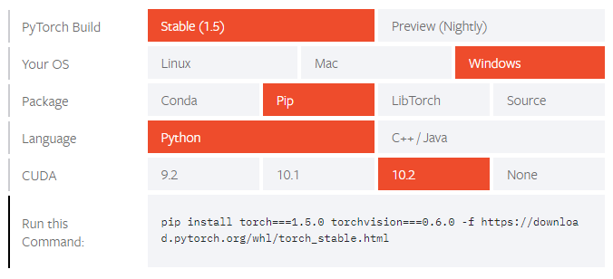
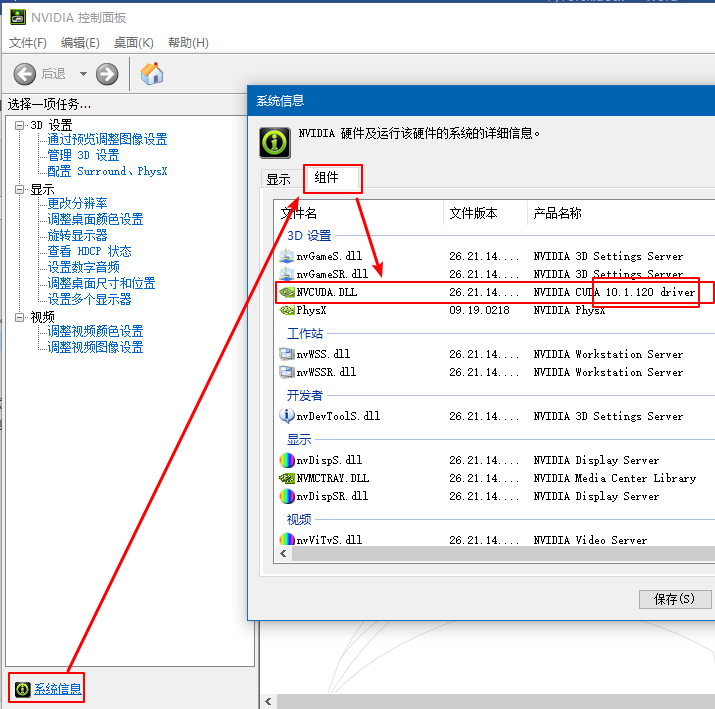
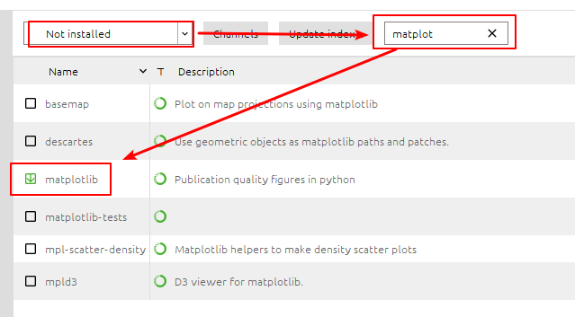
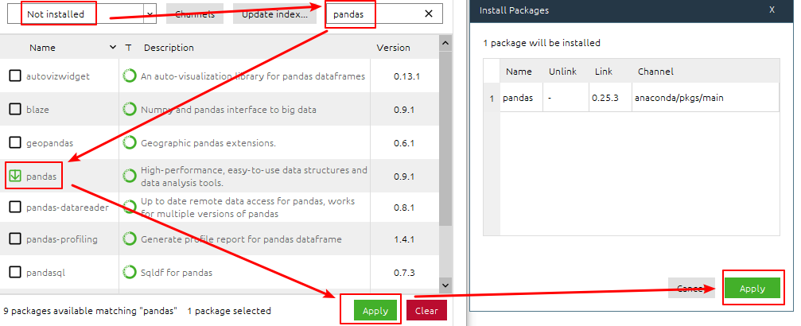
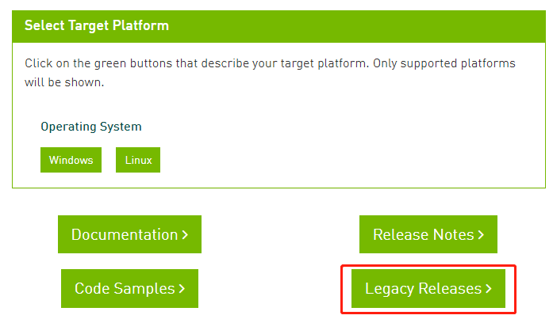
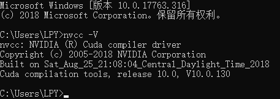
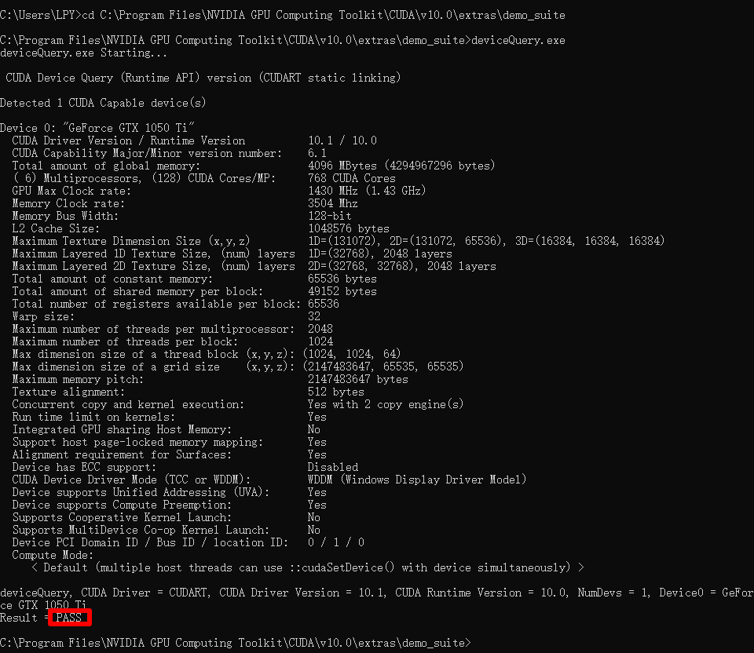
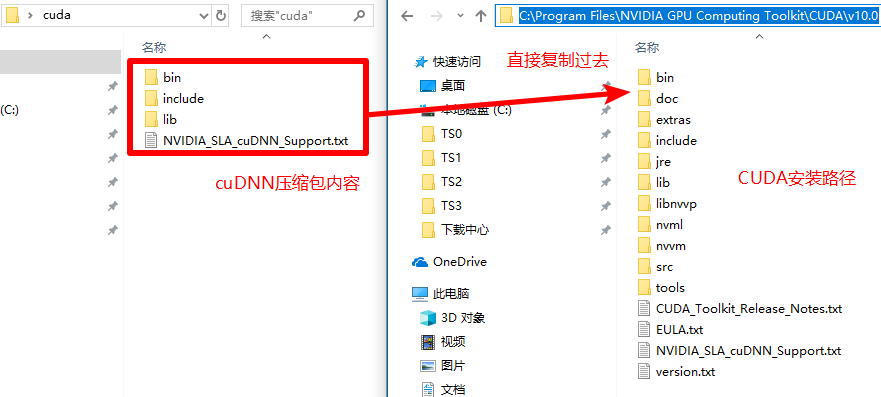
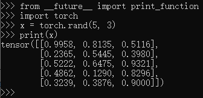

本文介绍了 Pytorch 机器学习框架的下载和部署，以及 Pytorch 开发环境的配置。

<!--more-->

 ---
 
- [1. 简介](#1-简介)
- [2. 配置Python开发环境](#2-配置python开发环境)
- [3. 配置PyTorch](#3-配置pytorch)
  - [3.1. 部署PyTorch](#31-部署pytorch)
  - [3.2. 部署其它包](#32-部署其它包)
    - [3.2.1. CUDA](#321-cuda)
    - [3.2.2. cuDNN](#322-cudnn)
    - [3.2.3. Numpy](#323-numpy)
    - [3.2.4. matplotlib](#324-matplotlib)
    - [3.2.5. pandas](#325-pandas)
  - [3.3. 手动部署CUDA和cuDNN](#33-手动部署cuda和cudnn)
  - [3.4. 测试](#34-测试)
- [4. 参考文献](#4-参考文献)

# 1. 简介

PyTorch是一个开源的Python机器学习库，基于Torch，用于自然语言处理等应用程序。2017年1月，由Facebook人工智能研究院（FAIR）基于Torch推出。它是一个基于Python的可续计算包，提供两个高级功能：1、具有强大的GPU加速的张量计算（类似NumPy）。2、包含自动求导系统的的深度神经网络。

吃别人一记强力安利：[PyTorch到底好用在哪里？](https://www.zhihu.com/question/65578911)

# 2. 配置Python开发环境

参考[《VSCode部署Python开发环境》](http://sirlis.github.io/2020-03-21-vscode-python/)配置。

# 3. 配置PyTorch

## 3.1. 部署PyTorch

前往官网（https://pytorch.org/get-started/locally/），根据自身的开发环境，获取PyTorch安装命令行。以Windows 10系统+RTX2060显卡为例，采用pip安装，如图选择，得到安装命令行



**注意**，PyTorch包含两个版本，CPU版（CUDA=None）和GPU版，若计算机没有合适的独立显卡，则CUDA选择None。不过GPU版同样包含CPU版的所有功能，因此完全可以安装GPU版，然后不用GPU计算加速功能。

**注意**，请自行确认独立显卡驱动支持的**CUDA版本**。打开控制面板，选择查看方式为“小图标”，选择“Nvidia控制面板”，然后如图所示的步骤依次打开“系统信息” => “组件”，查看 “NVCUDA.DLL” 的产品名称，并选择不超过其版本号的CUDA版本号。



若采用conda安装（推荐），则命令行如下

```
conda install pytorch torchvision cudatoolkit=10.2 -c pytorch
```

若采用pip安装，则命令行如下

```
pip install torch===1.5.0 torchvision===0.6.0 -f https://download.pytorch.org/whl/torch_stable.html
```

打开Anaconda Navigator，激活相应的环境，打开环境的终端，输入上述命令即可完成PyTorch的安装。【20200907补充，请务必尽量用上述命令行安装，才能安装 gpu 版本的 pytorch，单独从 Anaconda 界面安装的是 cpu 版的】

若已经更换了 Anaconda 的镜像源为国内源，则可以去掉后面的 `-c pytorch`，即使用

```
conda install pytorch torchvision cudatoolkit=10.1
```

【20200907补充，注意清华源可能不包括torchvision，因此万全之策还是加上 `-c pytorch`】

完整的GPU版本的PyTorch包含以下组件，版本号为我使用的版本号，其他人需要根据自身实际情况调整（尽量按照官网给出的版本匹配）：

- pytorch  1.6.0
- torchvision  0.6.0
- cuda  10.2.89（与显卡支持的cuda版本有关）
- cudnn  7.6.5（与cuda版本有关）

注意，务必不要单独通过 Anaconda 安装 pytorch，那样安装的版本是 cpu 版的。

## 3.2. 部署其它包

### 3.2.1. CUDA

CUDA（Compute Unified Device Architecture），是NVIDIA推出的运算平台。 CUDA™是一种由NVIDIA推出的通用并行计算架构，该架构使GPU能够解决复杂的计算问题。 它包含了CUDA指令集架构（ISA）以及GPU内部的并行计算引擎。 开发人员可以使用C语言来为CUDA™架构编写程序。所编写出的程序可以在支持CUDA™的处理器上以超高性能运行。

CUDA依赖显卡驱动，提前更新显卡驱动并确认显卡驱动支持的CUDA版本号。

采用命令行安装时，命令行中已经带有安装CUDA的指令 `cudatoolkit=10.1`。若命令行安装失败，可通过Anaconda界面安装cudatoolkit。

若界面安装仍然失败，可尝试手动安装，请前往 [手动部署CUDA和cuDNN](#手动部署CUDA和cuDNN)。

### 3.2.2. cuDNN

可通过Anaconda界面安装。

若界面安装失败，可尝试手动安装，请前往 [手动部署CUDA和cuDNN](#手动部署CUDA和cuDNN)。

### 3.2.3. Numpy

NumPy（Numerical Python）是Python的一种开源的数值计算扩展。这种工具可用来存储和处理大型矩阵，比Python自身的嵌套列表（nested list structure)结构要高效的多（该结构也可以用来表示矩阵（matrix）），支持大量的维度数组与矩阵运算，此外也针对数组运算提供大量的数学函数库。

- 注意！numpy若通过 conda 或 Anaconda 界面安装可能存在问题，需要用 pip 安装
- 注意！基础包一定要先安装并测试好能用，再安装其他包。比如先装numpy，再安装scipy，matplotlib等。

采用命令行安装

```
conda install numpy
pip install numpy
```

或者通过Anaconda界面进行安装。

### 3.2.4. matplotlib

matplotlib包用以进行绘图，采用命令行安装

```
conda install matplotlib
```

或者通过Anaconda界面进行安装



### 3.2.5. pandas

pandas包用于输入输出和处理csv格式数据，采用命令行安装

```
conda install pandas
```

或者通过Anaconda界面进行安装



## 3.3. 手动部署CUDA和cuDNN

若自动安装CUDA和cuDNN失败，也可选择手动安装部署CUDA。

首先需要更新自己的显卡驱动，此处不再赘述。

若要手动部署CUDA和cuDNN，必须遵循先CUDA后cuDNN的顺序。首先前往官网（https://www.nvidia.com/）下载CUDA。


在打开的页面中点击 ”Download Now“ 按钮，然后再新页面中选择 “Legacy Releases” 按钮，不要按照页面的说法进行系统选择等操作。



然后根据自己的实际情况选择相应的CUDA版本下载安装。


手动安装CUDA后需要进行检查。`win+R` 输入 `cmd` 回车，打开命令提示符，输入

```
nvcc -V
```

若成功返回cuda版本等信息则表示安装成功。



继续输入（其中路径自行根据CUDA安装路径调整）

```
cd C:\Program Files\NVIDIA GPU Computing Toolkit\CUDA\v10.0\extras\demo_suite
```

然后输入 `deviceQuery.exe`，执行此程序。出现 `PASS` 即表示CUDA安装成功。



然后，前往[此处](https://developer.nvidia.com/cudnn)（https://developer.nvidia.com/cudnn），点击 “Download cuDNN” 按钮下载cuDNN。下载前需要书册账号并登陆。**注意**，cuDNN版本与CUDA版本间存在匹配关系，下载时一定要注意。

下载解压后得到的文件直接覆盖到CUDA安装路径，如下图所示。



## 3.4. 测试

在环境中启动终端，输入

```
python
```

启动python环境。


然后一行行输入以下命令

```python
from __future__ import print_function
import torch
x = torch.rand(5, 3)
print(x)
```

上面的代码用于产生一个5行3列的随机矩阵（张量），输出应该为下面类似的形式

```python
tensor([[0.3380, 0.3845, 0.3217],
        [0.8337, 0.9050, 0.2650],
        [0.2979, 0.7141, 0.9069],
        [0.1449, 0.1132, 0.1375],
        [0.4675, 0.3947, 0.1426]])
```



检查pytorch是否能够正确调用GPU驱动和是否能够启用CUDA，输入：

```python
import torch
torch.cuda.is_available()
```

返回 `True` 即可。


# 4. 参考文献

<span id="ref1">[1]</span> [Sunnyside_Bao](https://blog.csdn.net/Sunnnyside_Bao). [Anaconda＋vscode＋pytorch环境搭建](https://blog.csdn.net/Sunnnyside_Bao/article/details/93495605).

