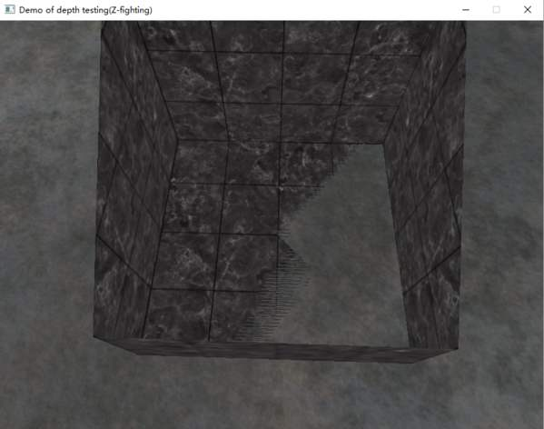

<head>
    <script src="https://cdn.mathjax.org/mathjax/latest/MathJax.js?config=TeX-AMS-MML_HTMLorMML" type="text/javascript"></script>
    <script type="text/x-mathjax-config">
        MathJax.Hub.Config({
            tex2jax: {
            skipTags: ['script', 'noscript', 'style', 'textarea', 'pre'],
            inlineMath: [['$','$']]
            }
        });
    </script>
</head>

## 深度缓冲

OpenGL是一个右手坐标系。简单来说，就是正x轴在你的右手边，正y轴朝上，而正z轴是朝向后方的。想象你的屏幕处于三个轴的中心，则正z轴穿过你的屏幕朝向你。在OpenGL中采用z坐标来描述深度信息。一般地，z轴的坐标原点在屏幕上，屏幕里为负轴，向外为正轴。OpenGL中的观察者为摄像机。一般地，摄像机的初始位置在OpenGL窗口的正中心。


<center>图 1 坐标系定义</center>

OpenGL在绘制图形时，有些图形在前，有些图形在后，这时候就用到了z坐标。当然，并不一定图形1的z坐标大于图形2的z坐标，就说图形1会绘制在图形2的前面，因为图形的前后顺序决于我们的观察平面，即摄像机的位置。

**深度缓冲**（Depth Buffer）的原理就是把一个距离观察平面的深度值与窗口的每个像素相关联。在场景绘制时，在片段着色器中，如果遇到两个像素在屏幕上坐标相同的情况，在绘制前将会比较两者的深度（Z值），以判断两者之间谁离观察者更近。如果新的像素深度值大于旧的顶点，则以新像素覆盖原有像素；反之则放弃绘制新像素，保留原有像素。这个比较的过程称为深度测试(deepth testing)。

深度缓冲是由窗口系统自动创建的，它会以16、24或32位float的形式储存它的深度值。在大部分的系统中，深度缓冲的精度都是24位的。深度缓冲包含了一个介于0.0和1.0之间的深度值，它将会与观察者视角所看见的场景中所有物体的z值进行比较。观察空间的z值可能是投影平截头体的近平面(Near)和远平面(Far)之间的任何值。我们需要一种方式来将这些观察空间的z值变换到[0, 1]范围之间，其中的一种方式就是将它们线性变换到[0, 1]范围之间。下面这个（线性）方程将z值变换到了0.0到1.0之间的深度值[[1](#ref1)]：


$$
F_{depth}=\frac{z-near}{far-near}
$$

这里的$near$和$far$值是我们之前提供给投影矩阵设置可视平截头体的近平面（near plane）和远平面（far plane）。这个方程需要平截头体中的一个$z$值，并将它变换到了$[0, 1]$的范围中。可以看出，这个方程计算得到的深度值是线性的，然而，在实践中是几乎永远不会使用这样的线性深度缓冲（Linear Depth Buffer）的。


<center>图 2 平截头体和远/近平面</center>

要想有正确的投影性质，需要使用一个非线性的深度方程，它是与$ 1/z$ 成正比的。它做的就是在$z$值很小的时候提供非常高的精度，而在$z$值很远的时候提供更少的精度。花时间想想这个：我们真的需要对1000单位远的深度值和只有1单位远的充满细节的物体使用相同的精度吗？线性方程并不会考虑这一点。

考虑一种深度缓冲与$z$成反比的非线性方程如下：


由于深度值与$ 1/z$ 成正比，在1.0和2.0之间的z值将会变换至1.0到0.5之间的深度值，这就是一个float提供给我们的一半精度了，这在z值很小的情况下提供了非常大的精度，而在$z$值很大时，比如$z$在50.0和100.0之间的z值将会只占2%的float精度，这正是我们所需要的。也就是说，深度值很大一部分是由很小的$z$值所决定的，这给了近处的物体很大的深度精度（靠近相机的地方精度更高）。

## 深度冲突

非线性深度缓冲在大多数场景中已经足够应用。然而，当两个模型间相距很近、或需要渲染大尺度场景（比如行星际场景）时，使用上述非线性深度缓冲会出现一个很严重的问题——**深度冲突（z-fighting）**。



<center>图 3 深度冲突</center>

比如在太阳系场景渲染中，一般需要同时渲染尺寸巨大距离遥远的行星（比如真实绕地飞行的月球）和体型相对很小的人造卫星。此时，需要设置很大的远平面值以保证极远处的物体能够得以渲染，设置很小的近平面值保证距离摄像机很近的物体也能够得以渲染。此时，若两个物体在距离摄像机较远，就没有足够的精度用于判断其远近。两个物体在同一个像素生成的渲染结果很容易对应到一个相同的z值，渲染器就不知道哪个物体在前，哪个物体在后，于是便开始“胡作非为”，这次让这个物体的这个像素在前面，下次让那个物体的这个像素在前面，于是模型的重叠部位便不停的闪烁起来。这便是深度冲突问题。

可采用以下措施来减缓深度冲突：

* **多边形偏移（Polygon_Offset）**：永远不要把多个物体摆得太靠近，以至于它们的一些三角形会重叠。通过在两个物体之间设置一个用户无法注意到的偏移值，你可以完全避免这两个物体之间的深度冲突。以放在地板上的一个箱子为例，我们可以将箱子朝上（沿着正y轴）稍微移动一点。箱子位置的这点微小改变将不太可能被注意到，但它能够完全减少深度冲突的发生。然而，这需要对每个物体都手动调整，并且需要进行彻底的测试来保证场景中没有物体会产生深度冲突。
* **近平面调整**：尽可能将近平面设置远一些。在前面我们提到了精度在靠近**近**平面时是非常高的，所以如果我们将**近**平面远离观察者，我们将会对整个平截头体有着更大的精度。然而，将近平面设置太远将会导致近处的物体被裁剪掉，所以这通常需要实验和微调来决定最适合你的场景的**近**平面距离。
* **提高深度缓冲精度**：牺牲一些性能，使用更高精度的深度缓冲。大部分深度缓冲的精度都是24位的，但现在大部分的显卡都支持32位的深度缓冲，这将会极大地提高精度。所以，牺牲掉一些性能，你就能获得更高精度的深度测试，减少深度冲突。

上述三个技术是最普遍也是很容易实现的抗深度冲突技术了。然而，上述措施只能减缓深度冲突问题，并不能够完全消除。还有一些更复杂的技术，但它们依然不能完全消除深度冲突：

* 多平截头体渲染（Multi-Frustums Rendering）
* 对数深度缓冲（Logarithmic Depth Buffer)

多边形平移需要手动设置每个可能发生深度冲突的模型，当模型很多时手动设置的工作量巨大。

多平截头体渲染需要根据所渲染的场景的尺寸，设置若干个平截头体，渲染工作量大，平截头体交汇处可能存在渲染问题。

## 对数深度缓冲

**对数深度缓冲**（Logarithmic Depth Buffer）使得大尺寸场景（比如行星际尺寸）能够按照真实比例渲染，而**几乎**不会出现因精度不足导致的深度冲突现象。公式如下[[2](#ref2)]：

}}{log(C \cdot far+1)}-1])

其中，$C$是常量。不同的$C$值会影响深度的精度；$w$是```gl_Position.w```。

相应的代码实现如下。顶点着色器中：

```glsl
// vertex shader
out float logz;
in float far;
void main()
{
    ...
    float C = 1;
    float FC = 1.0 / log(far * C + 1);
	logz = log(gl_Position.w * C + 1) * FC;
    gl_Position.z = (2 * logz - 1) * gl_Position.w;
}
```

片段着色器中：

```glsl
// fragment shader
in float logz;
void main()
{
    ...
    gl_FragDepth = logz;
}
```

可对上述代码进行进一步优化[[3](#ref3)]：

- **使用 log2 代替 log**: 因为在着色器中，log 是基于 log2 实现的，因此直接使用 log2 避免额外的计算；
- **避免裁剪问题**: 当数值小于等于 0 时，log 函数没有定义。当三角形的某个顶点超出相机平面时 (≤ -1)，会导致该三角形在裁剪之前就被整个删除。将 log 函数的输入值限定在```max(1e-6, 1.0 + gl_Position.w)```可以避免这个问题；
- **移除常数```C```**：常数```C```用来调整近端的精度，但因为一般情况下```C=1```时的精度已经足够使用，因此将其移除。

最终优化的代码如下。顶点着色器中：

```glsl
// vertex shader
out float flogz;
out float Fcoef;
in float far;
...
void main()
{
    ...
	Fcoef = 2.0 / log2(far + 1.0);
	flogz = 1.0 + gl_Position.w;
	gl_Position.z = log2(max(1e-6, flogz)) * Fcoef - 1.0;
	gl_Position.z *= gl_Position.w;
}
```

片段着色器中：

```glsl
// vertex shader
out float logz;
in float far;
...
void main()
{
    ...
    gl_FragDepth = log2(flogz) * Fcoef * 0.5;
}
```

值得注意的是，在某些极端场景下[[4](#ref4)]，单纯采用对数深度缓冲仍然会存在深度冲突（如从极远的距离观看极大尺寸的三角面）。此时可以采取“多平截头体渲染+对数深度缓冲”二者混合的模式（Hybrid Multi-Frustum Logarithmic Depth Buffer）来渲染场景。

## 参考文献

<span id="ref1">[1]</span>	LearnOpenGL. [Depth Testing](https://learnopengl-cn.github.io/04%20Advanced%20OpenGL/01%20Depth%20testing/)

<span id="ref2">[2]</span>	Outerra. [Maximizing Depth Buffer Range and Precision](https://outerra.blogspot.com/2012/11/maximizing-depth-buffer-range-and.html)

<span id="ref3">[3]</span>	Outerra. [Logarithmic depth buffer optimizations & fixes](https://outerra.blogspot.com/2013/07/logarithmic-depth-buffer-optimizations.html)

<span id="ref4">[4]</span>	Cesium. [Hybrid Multi-Frustum Logarithmic Depth Buffer](https://cesium.com/blog/2018/05/24/logarithmic-depth/)

[5]	sirlis. [Logarithmic Depth Buffer in OpenGL with glad/glfw](https://stackoverflow.com/questions/61967926/logarithmic-depth-buffer-in-opengl-with-glad-glfw)