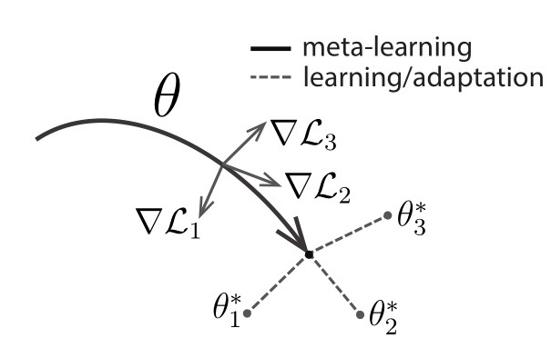
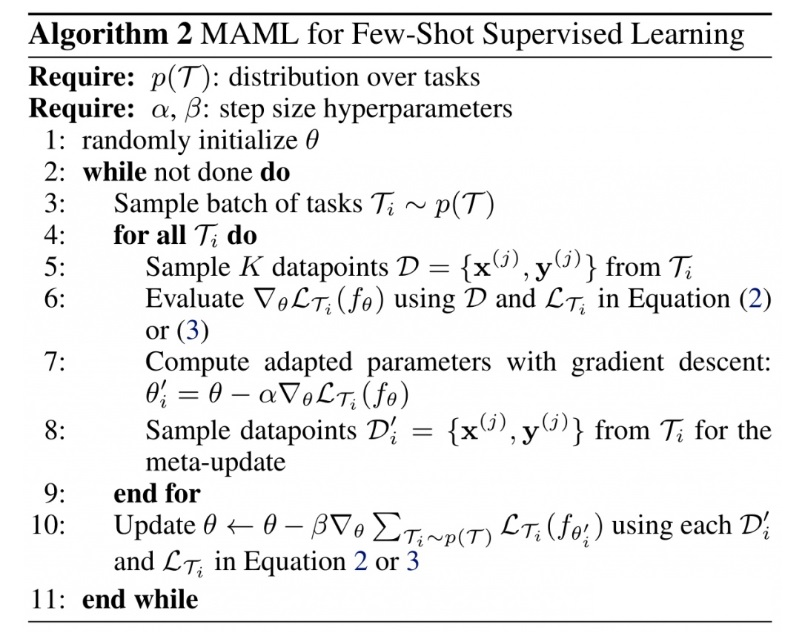
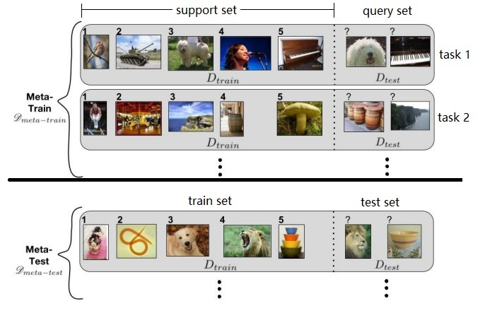

MAML 是2017年 Chelsea Finn 大佬提出的一种基于优化（Optimized-based）的小样本学习方法，核心在两个不同的数据集中分别计算梯度和更新参数。

<!--more-->

---

- [1. MAML](#1-maml)
  - [1.1. 算法](#11-算法)
  - [1.2. 梯度下降数学分析](#12-梯度下降数学分析)
  - [1.3. 基于优化的元学习目标](#13-基于优化的元学习目标)
  - [1.4. MAML数学分析](#14-maml数学分析)
  - [1.5. FOMAML](#15-fomaml)
  - [1.6. 缺点](#16-缺点)
- [2. 各类实现](#2-各类实现)
- [3. 参考文献](#3-参考文献)

# 1. MAML

2017.《Model-Agnostic Meta-Learning for Fast Adaptation of Deep Networks》

> The key idea underlying our method is to **train the model's initial parameters** such that the model has maximal performance on a new task after the parameters have been updated through one or more gradient steps computed with a small amount of data from that new task.

本文的设想是**训练一组初始化参数**，通过在初始参数的基础上进行一或多步的梯度调整，来达到**仅用少量数据就能快速适应新task**的目的。为了达到这一目的，训练模型需要最大化新task的loss function的参数敏感度（*maximizing the sensitivity of the loss functions of new tasks with respect to the parameters*），当敏感度提高时，极小的参数（参数量）变化也可以对模型带来较大的改进。本文提出的算法可以适用于多个领域，包括少样本的回归、图像分类，以及增强学习，并且使用更少的参数量达到了当时（2017年）最先进的专注于少样本分类领域的网络的准确率。

核心算法示意图如下

如上图所示，作者便将目标设定为，通过梯度迭代，找到对于task敏感的参数 $\theta$ 。训练完成后的模型具有对新task的学习域分布最敏感的参数，因此可以在仅一或多次的梯度迭代中获得最符合新任务的  $\theta^*$  ，达到较高的准确率。

## 1.1. 算法

假设这样一个监督分类场景，目的是训练一个数学模型 $M_{fine-tune}$ ，对未知标签的图片做分类，则两大步骤如下：

1. 利用某一批数据集训练元模型 $M_{meta}$ 
2. 在另外一批数据集上精调（fine-tune）得到最终的模型 $M_{fine-tune}$ 。

MAML在监督分类中的算法伪代码如下：

该算法是 meta-train 阶段，目的是得到 $M_{meta}$。下面进行详细分析：

参考示意图如下，一个 task 表示为 $\mathcal T$

**第一个Require**，假设我们有一个很大的图像池，里面有很多很多类别的图像，每类图像有几十个。我们从中随机抽取五个类别，形成一个 task $\mathcal T$，如此反复随机抽取可以得到一批（e.g. 1000个）task 作为训练集 $p(\mathcal T)$。假设一个 $\mathcal T$ 包含5类，每类20个样本，随机选5样本作为support set，剩余15样本为query set。

> 训练样本就这么多，要组合形成那么多的task，岂不是不同task之间会存在样本的重复？或者某些task的query set会成为其他task的support set？没错！就是这样！我们要记住，MAML的目的，在于fast adaptation，即通过对大量task的学习，获得足够强的泛化能力，从而面对新的、从未见过的task时，通过fine-tune就可以快速拟合。task之间，只要存在一定的差异即可。

**第二个Require**，step size 就是学习率，MAML 是基于二重梯度（gradient by gradient），每次迭代有两次参数更新过程，所以有两个学习率可以调整。

**1**：随机初始化模型参数 $\theta$；

**2**：循环，对于每个epoch，进行若干batch；

**3**：随机选取若干个（比如4个） $\mathcal T$  形成一个batch；

**4**：对于每个batch中的第 $i$ 个 $\mathcal T$ ，进行**第一次**梯度更新*「inner-loop 内层循环」*。

**5**：选取 $\mathcal T_i$ 中的 **support set**，共  $N\cdot K$个样本（5-way 5-shot=25个样本）

**6**：计算每个参数的梯度。原文写对每一个类下的 $K$ 个样本做计算。实际上参与计算的总计有 $N\cdot K$ 个样本。这里的loss计算方法，在回归问题中就是MSE；在分类问题中就是cross-entropy；

**7**：进行第一次梯度更新得到 $\theta'$，可以理解为对 $\mathcal T_i$ 复制一个原模型 $f(\theta)$ 来更新参数；

**8**：挑出训练集中的 query set 数据用于后续二次梯度更新；

**9**：完成第一次梯度更新。

**10**：进行**第二次**梯度更新，此时计算出的梯度直接通过GD作用于原模型上，用于更新其参数。*「outer-loop 外层循环」*

大致与步骤 **7** 相同，但是不同点有三处：

- 隐含了**二重梯度**，需要计算 $\mathcal L_{T_i}f(\theta')$ 对 $\theta$ 的导数，而 $\mathcal L_{T_i}f(\theta')$ 是 $\theta'$ 的函数， $\theta'$ 又是 $\theta$ 的函数（见步骤**7**）；

- 不再分别利用每个 $\mathcal T$ 的loss更新梯度，而是计算一个 batch 中模型 $L_{T_i}f(\theta')$ 的 loss 总和进行梯度下降；

- 参与计算的样本是task中的 **query set**（5way*15=75个样本），目的是增强模型在task上的泛化能力，避免过拟合support set。

**11**：结束在该batch中的训练，回到步骤**3**，继续采样下一个batch。

**总结**：MAML使用训练集优化内层循环，使用测试集优化模型，也就是外层循环。外层循环需要计算**二重梯度（gradient by gradient）**。

## 1.2. 梯度下降数学分析

定义神经网络模型的初始的参数为

$$
\boldsymbol{\theta} = [\theta_1,\theta_2,...,\theta_n]^T
$$

假设随机选取的一批任务为 $\tau$，包含 10 个样本，每个样本输入 6 个量，输出 4 个量。神经网络即为一个 6 输入 2 输出的网络。

样本输入矩阵为（行是样本，列是输入维度）

$$
\boldsymbol M_{in} = \begin{bmatrix}
 ^1x_1&  ^1x_2&  \cdots& ^1x_6\\ 
 ^2x_1&  ^2x_2&  \cdots& ^2x_6 \\ 
 \vdots& \vdots & \ddots & \vdots\\ 
 ^{10}x_1& ^{10}x_2&  \cdots& ^{10}x_6
\end{bmatrix}
$$

同理，输出矩阵为

$$
\boldsymbol M_{out} = \begin{bmatrix}
 ^1y_1&  ^1y_2&  \cdots& ^1y_4\\ 
 ^2y_1&  ^2y_2&  \cdots& ^2y_4 \\ 
 \vdots& \vdots & \ddots & \vdots\\ 
 ^{10}y_1& ^{10}y_2&  \cdots& ^{10}y_4
\end{bmatrix}
$$

对于参数为 $\boldsymbol \theta$ 的模型，其预测输出矩阵为

$$
\boldsymbol M_{pred}(\boldsymbol \theta) = \begin{bmatrix}
 ^1\hat{y}_1(\boldsymbol \theta)&  ^1\hat{y}_2(\boldsymbol \theta)&  \cdots& ^1\hat{y}_4(\boldsymbol \theta)\\ 
 ^2\hat{y}_1(\boldsymbol \theta)&  ^2\hat{y}_2(\boldsymbol \theta)&  \cdots& ^2\hat{y}_4(\boldsymbol \theta) \\ 
 \vdots& \vdots & \ddots & \vdots\\ 
 ^{10}\hat{y}_1(\boldsymbol \theta)& ^{10}\hat{y}_2(\boldsymbol \theta)&  \cdots& ^{10}\hat{y}_4(\boldsymbol \theta)
\end{bmatrix}
$$

定义一个损失函数 $L_\tau$ 来衡量模型在任务 $\tau$ 上的性能（即模型预测输出与期望输出间的距离），可以采用 MSE 来表征，注意到损失函数是关于模型参数的函数

$$
L_\tau(\boldsymbol \theta) = MSE_\tau = \frac{1}{10\cdot4} \cdot [\frac{1}{2} \sum_i^{10} \sum_j^{4}(^i\hat{y}_j(\boldsymbol \theta) - {}^iy_j)^2]
$$

如何使得模型的预测输出与期望输出的距离变小呢？按照梯度下降方法（GD），我们可以计算损失函数 $L_\tau(\boldsymbol \theta)$ 关于模型参数 $\boldsymbol \theta$ 的梯度，然后沿着这个梯度的负方向更新模型参数即可。

假设损失函数关于模型参数的梯度为 $\boldsymbol g$，则

$$
\begin{aligned}
\boldsymbol g = \nabla_{\boldsymbol \theta} L_\tau(\boldsymbol \theta) = \frac{\partial L_\tau(\boldsymbol \theta)}{\partial \boldsymbol \theta} = \begin{bmatrix}
\partial L_\tau(\boldsymbol \theta) / \partial \theta_1\\ 
\partial L_\tau(\boldsymbol \theta) / \partial \theta_2\\ 
\vdots\\ 
\partial L_\tau(\boldsymbol \theta) / \partial \theta_n
\end{bmatrix}
\end{aligned}
$$

我们可以计算1次梯度下降，也可以计算多次。假设 $\boldsymbol g_1$ 是在原始模型参数上进行第1次梯度计算，有

$$
\begin{aligned}
\boldsymbol g_1 & =  \nabla_{\boldsymbol \theta} L_\tau(\boldsymbol \theta_0)\\
\boldsymbol \theta_1 &= \boldsymbol \theta_0 - \alpha \boldsymbol g_1
\end{aligned}
$$

其中，$\boldsymbol \theta_1$ 表示经过1次梯度更新后的模型参数，后文以此类推。

第2次梯度计算建立在第1次梯度计算的基础上，有

$$
\begin{aligned}
\boldsymbol g_2 &= \nabla_{\boldsymbol \theta_1} L_\tau(\boldsymbol \theta_1)\\
\boldsymbol \theta_2 &= \boldsymbol \theta_1 - \alpha \boldsymbol g_2\\
& = \boldsymbol \theta_0 - \alpha \boldsymbol g_1 - \alpha \boldsymbol g_2
\end{aligned}
$$

我们将1次，2次，...，直到 $k$ 次梯度计算的过程统一列写如下：

$$
\begin{aligned}
initialization:\quad&\boldsymbol \theta_0 = \boldsymbol \theta\\
1^{st}\;gradient\;step:\quad&\boldsymbol \theta_1 = U^1_\tau(\boldsymbol \theta)=\boldsymbol \theta - \alpha \boldsymbol g_1\\
2^{nd}\;gradient\;step:\quad&\boldsymbol \theta_2 = U^2_\tau(\boldsymbol \theta)=\boldsymbol \theta- \alpha \boldsymbol g_1- \alpha \boldsymbol g_2\\
...&...\\
k^{th}\;gradient\;step:\quad&\boldsymbol \theta_k = U^k_\tau(\boldsymbol \theta)=\boldsymbol \theta- \alpha \boldsymbol g_1- \alpha \boldsymbol g_2-...- \alpha \boldsymbol g_k\\
&\boldsymbol g_k = \nabla_{\boldsymbol \theta_{k-1}} L_\tau(\boldsymbol \theta_{k-1})
\end{aligned}
$$

其中，模型参数 ${}^k_\tau\boldsymbol \theta$ 表示模型参数已经在任务数据 $\tau$ 上经过 $k$ 次更新，$U^k_\tau$ 是一个梯度算子，定义为在数据 $\tau$ 进行 $k$ 次更新，$U^k_\tau(\boldsymbol \theta)={}^{k}_\tau \boldsymbol \theta$。

## 1.3. 基于优化的元学习目标

MAML 的目标是：找寻一组**模型初始参数** $\boldsymbol \theta$，使得模型在面对随机选取的新任务 $\tau$ 时，经过 $k$ 次梯度更新，在 $\tau$ 上的损失函数就能达到很小。

> We consider the optimization problem of MAML: find an initial set of parameters, $\boldsymbol \theta$, such that for a randomly sampled task $\tau$ with corresponding loss $L_\tau$, the learner will have low loss after $k$ updates. --------[Reptile]

用数学语言描述，即

$$
\begin{aligned}
\mathop{minimize}_{\theta} \; \mathbb E_{\tau}[L_{\tau}(^{k}_\tau\boldsymbol \theta)]
= \mathop{minimize}_{\theta} \; \mathbb E_{\tau}[L_{\tau}(U^k_\tau(\boldsymbol \theta))]
\end{aligned}
$$

其中，${}^{k}_\tau \boldsymbol \theta$ 是在任务 $\tau$ 上经过 $k$ 次更新后的模型参数。在前面的梯度数学分析中，我们省略了下标 $\tau$，因为梯度计算和损失函数计算默认都是对同一批数据，但是在这里加上下标，是因为后面 MAML 并不在同一批数据上计算梯度和计算损失函数，需要下标做区分。

这里说的是 MAML 的目标，是因为截至 MAML 文章发表，人们还没有建立起元学习的框架概念，后来人们将 MAML 等寻找最优模型初始参数的方法称作 **基于优化的元学习问题**（Optimization-based Meta-Learning）的方法，上述数学描述也就成为整个问题的共同目标。

## 1.4. MAML数学分析

假设任务 $\tau$ 可以分解为两个互不相交的数据子集 A（比如包含7个样本） 和 B（包含3个样本），MAML 通过进行 $k=1$ 次梯度算子更新，将上述问题转化为如下问题。省略 $U$ 的上标 $k$，有

$$
\begin{aligned}
\mathop{minimize}_{\theta} \; \mathbb E_{\tau}[L_{B}(U_{A}(\boldsymbol \theta))]
\end{aligned}
$$

即 MAML 在数据集 A 上训练，在数据集 B 上计算损失函数 $L_{B}(U_{A}(\boldsymbol \theta))$，使得其最小。

MAML 中只进行 $k=1$ 次梯度算子更新，作者号称有如下四个原因：

- Meta Learning会快很多；

- 如果能让模型只经过一次梯度下降就性能优秀，当然很好；

- Few-shot learning的数据有限，多次梯度下降很容易过拟合；

- 刚才说的可以在实际应用中多次梯度下降。

**为了使损失函数最小，需要计算损失函数对模型原始参数 $\boldsymbol \theta$ 的梯度 $\boldsymbol g_{MAML}$，然后在梯度负方向更新参数。** 即

$$
\boldsymbol g_{MAML} = \nabla_{\boldsymbol \theta} L_{B}(U_{A}(\boldsymbol \theta))
$$

注意到

$$
U^{k=1}_\tau(\boldsymbol \theta)={}\tau \boldsymbol \theta_1
$$

省略 $k$，那么

$$
\begin{aligned}
\boldsymbol g_{MAML} &= \nabla_{\boldsymbol \theta} L_{B}(U_{A}(\boldsymbol \theta))= \frac{\partial}{\partial \boldsymbol \theta} L_{B}(U_{A}(\boldsymbol \theta))\\
&= L_{B}'({}_{A}\boldsymbol \theta_1) U_{A}'(\boldsymbol \theta)\quad where \quad {}_{A} \boldsymbol \theta_1 = U_{A}(\boldsymbol \theta)
\end{aligned}
$$

上式中，第一项是使用 A 数据进行一次梯度更新后的模型参数计算损失函数，然后在 B 数据上计算损失函数的导数，这里的导数是对更新后的模型参数求的，因此这一项比较好求。

下面计算第二项 $U'_{A}(\boldsymbol \theta)$。前面算子更新时我们知道

$$
U^1_\tau(\boldsymbol \theta)=\boldsymbol \theta - \alpha \boldsymbol g_1
$$

那么有

$$
U_{A}'(\boldsymbol \theta) = \frac{\partial U_{A}(\boldsymbol \theta)}{\partial \boldsymbol \theta}= \frac{\partial \boldsymbol \theta}{\partial \boldsymbol \theta}-\alpha \frac{\partial \boldsymbol g_1}{\partial \boldsymbol \theta}
$$

下面分析第一项 $\frac{\partial \boldsymbol \theta}{\partial \boldsymbol \theta}$ 的展开，注意到 $\boldsymbol \theta = [\theta_1,\theta_2,...,\theta_n]^T$ 的定义，那么该项展开即为 $\boldsymbol \theta$ 的每个分量对其自身求偏导，需要分情况讨论

$$
\begin{aligned}
\frac{\partial \theta_i}{\partial \theta_j} = \left\{\begin{matrix}
1 \quad i=j\\ 
0 \quad i \neq j
\end{matrix}\right.
\end{aligned}
$$

那么第一项即为 $n\times n$ 单位阵（可以看作一个特殊的 Jacobian 矩阵）

$$
\begin{aligned}
\frac{\partial \boldsymbol \theta}{\partial \boldsymbol \theta} = 
\begin{bmatrix}
1\;0\;\cdots \; 0\\
0\;1\;\cdots \; 0\\
\vdots\;\vdots\;\ddots \; \vdots\\
0\;0\;\cdots \; 1
\end{bmatrix} = \boldsymbol I_{n \times n}
\end{aligned}
$$

然后分析第二项的展开。根据前文知

$$
\begin{aligned}
\boldsymbol g_1 = \frac{\partial L_\tau(\boldsymbol \theta)}{\partial \boldsymbol \theta} = \begin{bmatrix}
\partial L_\tau(\boldsymbol \theta) / \partial \theta_1\\ 
\partial L_\tau(\boldsymbol \theta) / \partial \theta_2\\ 
\vdots\\ 
\partial L_\tau(\boldsymbol \theta) / \partial \theta_n
\end{bmatrix}
\end{aligned}
$$

代入第二项有

$$
\begin{aligned}
\alpha \frac{\partial \boldsymbol g_1}{\partial \boldsymbol \theta} &= \alpha \frac{\partial L_\tau(\boldsymbol \theta)}{\partial \boldsymbol \theta} / \partial \boldsymbol \theta\\
& = \alpha \begin{bmatrix}
\partial L_\tau(\boldsymbol \theta) / \partial \theta_1\\ 
\partial L_\tau(\boldsymbol \theta) / \partial \theta_2\\ 
\vdots\\ 
\partial L_\tau(\boldsymbol \theta) / \partial \theta_n
\end{bmatrix} / \partial \boldsymbol \theta\\
& = \alpha \begin{bmatrix}
    \partial (\frac{\partial L_{A}}{\partial \theta_1}) / \partial \theta_1 &  \partial (\frac{\partial L_{A}}{\partial \theta_1}) / \partial \theta_2&  \cdots & \partial (\frac{\partial L_{A}}{\partial \theta_1}) / \partial \theta_n \\ 
    \partial (\frac{\partial L_{A}}{\partial \theta_2}) / \partial \theta_1 &  \partial (\frac{\partial L_{A}}{\partial \theta_2}) / \partial \theta_2&  \cdots & \partial (\frac{\partial L_{A}}{\partial \theta_2}) / \partial \theta_n \\ 
    \vdots & \vdots & \ddots & \vdots\\
    \partial (\frac{\partial L_{A}}{\partial \theta_n}) / \partial \theta_1 &  \partial (\frac{\partial L_{A}}{\partial \theta_n}) / \partial \theta_2&  \cdots & \partial (\frac{\partial L_{A}}{\partial \theta_n}) / \partial \theta_n \\ 
    \end{bmatrix}_{n \times n}\\
&= \alpha \begin{bmatrix}
    \partial^2 L_{A} / \partial \theta_1^2 &  \partial^2 L_{A} /\partial \theta_1 \partial \theta_2 &  \cdots & \partial^2 L_{A} /\partial \theta_1 \partial \theta_n \\ 
    \partial^2 L_{A} /\partial \theta_2 \partial \theta_1 &  \partial^2 L_{A} / \partial \theta_2^2 &  \cdots & \partial^2 L_{A} /\partial \theta_2 \partial \theta_n \\ 
    \vdots & \vdots & \ddots & \vdots\\
    \partial^2 L_{A} /\partial \theta_n \partial \theta_1 &  \partial^2 L_{A} /\partial \theta_n \partial \theta_2&  \cdots & \partial^2 L_{A} / \partial \theta_n^2 \\ 
    \end{bmatrix}_{n \times n}\\
&= \alpha \boldsymbol H_{A}(\boldsymbol \theta)_{n \times n}
\end{aligned}
$$

（**向量对向量求偏导，是向量的每个分量对另一个向量的每个分量求偏导后形成矩阵，就是Hessian 矩阵！Hessian 等价于梯度的 Jacobian 矩阵。——Ian Goodfellow所著的《Deep Learning》的P78**）

最终计算得到的第二项 $U_{A}'(\boldsymbol \theta)$的表达式为

$$
\begin{aligned}
U_{A}'(\boldsymbol \theta) &= \frac{\partial U_{A}(\boldsymbol \theta)}{\partial \boldsymbol \theta}= \frac{\partial \boldsymbol \theta}{\partial \boldsymbol \theta}-\alpha \frac{\partial \boldsymbol g_1}{\partial \boldsymbol \theta}\\
&= \boldsymbol I_{n \times n} - \alpha \boldsymbol H_{A}(\boldsymbol \theta)_{n \times n}
\end{aligned}
$$

MAML 的作者表示，大部分计算量都在于计算 $H_{A}(\boldsymbol \theta)_{n \times n}$ 这个包含二重梯度的 Hessian 矩阵，导致 MAML 的计算量很大，使得 MAML 以难以训练成名。

那么当进行 $k>1$ 次梯度算子更新时又会怎样呢？（作者：我不要面子的？）

我们将1次，2次，...，直到 $k$ 次梯度计算的过程改写如下（注意到这里采用数据集 A 来更新参数 $\boldsymbol\theta$，但是在式中我们省略了左下标 A）：

$$
\begin{aligned}
initialization:\quad&\boldsymbol \theta_0 = \boldsymbol \theta\\
1^{st}\;gradient\;step:\quad&\boldsymbol \theta_1 = U^1_A(\boldsymbol \theta)=\boldsymbol \theta_0 - \alpha \boldsymbol g_1\\
2^{nd}\;gradient\;step:\quad&\boldsymbol \theta_2 = U^2_A(\boldsymbol \theta)=\boldsymbol \theta_1 - \alpha \boldsymbol g_2\\
...&...\\
k^{th}\;gradient\;step:\quad&\boldsymbol \theta_k = U^k_A(\boldsymbol \theta)=\boldsymbol \theta_{k-1}- \alpha \boldsymbol g_k\\
&\boldsymbol g_k = \nabla_{\boldsymbol \theta_{k-1}} L_\tau(\boldsymbol \theta_{k-1})
\end{aligned}
$$

在外循环中，假设只使用一个task来更新参数，省略求和号，有

$$
\boldsymbol \theta \leftarrow \boldsymbol \theta - \beta \cdot \boldsymbol g_{MAML}
$$

其中

$$
\begin{aligned}
\boldsymbol g_{MAML} &= \nabla_{\boldsymbol \theta} L_{B}(U^k_{A}(\boldsymbol \theta))\\
&= \nabla_{\boldsymbol \theta} L_{B}(\boldsymbol \theta_k)\\
&= \nabla_{\boldsymbol \theta_k} L_{B}(\boldsymbol \theta_k)\cdot(\nabla_{\boldsymbol \theta}\boldsymbol \theta_k)\\
&= \nabla_{\boldsymbol \theta_k} L_{B}(\boldsymbol \theta_k)\cdot(\nabla_{\boldsymbol \theta_{k-1}}\boldsymbol \theta_k) \cdots (\nabla_{\boldsymbol \theta_{1}}\boldsymbol \theta_2)\cdot (\nabla_{\boldsymbol \theta_{0}}\boldsymbol \theta_1)\\
&= \nabla_{\boldsymbol \theta_k} L_{B}(\boldsymbol \theta_k)\cdot\prod_{i=1}^k (\nabla_{\boldsymbol \theta_{i-1}}\boldsymbol \theta_i)\\
&= \nabla_{\boldsymbol \theta_k} L_{B}(\boldsymbol \theta_k)\cdot\prod_{i=1}^k (\nabla_{\boldsymbol \theta_{i-1}}(\boldsymbol \theta_{i-1}- \alpha \boldsymbol g_i))\\
&= \nabla_{\boldsymbol \theta_k} L_{B}(\boldsymbol \theta_k)\cdot\prod_{i=1}^k (\nabla_{\boldsymbol \theta_{i-1}}(\boldsymbol \theta_{i-1}- \alpha (\nabla_{\boldsymbol \theta_{i-1}} L_\tau(\boldsymbol \theta_{i-1})))\\
&= \nabla_{\boldsymbol \theta_k} L_{B}(\boldsymbol \theta_k)\cdot\prod_{i=1}^k (\boldsymbol I - \alpha \nabla_{\boldsymbol \theta_{i-1}} (\nabla_{\boldsymbol \theta_{i-1}} L_\tau(\boldsymbol \theta_{i-1})))\\
\end{aligned}
$$

当 $k=1$ 时我们发现，后面的连乘项就退化为前面已经推得的 Hessian 矩阵了

$$
\begin{aligned}
\prod_{i=1}^{k=1} (\boldsymbol I - \alpha \nabla_{\boldsymbol \theta_{i-1}} (\nabla_{\boldsymbol \theta_{i-1}} L_\tau(\boldsymbol \theta_{i-1}))) &= 
\boldsymbol I - \alpha \nabla_{\boldsymbol \theta_0} \nabla_{\boldsymbol \theta_0} L_\tau\boldsymbol (\theta_0)\\
& = \boldsymbol I - \alpha \boldsymbol H_{A}(\boldsymbol \theta)\\
\end{aligned}
$$

则

$$
\boldsymbol g_{MAML} = \nabla_{\boldsymbol \theta_k} L_{B}(\boldsymbol \theta_k) \cdot (\boldsymbol I - \alpha \boldsymbol H_{A}(\boldsymbol \theta))
$$

## 1.5. FOMAML

为了降低二重梯度导致的巨大计算量，作者提出了一种将二重梯度简化计算为一重梯度的方法，即 First-Order MAML (FOMAML)。

FOMAML 假设学习率 $\alpha \rightarrow 0^+$，则前面与 $\alpha$ 相乘的项（$k=1$ 时是 Hessian 矩阵，$k>1$ 时是连乘项）因为乘以 $0^+$ 被消去。那么整个 $U_{A}'(\boldsymbol \theta)$ 就等于单位阵了，

此时 FOMAML 的梯度即为

$$
\boldsymbol g_{FOMAML} = L'_{B}({}_A\boldsymbol \theta_k)=\nabla_{\boldsymbol \theta_k} L_{B}({}_A\boldsymbol \theta_k)
$$

也即仅用最后一次更新的模型参数 $_{A}\boldsymbol \theta_k$ 计算梯度。

那么，进行 $k=1$ 次梯度算子更新的 FOMAML 的实现过程就很简单了：

- 采样任务 $\tau$；
- 计算在数据集 A 上的梯度因子 $U^{k=1}_{A}(\boldsymbol \theta)= _{A} \boldsymbol \theta_1 = \phi$;
- 计算在数据集 B 上的损失函数 $L_{B}$ 对 $\phi$ 的（偏）导数：$g_{FOMAML}=\nabla_{\phi} L_{B}(\phi)$；
- 将 $g_{FOMAML}$ 插入外循环更新参数。

简化后的 FOMAML 模型参数更新式为：

$$
\begin{aligned}
\theta_i' \leftarrow \theta - \alpha \nabla_\theta L_{Ai}(\theta)\\
\theta \leftarrow \theta - \beta \nabla_{\theta'} \sum L_B(\theta')\\
\end{aligned}
$$

可以看出只需要计算一重梯度即可，作者在文中号称约节省了33%的计算量。

> This approximation removes the need for computing Hessian-vector products in an additional backward pass, which we found led to roughly 33% speed-up in network computation.

一阶近似的MAML可以看作是如下形式的参数更新：假设每个batch只有一个task，某次采用第m个task来更新模型参数，得到$\hat\theta^m$，再求一次梯度，沿着该梯度方向更新模型的原始参数$\phi$，将其从 $\phi^0$ 更新至 $\phi^1$，以此类推。

与之相比，右边是模型预训练方法，它是将参数根据每次的训练任务一阶导数的方向来更新参数。

## 1.6. 缺点

MAML的缺点[[2](#ref2)]：

1. Hard to train：paper中给出的backbone是4层的conv加1层linear，试想，如果我们换成16层的VGG，每个task在算fast parameter的时候需要计算的Hessian矩阵将会变得非常大。那么你每一次迭代就需要很久，想要最后的model收敛就要更久。

2. Robustness一般：不是说MAML的robustness不好，因为也是由一阶online的优化方法SGD求解出来的，会相对找到一个flatten minima location。然而这和非gradient-based meta learning方法求解出来的model的robust肯定是没法比的。

# 2. 各类实现

[dragen-1860 的 Pytorch 实现](https://github.com/dragen1860/MAML-Pytorch)：https://github.com/dragen1860/MAML-Pytorch

[Tensorflow实现](https://github.com/dragen1860/MAML-TensorFlow)：https://github.com/dragen1860/MAML-TensorFlow

# 3. 参考文献

[1]  [Rust-in](https://www.zhihu.com/people/rustinnnnn). [MAML 论文及代码阅读笔记](https://zhuanlan.zhihu.com/p/66926599).

[2] 人工智障. [MAML算法，model-agnostic metalearnings?](https://www.zhihu.com/question/266497742/answer/550695031)

[3] [Veagau](https://www.cnblogs.com/veagau/). [【笔记】Reptile-一阶元学习算法](https://www.cnblogs.com/veagau/p/11816163.html)

[4] [pure water](https://blog.csdn.net/qq_41694504). [Reptile原理以及代码详解](https://blog.csdn.net/qq_41694504/article/details/106750606)

[5] Tianhao Wei翻译自Lilian.[元学习：学习如何学习【译】](https://wei-tianhao.github.io/blog/2019/09/17/meta-learning.html)