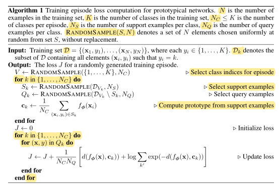

Prototypical Network 又称为原型网络，是2017年 NIPS 会议论文提出的一种神经网络训练方法，是一种基于度量（Metrix-based）的小样本学习方法，通过计算 support set 中的嵌入中心，然后通过衡量新样本与这些中心的距离来完成分类。

<!--more-->

---

- [1. Prototypical Network](#1-prototypical-network)
  - [1.1. 模型](#11-模型)
  - [1.2. 算法](#12-算法)
  - [1.3. 进行混合密度估计](#13-进行混合密度估计)
  - [1.4. 距离度量](#14-距离度量)
- [2. 参考文献](#2-参考文献)

# 1. Prototypical Network

2017.《Prototypical Networks for Few-shot Learning》

本文是2017年NIPS的会议论文，作者来自多伦多大学以及Twitter公司。在论文中作者提出了一种新的基于度量（Metric-based）的少样本学习模型——**原型网络（Prototypical Networks）**。原型网络首先利用 support  set 中每个类别提供的少量样本，计算它们的嵌入的中心，作为每一类样本的**原型（Prototype）**，接着基于这些原型学习一个度量空间，使得新的样本通过计算自身嵌入与这些原型的距离实现最终的分类，思想与聚类算法十分接近，但出发点有着很大的差异。除此之外，作者在文章中还尝试将原型网络应用于**零样本学习（Zero-shot learning）**问题上，通过数据集携带的属性向量形成**元数据（meta-data）**，基于这些元数据构建原型，从而实现零样本分类。

原型网络在少样本分类与零样本分类任务上的示意图如下所示。

## 1.1. 模型

在 few-shot 分类任务中，假设有 $N$ 个标记的样本 $S=\{(x_1,y_1),...,(x_N,y_N)\}$ ，其中 $x_i \in \mathbb R^D$ 是 $D$ 维的样本特征向量，$y \in \{1,...,K\}$ 是相应的 label 。$S_K$ 表示第 $k$ 类样本的集合。

原型网络计算每个类的 $M$ 维原型向量 $c_k \in \mathbb R^M$ ，计算的函数为 $f_{\phi}: \mathbb R^D \rightarrow \mathbb R^M$ ，其中 $\phi$ 为可学习参数。原型向量 $c_k$ 即为 embedding space 中该类的所有 support set 样本点的均值向量

$$
c_k = \frac{1}{|S_K|} \sum_{(x_i,y_i) \in S_K} f_{\phi}(x_i)
$$

给定一个距离函数 $d: \mathbb R^M \times \mathbb R^M \rightarrow [0,+\infty)$ ，原型网络通过在 embedding space 中对距离进行 **softmax** 计算，可以得到一个针对 $x$ 的样本点的概率分布

$$
p_{\phi}(y=k|x)=\frac{exp(-d(f_{\phi},c_k))}{\sum_{k'}exp(-d(f_{\phi}(x),c_{k'}))}
$$

通过在 SGD 中最小化第 $k$ 类的负对数似然函数 $J(\phi)$ 来推进学习

$$
J(\phi) = -log\; p(\phi)(y=k|x)
$$

## 1.2. 算法

其中

- $N$ 是训练集中的样本个数；
- $K$ 是训练集中的类个数；
- $N_C \leq K$ 是每个 episode 选出的类个数；
- $N_S$ 是每类中 support set 的样本个数；
- $N_Q$ 是每类中 query set 的样本个数；
- $RANDOMSAMPLE(S,N)$ 表示从集合 S 中随机选出 N 个元素。

下面详细分析算法。

首先，算法输入训练集 $D=\{(x_1,y_1),...,(x_N,y_N)\}$，其中 $y_i$ 是标签，$D_k$ 则是标签 $y_i=k$ 的子训练集。算法输出损失函数 $J$。

在每个 episode 中：

第一步，从训练集中的 $K$ 个类中随机选取 $N_C$ 个类，形成子集 $V$；

第二步，对于 $V$ 中的每个类 $k$，相应的训练集为 $D_{Vk}$

- 随机选取 $D_{Vk}$ 中 $N_S$ 个样本作为 $S_k$ (support set)
- 剩余样本作为 $S_q$ (query set)
- 计算该类（第 $k$ 个类）的原型向量 $c_k$，公式如下

$$
c_k = \frac{1}{N_S} \sum_{(x_i,y_i) \in S_K} f_{\phi}(x_i)
$$

**注意，此处公式与原文不同，原文分母为 $N_C$ ，强烈怀疑写错了，因为本步中对单一类别的所有 support set 计算原型向量，应该通过除以support set 中的样本个数 $N_S$ 而不是类个数 $N_C$ 来计算均值。**

第二步完成后，可以得到每个类的原型向量。下面开始更新损失函数。

首先将损失函数 $J$ 初始化为0，然后进入两个 for 循环，对于每一个类别 $k$ 中的每一个 query set 中的每一个样本，采用下式更新 $J$

$$
J\leftarrow J+\frac{1}{N_C N_Q}[d(f_\phi(x),c_k)+log\sum_{k'} exp(-d(f_\phi(x),c_{k'}))]
$$

为便于理解，对于第 $k$ 类的第 $i$ 个样本，不妨假损失函数更新方向为

$$
^kA_i = d(f_\phi(x_i),c_k)+log\sum_{i=1}^{N_Q} exp(-d(f_\phi(x_i),c_{i}))
$$

则对于所有类别的所有 query set 的所有样本，最终 $J$ 的更新为以下形式

$$
J\leftarrow J+\frac{1}{N_C N_Q}({}^1A_1+{}^1A_2+...+{}^{N_C}A_{N_Q})
$$

可以看出，括号内总共有 $N_C N_Q$ 项，因此分母除以该值以求均值。

## 1.3. 进行混合密度估计

对于特定的距离函数，如 Bregman 散度，原型网络算法相当于对具有指数族密度的支持集进行混合密度估计。原型计算可以用支持集上的硬聚类来表示，每个类有一个簇，每个支持点都被分配给相应的类簇。

> the prototypical networks algorithm is equivalent to performing mixture density estimation on the support set with an exponential family density. Prototype computation can be viewed in terms of hard clustering on the support set, with one cluster per class and each support point assigned to its corresponding class cluster.

[如何理解Bregman divergence？]([https://www.zhihu.com/question/22426561/answer/209945856](https://links.jianshu.com/go?to=https%3A%2F%2Fwww.zhihu.com%2Fquestion%2F22426561%2Fanswer%2F209945856))

已被证明，对于 Bregman 散度，聚类的均值就是到各类特征的距离的极小值。也就是说，如果采用某个 Bregman 散度距离函数，原型计算 $c_k$ 等价于 support set 中样本标签的最优聚类表示。

任何正则指数分布都可以写为一个确定的正则 Bregman 散度。假设该正则指数分布为 $p_\psi(z\mid\theta)$ ，参数为 $\theta$，累积函数为 $\psi$，则有

$$
p_\psi(z\mid\theta) = exp\{z^T\theta-\psi (\theta) - g_\psi(z)\} = exp\{-d_\psi(z,\mu(\theta)) - g_\psi(z)\}
$$

算了算了后面看不懂了。。。

## 1.4. 距离度量

作者进行了进一步的分析，以确定距离度量和每Episode中训练classes的数量对原型网络和匹配网络的影响。

为了使这些方法更具有可比性，我们使用我们自己的匹配网络实现，它使用与我们的原型网络相同的嵌入架构。

在下图中，我们比较了余弦距离与欧式距离，5-way和20-way  training episodes。在1-shot和5-shot场景中，每个Episode每个类中有15个查询点。

注意到20-way比5-way获得了更高的准确率，并且推测20-way分类难度的增加有助于网络更好的泛化，因为它迫使模型在嵌入空间中做出更细粒度的决策。

此外，使用欧氏距离比预先距离大大提高了性能。这种效果对于原型网络更为明显，在这种网络中，将类原型作为嵌入支持点的平均值进行计算更适合于欧氏距离，因为余弦距离不是Bregman散度。

# 2. 参考文献

[1]  [Smiler_](https://blog.csdn.net/Smiler_). [《Prototypical Networks for Few-shot Learning 》论文翻译](https://blog.csdn.net/Smiler_/article/details/103133876).

