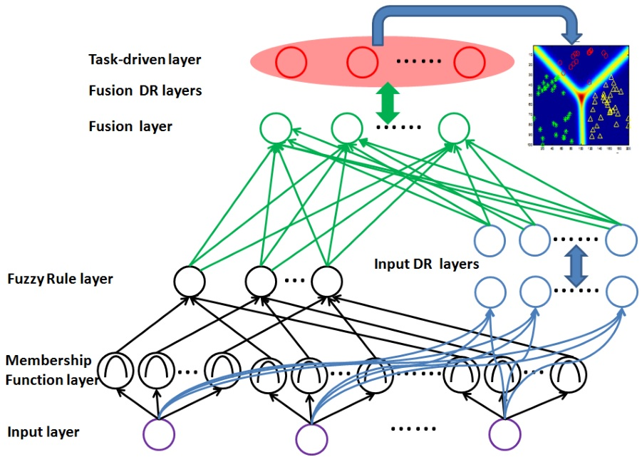

FDNN 于2016年由 Deng Yue 提出，是一种模糊深度神经网络的混合架构，在图像分类和区域划分方面优于传统的深度神经网络等多种方法。

<!--more-->

---

- [1. 网络架构](#1-网络架构)
  - [1.1. 模糊逻辑表示部分](#11-模糊逻辑表示部分)
  - [1.2. 神经表示部分](#12-神经表示部分)
  - [1.3. 混合部分](#13-混合部分)
  - [1.4. 任务驱动部分](#14-任务驱动部分)
  - [1.5. 总结](#15-总结)
- [2. 训练](#2-训练)
- [3. 参考文献](#3-参考文献)

# 1. 网络架构

2016.《A Hierarchical Fused Fuzzy Deep Neural Network for Data Classification》

混合架构由四部分组成：模糊逻辑表示部分（黑色）、神经表示部分（蓝色）、混合部分（绿色）、任务驱动部分（红色）。假设 $l$ 为层编号，$a_i^{(l)}$ 为第 $l$ 层第 $i$ 个神经元的输入，$o_i^{(l)}$ 为对应的输出。

假设我们输入的图像有 $k=15$ 个类别，每张图像有 $n=200$ 个特征，那么输入层维度为200，隶属度函数层维度为 $15\times 200$。输出层维度为15。

## 1.1. 模糊逻辑表示部分

输入层的每一个神经元均于多个隶属度函数相连接，隶属度函数用来表征任意输入元素的语言标签，这里的输入元素即输入层的单一神经元，也即输入向量的一个特征维度。

隶属度函数层将输入计算为属于某个模糊集的程度。文中采用高斯隶属度函数，将第 $i$ 个模糊神经元映射的第 $k$ 个输入转化为模糊度

$$
o_i^{(l)} = u_i(a_k^{(l)})=e^{-\frac{-(a_k^{(l)}-\mu_i)^2}{\sigma_i^2}},\forall i
$$

对于输入的每一个特征维度（$\forall n$），隶属度函数层均会计算其在每个类别（$k$）中的模糊度。

文中均值 $\mu$ 和方差 $\sigma$ 的选取遵循前人研究：

> C.-T. Lin, C.-M. Yeh, S.-F. Liang, J.-F. Chung, and N. Kumar, “Support-vector-based fuzzy neural network for pattern classification,” Fuzzy Systems, IEEE Transactions on, vol. 14, no. 1, pp. 31–41, 2006.

> F.-J. Lin, C.-H. Lin, and P.-H. Shen, “Self-constructing fuzzy neural network speed controller for permanent-magnet synchronous motor drive,” Fuzzy Systems, IEEE Transactions on, vol. 9, no. 5, pp. 751–759, 2001.

模糊规则层执行模糊 AND 逻辑，定义为求连乘，假设 $\Omega_i$ 是第 $l-1$ 层所有与第 $l$ 层第 $i$ 个神经元节点相连的神经元，有：

$$
o_i^{(l)} = \prod_j o_j^{(l-1)},\forall j\in \Omega_i
$$

连乘后的结果仍然是模糊度。

## 1.2. 神经表示部分

该部分用来将输入转化为某种高层表达，采用全连接神经网络，激活函数为Sigmoid，参数为权重和方差 $\theta^{(l)} = \{\boldsymbol w^{(l)},\boldsymbol b^{(l)}\}$，有

$$
o_i^{(l)} = \frac{1}{1+e^{-a_i^{(l)}}},\quad a_i^{(l)} = \boldsymbol w_i^{(l)}\boldsymbol o^{(l-1)} + \boldsymbol b_i^{(l)}
$$

## 1.3. 混合部分

该部分受到已有研究的启发，采用一个被广泛使用的多模型混合神经网络结构：

> J. Ngiam, A. Khosla, M. Kim, J. Nam, H. Lee, and A. Y. Ng, “Multimodal deep learning,” in Proceedings of the 28th International Conference on Machine Learning (ICML-11), 2011, pp. 689–696.

$$
\begin{aligned}
o_i^{(l)} &= \frac{1}{1+e^{-a_i^{(l)}}}\\
a_i^{(l)} &= (\boldsymbol w_d)_i^{(l)}(\boldsymbol o_d)^{(l-1)} + (\boldsymbol w_f)_i^{(l)}(\boldsymbol o_f)^{(l-1)} + \boldsymbol b_i^{(l)}
\end{aligned}
$$

其中，$\boldsymbol o_d$ 表示（深度）神经表示部分的输出，$\boldsymbol o_f$ 表示模糊逻辑表示部分的输出，二者通过权重$\boldsymbol w_d, \boldsymbol w_f$ 来混合。然后，混合后的信息，通过与神经表示部分类似的多层全连接层来进行更深度的变换，输出结果结合了模糊度和神经表达，而不再是模糊度。

## 1.4. 任务驱动部分

在该部分中，设置分类层，将混合表达信息对应到相应的分类中，采用softmax函数。假设 $(\boldsymbol f_i,y_i)$ 是第 $i$ 个输入以及其对应的标签， $\pi_\Theta(\boldsymbol f_i)$ 表示 FDNN 的前向传播过程，那么对于第 $c$ 个通道的 softmax 函数的计算过程如下

$$
\hat y_{(ic)} = p(y_i\vert\boldsymbol f_i) = \frac{e^{\boldsymbol w_c\pi_\Theta(\boldsymbol f_i)+b_c}}{\sum_c e^{\boldsymbol w_c\pi_\Theta(\boldsymbol f_i)+b_c}}
$$

其中，$\boldsymbol w_c, b_c$ 分别为第 $c$ 个类别的回归系数和回归偏差，$\hat \boldsymbol y=[\hat y_{i1},\cdots,\hat y_{ik}]$ 表示 $k$ 类的预测的标签输出。

在 $m$ 个训练样本上，采用 MSE 作为损失函数

$$
C = \frac{1}{m}\sum_i^m \vert\vert \hat \boldsymbol y_i-\boldsymbol y_i \vert\vert_2^2
$$

## 1.5. 总结

虽然有多种其它可选方法来提取深度混合信息，这里作者仍然倾向于使用模糊学习，原因有如下三点：

- 模糊学习可以方便的降低输入数据的不确定性，这种重要的模糊度降低追求是模糊系统不可或缺的特性，是其它学习系统无法替代的。
- 模糊学习自然会产生 $(0,1)$ 范围内的软逻辑值（模糊表示）。模糊量（原文`fusion`有误，应为`fuzzy`）和神经输出量在相同的范围内，使得这两种输出在融合部分很容易融合。
- 模糊学习部分允许任务驱动的参数学习。在这里，通过反向传播的智能数据驱动学习，可以代替精疲力竭的手工参数调整步骤。

# 2. 训练

两个主要步骤：初始化和微调。

分别对模糊逻辑表示部分和神经网络部分（包括神经表示、混合、任务驱动部分）进行初始化。

对于神经部分，所有神经元节点的 $b=0$。权重在以下区间内均匀采样随机初始化

$$
\omega_i^{(l)} \sim U[-\frac{1}{\sqrt n^{(l-1)}},\frac{1}{\sqrt n^{(l-1)}}]
$$

其中 $U$ 表示均匀分布，$n^{(l-1)}$ 表示第 $l-1$ 层的神经元节点个数。对于混合部分，$n^{(l-1)}$ 是上一层也即模糊表示部分的输出层和神经表示部分的输出层的神经元节点个数之和。

对于模糊表示部分，所有层（即隶属度层和模糊规则层）的权值均为1。隶属度函数层的神经元节点还包括两个额外的未知参数：第 $i$ 个模糊神经元节点的模糊中心 $\mu_i$ 和模糊宽度 $\sigma_i$。作者根据输入数据的 k-均值聚类结果（k与分类数相等），采用下面参考文献中的方法初始化这些参数。

> N. Kasabov and Q. Song, “Denfis: dynamic evolving neural-fuzzy inference system and its application for time-series prediction,” Fuzzy Systems, IEEE Transactions on, vol. 10, no. 2, pp. 144–154, Apr 2002.

作者采用著名的反向传播算法来计算所有参数的梯度，从而进行训练

$$
\frac{\partial C}{\partial \theta^{(l)}} = \sum_n (\frac{\partial C_n}{\partial o_i^{(l)}})\frac{\partial o_i^{(l)}}{\partial a_i^{(l)}}\frac{\partial a_i^{(l)}}{\partial \theta_i^{(l)}}
$$

其中，第一项被称为BP项，后两项是与层相关的求导项。神经表示部分、混合部分和任务驱动部分的神经元的反向传播求导，根据前面的式子，因为使用的激活函数和参数比较简单，因此求导很简单。

模糊表示部分，根据前面的式子，包括参数对 $\theta = (\mu_i,\sigma_i)$ （原文有误，写为了 $\theta = (m_i,\sigma_i)$），根据前面隶属度函数的定义，其对参数的导数也容易求得。

采用动量梯度下降法训练。

# 3. 参考文献

[1]  [Rust-in](https://www.zhihu.com/people/rustinnnnn). [MAML 论文及代码阅读笔记](https://zhuanlan.zhihu.com/p/66926599).

[2] 人工智障. [MAML算法，model-agnostic metalearnings?](https://www.zhihu.com/question/266497742/answer/550695031)

[3] [Veagau](https://www.cnblogs.com/veagau/). [【笔记】Reptile-一阶元学习算法](https://www.cnblogs.com/veagau/p/11816163.html)
