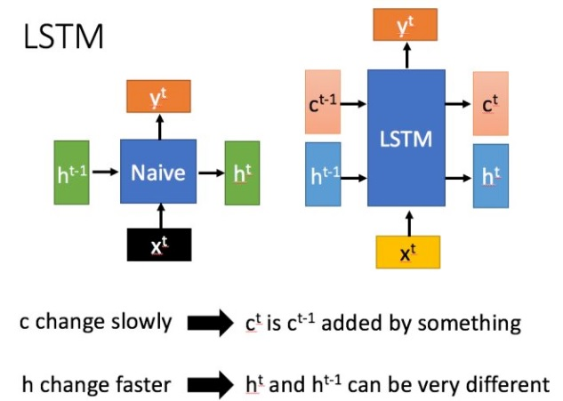

本文介绍了 RNN （循环神经网络）和 LSTM （长短时记忆网络）的基本概念。

<!--more-->

---

- [1. RNN](#1-rnn)
  - [1.1. 概念](#11-概念)
  - [1.2. 模型](#12-模型)
- [2. LSTM](#2-lstm)
  - [2.1. 概念](#21-概念)
- [3. 参考文献](#3-参考文献)

# 1. RNN

## 1.1. 概念

在前馈神经网络中，信息传递是单向的[[1](#ref1)]。前馈神经网络可以看作一个复杂的函数，每次输入都是独立的，即网络的输出只依赖于当前的输入．但是在很多现实任务中，网络的输出不仅和当前时刻的输入相关，也和其过去一段时间的输出相关。．此外，前馈网络难以处理时序数据，比如视频、语音、文本等．时序数据的长度一般是不固定的，而前馈神经网络要求输入和输出的维数都是固定的，不能任意改变．因此，当处理这一类和时序数据相关的问题时，就需要一种能力更强的模型．

循环神经网络（Recurrent Neural Network，RNN）是一类具有短期记忆能力的神经网络．在循环神经网络中，神经元不但可以接受其他神经元的信息，也可以接受自身的信息，形成具有环路的网络结构．和前馈神经网络相比，循环神经网络更加符合生物神经网络的结构．循环神经网络已经被广泛应用在语音识别、语言模型以及自然语言生成等任务上．

## 1.2. 模型

循环神经网络（Recurrent Neural Network，RNN）通过使用带自反馈的神经元，能够处理任意长度的时序数据。

给定一个输入序列 $\boldsymbol x_{1:T} = (\boldsymbol x_1,...,\boldsymbol x_t,...,\boldsymbol x_T)$，通过下面的公式更新隐层活性值 $\boldsymbol h_t$：

$$
\boldsymbol h_t = f(\boldsymbol h_{t-1},\boldsymbol x_t)
$$

其中，$\boldsymbol h_0 = 0$，$f(\cdot)$ 是非线性函数，可以是一个前馈网络。

网络结构如下图所示

从数学上讲，上述公式可以堪称一个动力系统，因此隐层活性值在很多文献中也称为隐状态（hidden state）。

由于循环神经网络具有短期记忆能力，因此其计算能力十分强大，可以近似任意非线性动力系统（程序），相比较而言，前馈神经网络可以模拟任何连续函数。

如果我们把每个时刻的状态都看作前馈神经网络的一层，循环神经网络可以看作在时间维度上权值共享的神经网络。一个简单的循环神经网络按时间展开后如下图所示

令 $\boldsymbol x_t \in \mathbb R^M$ 为 $t$ 时刻的网络输入向量，则在该时刻的网络隐状态 $\boldsymbol h_t \in \mathbb R^D$ 和网络输出 $\boldsymbol y_t \in \mathbb R^N$ 的更新公式为

$$
\begin{aligned}
\boldsymbol h_t &= f(\boldsymbol U \boldsymbol h_{t-1} + \boldsymbol W \boldsymbol x_t + \boldsymbol b)\\
\boldsymbol y_t &= g(\boldsymbol V \boldsymbol h_t)
\end{aligned}
$$

其中 $\boldsymbol U \in \mathbb R^{D\times D}$ 是状态-状态权重矩阵，$\boldsymbol W \in \mathbb R^{D\times M}$ 是状态-输入权重矩阵，$\boldsymbol b \in \mathbb R^D$ 是偏置向量，$\boldsymbol V \in \mathbb R^{N\times D}$ 是状态-输出权重矩阵，$f(\cdot)$ 是激活函数，如 $sigmoid$ 或 $tanh$ 函数，$g(\cdot)$ 也是激活函数，如 $softmax$ 或 $purlin$ 函数。

注意到，第二个方程的具体形式与模型的具体使用方式有关。

# 2. LSTM

## 2.1. 概念

长短期记忆（Long short-term memory, LSTM）是一种特殊的RNN（Gers et al.,2000; Hochreiter et al., 1997），主要是为了解决长序列训练过程中的梯度消失和梯度爆炸问题。简单来说，就是相比普通的RNN，LSTM能够在更长的序列中有更好的表现。

LSTM 与 RNN 的主要输入输出区别如下图所示

相比 RNN，LSTM 引入了一个新的状态，称为细胞状态（cell state），表示为 $\boldsymbol c_t$。

LSTM 网络的循环单元结构如下图所示

其中，LSTM 引入三个门来控制信息的传递，分别为遗忘门 $\boldsymbol f_t$、输入门 $\boldsymbol i_t$、输出门 $\boldsymbol o_t$。三个门的作用是：

- 遗忘门 $\boldsymbol f_t$ 控制上一个时刻的内部状态 $\boldsymbol c_{t-1}$ 需要遗忘多少信息；
- 输入门 $\boldsymbol i_t$ 控制当前时刻的候选状态 $\tilde \boldsymbol c_t$ 有多少信息需要保存；
- 输出门 $\boldsymbol o_t$ 控制当前时刻的内部状态 $\boldsymbol c_t$ 有多少信息需要输出给外部状态 $\boldsymbol h_t$。

三个门的计算方式为：

$$
\begin{aligned}
\boldsymbol f_t &= \sigma(\boldsymbol U_f \boldsymbol h_{t-1} + \boldsymbol W_f \boldsymbol x_t + \boldsymbol b_f)\\
\boldsymbol i_t &= \sigma(\boldsymbol U_i \boldsymbol h_{t-1} + \boldsymbol W_i \boldsymbol x_t + \boldsymbol b_i)\\
\boldsymbol o_t &= \sigma(\boldsymbol U_o \boldsymbol h_{t-1} + \boldsymbol W_o \boldsymbol x_t + \boldsymbol b_o)\\
\end{aligned}
$$

其中，$\sigma$ 为 $sigmoid$ 激活函数，输出区间为 $[0,1]$。

# 3. 参考文献

[1]  邱锡鹏. 《神经网络与深度学习》.

[2] Rudolf Kruse. [Fuzzy neural network](http://www.scholarpedia.org/article/Fuzzy_neural_network).

[3] Milan Mares. [Fuzzy Sets](http://www.scholarpedia.org/article/Fuzzy_systems).

[4] L.A. Zadeh. [Fuzzy sets](https://www.sciencedirect.com/science/article/pii/S001999586590241X).