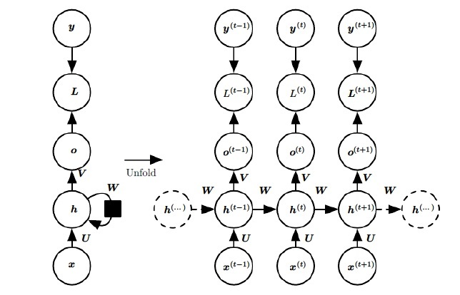
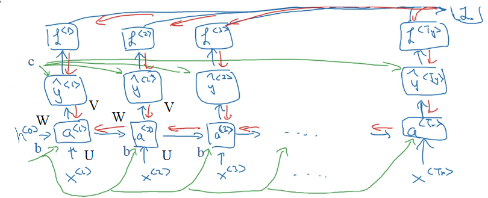
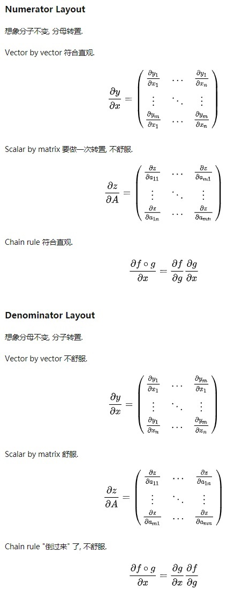

本文介绍了 RNN （循环神经网络）和 LSTM （长短时记忆网络）的基本概念，以及正/反向传播的推导过程。

<!--more-->

---

- [1. RNN](#1-rnn)
  - [1.1. 概念](#11-概念)
  - [1.2. 模型](#12-模型)
  - [1.3. 前向传播](#13-前向传播)
  - [1.4. 反向传播](#14-反向传播)
  - [1.5. 梯度消失](#15-梯度消失)
  - [1.6. 梯度爆炸](#16-梯度爆炸)
- [2. LSTM](#2-lstm)
  - [2.1. 概念](#21-概念)
  - [2.2. 模型](#22-模型)
  - [2.3. 前向传播](#23-前向传播)
  - [2.4. 如何解决梯度消失](#24-如何解决梯度消失)
- [3. 参考文献](#3-参考文献)

# 1. RNN

## 1.1. 概念

在前馈神经网络中，信息传递是单向的[[1](#ref1)]。前馈神经网络可以看作一个复杂的函数，每次输入都是独立的，即网络的输出只依赖于当前的输入．但是在很多现实任务中，网络的输出不仅和当前时刻的输入相关，也和其过去一段时间的输出相关。．此外，前馈网络难以处理时序数据，比如视频、语音、文本等．时序数据的长度一般是不固定的，而前馈神经网络要求输入和输出的维数都是固定的，不能任意改变．因此，当处理这一类和时序数据相关的问题时，就需要一种能力更强的模型．

循环神经网络（Recurrent Neural Network，RNN）是一类具有短期记忆能力的神经网络．在循环神经网络中，神经元不但可以接受其他神经元的信息，也可以接受自身的信息，形成具有环路的网络结构．和前馈神经网络相比，循环神经网络更加符合生物神经网络的结构．循环神经网络已经被广泛应用在语音识别、语言模型以及自然语言生成等任务上．

## 1.2. 模型

循环神经网络（Recurrent Neural Network，RNN）通过使用带自反馈的神经元，能够处理任意长度的时序数据。

给定一个输入序列 $\boldsymbol x_{1:T} = (\boldsymbol x_1,...,\boldsymbol x_t,...,\boldsymbol x_T)$，通过下面的公式更新隐层活性值 $\boldsymbol h_t$：

$$
\boldsymbol h_t = f(\boldsymbol h_{t-1},\boldsymbol x_t)
$$

其中，$\boldsymbol h_0 = 0$，$f(\cdot)$ 是非线性函数，可以是一个前馈网络。

网络结构如下图所示

从数学上讲，上述公式可以堪称一个动力系统，因此隐层活性值在很多文献中也称为隐状态（hidden state）。

由于循环神经网络具有短期记忆能力，因此其计算能力十分强大，可以近似任意非线性动力系统（程序），相比较而言，前馈神经网络可以模拟任何连续函数。

## 1.3. 前向传播

如果我们把每个时刻的状态都看作前馈神经网络的一层，循环神经网络可以看作在时间维度上权值共享的神经网络。一个简单的循环神经网络按时间展开后如下图所示

令 $\boldsymbol x_t \in \mathbb R^M$ 为 $t$ 时刻的网络输入向量，则在该时刻的网络隐状态 $\boldsymbol h_t \in \mathbb R^D$ 和网络输出 $\boldsymbol y_t \in \mathbb R^N$ 的更新公式为

$$
\begin{aligned}
\boldsymbol h_t &= f(\boldsymbol U \boldsymbol h_{t-1} + \boldsymbol W \boldsymbol x_t + \boldsymbol b)\\
\boldsymbol y_t &= g(\boldsymbol V \boldsymbol h_t + \boldsymbol c)
\end{aligned}
$$

其中 $\boldsymbol U \in \mathbb R^{D\times D}$ 是状态-状态权重矩阵，$\boldsymbol W \in \mathbb R^{D\times M}$ 是状态-输入权重矩阵，$\boldsymbol b \in \mathbb R^D$ 是偏置向量，$\boldsymbol V \in \mathbb R^{N\times D}$ 是状态-输出权重矩阵，$f(\cdot)$ 是激活函数，如 $sigmoid$ 或 $tanh$ 函数，$g(\cdot)$ 也是激活函数，如 $softmax$ 或 $purlin$ 函数。

注意到，第二个方程的具体形式与模型的具体使用方式有关，比如其中的常数项 $\boldsymbol c$ 的有无，激活函数的选取等。

## 1.4. 反向传播

有了RNN前向传播算法的基础，就容易推导出RNN反向传播算法的流程了。RNN 反向传播算法的思路和 DNN 是一样的，即通过梯度下降法一轮轮的迭代，得到合适的RNN模型参数 $\boldsymbol U,\boldsymbol W,\boldsymbol V,\boldsymbol b,\boldsymbol c$。由于我们是**基于时间反向传播**，所以 RNN 的反向传播有时也叫做 BPTT(back-propagation through time)。当然这里的 BPTT 和 DNN 的 BP 也有很大的不同点，即这里所有的 $\boldsymbol U, \boldsymbol W,\boldsymbol V,\boldsymbol b,\boldsymbol c$ 在序列的各个位置是共享的，反向传播时我们更新的是相同的参数。

RNN反向传播过程中，需要计算 $U,W,V,b,c$ 等参数的梯度。清晰起见，我们将前向传播过程整理如下

$$
\begin{aligned}
\boldsymbol a_t &= \boldsymbol W \boldsymbol h_{t-1} + \boldsymbol U \boldsymbol x_t + \boldsymbol b\\
\boldsymbol h_t &= f(\boldsymbol a_t)\\
\boldsymbol o_t &= \boldsymbol V \boldsymbol h_t + \boldsymbol c\\
\hat \boldsymbol y_t &= g(\boldsymbol o_t)
\end{aligned}
$$

反向传播的形象的分析如下图所示。途中绿线是正向传播过程，红线是反向传播过程。可以看出，在输出端的 $V,c$ 参数仅与 $t$ 时刻的反向传播通路有关，因此分别求导数后求和即可。而输入端 $U,W,b$ 参数的梯度受到两个反向传播通路的影响，分别是 $t$ 时刻的输出端反向通路，以及 $t+1$ 时刻隐层信息的反向通路。

为了简化描述，这里的损失函数我们为[交叉熵损失函数](https://zhuanlan.zhihu.com/p/38241764)，输出的激活函数 $g(\cdot)$ 为 softmax 函数，隐藏层的激活函数 $f(\cdot)$ 为 tanh 函数。对于 RNN，由于在序列的每个位置（任意 $t$ 时刻）都有输出 $\hat y_t$，也即都有损失函数，因此最终损失 $L$ 为

$$
\boldsymbol L = \sum_{t=1}^T \boldsymbol L_t = \sum_{t=1}^T \left[ - (\boldsymbol y_t ln\hat \boldsymbol y_t +(\boldsymbol 1_i-\boldsymbol y_t)ln(\boldsymbol 1_i-\hat \boldsymbol y_t) ) \right]
$$
其中, $\boldsymbol 1_i$ 表示第 $i$ 维为1，其余维为0的向量。

首先计算比较简单的 $V,c$ 的梯度。在输出端的 $V,c$ 参数仅与 $t$ 时刻的反向传播通路有关，因此分别求导数后求和即可，有[[1](#ref1)]

$$
\begin{aligned}
\frac{\partial L}{\partial \boldsymbol c} &= \sum_{t=1}^T \frac{\partial \boldsymbol L_t}{\partial \boldsymbol c}
= \sum_{t=1}^T \frac{\partial \boldsymbol L_t}{\partial \hat \boldsymbol y_t} \frac{\partial \hat \boldsymbol y_t}{\partial \boldsymbol o_t} \frac{\partial \boldsymbol o_t}{\partial \boldsymbol c}\\
&= \sum_{t=1}^T -(\frac{\boldsymbol y_t}{\hat \boldsymbol y_t}-\frac{\boldsymbol 1_i-\boldsymbol y_t}{\boldsymbol 1_i-\hat \boldsymbol y_t})softmax'\cdot \boldsymbol I\\
&= \sum_{t=1}^T -(\frac{\boldsymbol y_t}{\hat \boldsymbol y_t}-\frac{\boldsymbol 1_i-\boldsymbol y_t}{\boldsymbol 1_i-\hat \boldsymbol y_t})\cdot \hat \boldsymbol y_t(\boldsymbol 1_i -\hat \boldsymbol y_t)\\
&= \sum_{t=1}^T (\hat \boldsymbol y_t-\boldsymbol y_t)\\
\frac{\partial L}{\partial V} &= \sum_{t=1}^T \frac{\partial L_t}{\partial c}
= \sum_{t=1}^T \frac{\partial \boldsymbol L_t}{\partial \hat \boldsymbol y_t} \frac{\partial \hat \boldsymbol y_t}{\partial \boldsymbol o_t} \frac{\partial \boldsymbol o_t}{\partial \boldsymbol V}\\
&= \sum_{t=1}^T (\hat \boldsymbol y_t-\boldsymbol y_t)\boldsymbol h_t
\end{aligned}
$$

$\boldsymbol U,\boldsymbol W,\boldsymbol b$ 的梯度计算就比较复杂了，误差传播源来自于**两个反向传播通路**的方向，分别是 $t$ 时刻的输出端反向通路，以及 $t+1$ 时刻隐层信息的反向通路。

在进一步求解前，首先要考虑矩阵对向量求导的布局。根据布局约定（layout conventions），谁是列向量就是什么布局[[2](#ref2)]：

- 分子布局（numerator layout）： 分子为列向量且分母为行向量 
- 分母布局（denominator layout）：分子为行向量且分母为列向量

二者使用完全依据习惯而定，二者结果之间差一个转置。[这里](https://www.zhihu.com/question/352174717)讨论了两种布局下的优劣。

<!--  -->

如果我们采用分母布局（[点此参考](https://www.pianshen.com/article/5516168061/)），即分母保持列向量，分子按行向量展开，那么有

$$
\begin{aligned}
\frac{\partial \boldsymbol {Ax}}{\partial \boldsymbol x} &= \partial
\begin{bmatrix}
A_{11} &A_{12}&\cdots&A_{1n}\\
A_{21} &A_{22}&\cdots&A_{2n}\\
\vdots &\vdots&\ddots&\vdots\\
A_{m1} &A_{n2}&\cdots&A_{mn}\\
\end{bmatrix}
\begin{bmatrix}
x_1 \\
x_2\\
\vdots\\
x_n\\
\end{bmatrix} / \partial \boldsymbol x\\
&= \begin{bmatrix}
\partial (A_{11}x_1 + A_{12} x_2 + \cdots + A_{1n} x_n) &
\cdots &
\partial (A_{m1}x_1 + A_{m2} x_2 + \cdots + A_{mn} x_n)\\
\end{bmatrix}/\partial \boldsymbol x\quad <row!>\\
&= \begin{bmatrix}
\partial (A_{11}x_1 + A_{12} x_2 + \cdots + A_{1n} x_n)/\partial \boldsymbol x &
\cdots &
\partial (A_{m1}x_1 + A_{m2} x_2 + \cdots + A_{mn} x_n)/\partial \boldsymbol x\\
\end{bmatrix}\\
&= \begin{bmatrix}
\partial (A_{11}x_1 + A_{12} x_2 + \cdots + A_{1n} x_n)/\partial x_1 & \cdots & \partial (A_{m1}x_1 + A_{m2} x_2 + \cdots + A_{mn} x_n)/\partial x_1\\
\partial (A_{11}x_1 + A_{12} x_2 + \cdots + A_{1n} x_n)/\partial x_2 & \cdots & \partial (A_{m1}x_1 + A_{m2} x_2 + \cdots + A_{mn} x_n)/\partial x_2\\
\vdots & \cdots & \vdots\\
\partial (A_{11}x_1 + A_{12} x_2 + \cdots + A_{1n} x_n)/\partial x_n & \cdots & \partial (A_{m1}x_1 + A_{m2} x_2 + \cdots + A_{mn} x_n)/\partial x_n\\
\end{bmatrix}\\
&=\begin{bmatrix}
A_{11} &A_{21}&\cdots&A_{m1}\\
A_{12} &A_{22}&\cdots&A_{m2}\\
\vdots &\vdots&\ddots&\vdots\\
A_{1n} &A_{2n}&\cdots&A_{mn}\\
\end{bmatrix} = \boldsymbol A^T
\end{aligned}
$$

需要注意的是，分母布局下，求导的链式法则的顺序是反向的，假设 $\boldsymbol u = \boldsymbol u(\boldsymbol x)$，那么

$$
\frac{\partial \boldsymbol f(\boldsymbol g(\boldsymbol u)}{\partial \boldsymbol x}
= \frac{\partial \boldsymbol u}{\partial \boldsymbol x}
\frac{\partial \boldsymbol g}{\partial \boldsymbol u}
\frac{\partial \boldsymbol f}{\partial \boldsymbol g}
$$

我们先计算最后时刻 $t=T$ 的隐层梯度（分母布局链式法则方向相反）

$$
\frac{\partial \boldsymbol L}{\partial \boldsymbol h_T} = \frac{\partial \boldsymbol o_T}{\partial \boldsymbol h_T} \frac{\partial \boldsymbol L}{\partial \boldsymbol o_T}
$$

前面求 $\boldsymbol V, \boldsymbol c$ 的梯度时已经求出

$$
\frac{\partial \boldsymbol L}{\partial \boldsymbol o_T} = \frac{\partial \boldsymbol L}{\partial \hat \boldsymbol y_T}\frac{\partial \hat \boldsymbol y_T}{\partial \boldsymbol o_T} = \hat \boldsymbol y_T-\boldsymbol y_T = \nabla_{\boldsymbol o_T}\boldsymbol L
$$

假定 $\boldsymbol {Vh}_T$ 的结果是**列**向量，而 $\boldsymbol h_T$ 也是**列**向量，根据分母布局，有

$$
\frac{\partial \boldsymbol L}{\partial \boldsymbol h_T} = \frac{\partial \boldsymbol o_T}{\partial \boldsymbol h_T} \nabla_{\boldsymbol o_T}\boldsymbol L = \frac{\partial \boldsymbol {Vh}_T}{\partial \boldsymbol h_T} \nabla_{\boldsymbol o_T}\boldsymbol L= \boldsymbol V^T\nabla_{\boldsymbol o_T}\boldsymbol L
$$

对于 $T$ 时刻之前的任意时刻 $t$，根据迭代关系，$\boldsymbol h_t$ 与 $\boldsymbol o_t$ 和 $\boldsymbol h_{t+1}$ 均有关，即

$$
\begin{aligned}
\boldsymbol h_{t+1} &= f(\boldsymbol a_{t+1}) =f(\boldsymbol W \boldsymbol h_t + \boldsymbol U \boldsymbol x_{t+1} + \boldsymbol b)\\
\boldsymbol o_t &= \boldsymbol V \boldsymbol h_t + \boldsymbol c\\
\end{aligned}
$$

对两个反向通路方向的梯度求和，有（分母布局链式法则方向相反）

$$
\begin{aligned}
\frac{\partial \boldsymbol L}{\partial \boldsymbol h_t}&=\frac{\partial \boldsymbol h_{t+1}}{\partial \boldsymbol h_t}\frac{\partial \boldsymbol L}{\partial \boldsymbol h_{t+1}} + \frac{\partial \boldsymbol o_t}{\partial \boldsymbol h_t}\frac{\partial \boldsymbol L_t}{\partial \boldsymbol o_t}\\
&=\frac{\partial \boldsymbol h_{t+1}}{\partial \boldsymbol h_t}\frac{\partial \boldsymbol L}{\partial \boldsymbol h_{t+1}} + \boldsymbol V^T\nabla_{\boldsymbol o_t}\boldsymbol L
\end{aligned}
$$

下面考察 $\partial \boldsymbol h_t / \partial \boldsymbol a_t$，因为 $\boldsymbol h_t, \boldsymbol a_t$ 均为列向量，若采用分母布局，将分子 $\boldsymbol h_t$ 看作行向量展开，那么

$$
\begin{aligned}
\frac{\partial \boldsymbol h_t }{ \partial \boldsymbol a_t} &= \partial[h_1,h_2,\cdots,h_D]/\partial \boldsymbol a_t\quad<row!>\\
&=\begin{bmatrix}
\partial h_1/\partial a_1&\partial h_2/\partial a_1&\cdots&\partial h_D/\partial a_1\\
\partial h_1/\partial a_2&\partial h_2/\partial a_2&\cdots&\partial h_D/\partial a_2\\
\vdots&\vdots&\ddots&\vdots\\
\partial h_1/\partial a_D&\partial h_2/\partial a_D&\cdots&\partial h_D/\partial a_D\\
\end{bmatrix}\\
&= diag(f'(a_{t}))
\end{aligned}
$$

其中 $diag$ 为对角线矩阵，因为下标不同的项偏导为 0 ，只有对角线元素非 0 。

若 $f(\cdot)$ 为 $tanh$ 函数，有 $tanh'=1-tanh^2$，那么

$$
\frac{\partial \boldsymbol h_{t+1}}{\partial \boldsymbol a_{t+1}} = diag(tanh'(a_{t+1})) = diag(1-tanh(a_{t+1})^2) = diag(1-h_{t+1}^2)
$$

那么（分母布局链式法则反向）

$$
\frac{\partial \boldsymbol h_{t+1}}{\partial \boldsymbol h_t} = \frac{\partial \boldsymbol a_{t+1}}{\partial \boldsymbol h_t} \frac{\partial \boldsymbol h_{t+1}}{\partial \boldsymbol a_{t+1}} = W^T diag(1-h_{t+1}^2)
$$

带回隐层梯度公式有

$$
\frac{\partial \boldsymbol L}{\partial \boldsymbol h_t} = \boldsymbol W^T diag(1- h_{t+1}^2)\cdot\frac{\partial \boldsymbol L}{\partial \boldsymbol h_{t+1}} + \boldsymbol V^T\nabla_{\boldsymbol o_t}\boldsymbol L
$$

稍作整理有

$$
\nabla_{\boldsymbol h_t}\boldsymbol L = \boldsymbol W^T diag(1- h_{t+1}^2)\cdot\nabla_{\boldsymbol h_{t+1}}\boldsymbol L + \boldsymbol V^T\nabla_{\boldsymbol o_t}\boldsymbol L
$$

可以看出，隐层梯度 $\nabla_{\boldsymbol h_t}\boldsymbol L$ 可以采用递归的方式求解。

下面即可写出 $\boldsymbol W,\boldsymbol U,\boldsymbol b$ 的梯度表达式（分母布局链式法则方向相反）

$$
\begin{aligned}
\frac{\partial \boldsymbol L}{\partial \boldsymbol b} &= \sum_t \frac{\partial \boldsymbol a_t}{\partial \boldsymbol b}\frac{\partial \boldsymbol h_t}{\partial \boldsymbol a_t}\frac{\partial \boldsymbol L}{\partial \boldsymbol h_t} = \sum_t \boldsymbol I\cdot diag(1-h_t^2)\nabla_{\boldsymbol h_t}\boldsymbol L\\
\frac{\partial \boldsymbol L}{\partial \boldsymbol W} &= \sum_t \frac{\partial \boldsymbol a_t}{\partial \boldsymbol W}\frac{\partial \boldsymbol h_t}{\partial \boldsymbol a_t}\frac{\partial \boldsymbol L}{\partial \boldsymbol h_t} = \sum_t \frac{\partial \boldsymbol a_t}{\partial \boldsymbol W}\cdot diag(1-h_t^2)\nabla_{\boldsymbol h_t}\boldsymbol L\\
\frac{\partial \boldsymbol L}{\partial \boldsymbol U} &= \sum_t \frac{\partial \boldsymbol a_t}{\partial \boldsymbol U}\frac{\partial \boldsymbol h_t}{\partial \boldsymbol a_t}\frac{\partial \boldsymbol L}{\partial \boldsymbol h_t} = \sum_t \frac{\partial \boldsymbol a_t}{\partial \boldsymbol U}\cdot diag(1-h_t^2)\nabla_{\boldsymbol h_t}\boldsymbol L
\end{aligned}
$$

对于 $\boldsymbol W$ 和 $\boldsymbol U$，需要进一步分析 $\boldsymbol a$ 对矩阵 $\boldsymbol W, \boldsymbol U$ 的偏导。因为

$$
\boldsymbol a_t = \boldsymbol W \boldsymbol h_{t-1} + \boldsymbol U \boldsymbol x_t + \boldsymbol b
$$

以 $\boldsymbol a$ 对 $\boldsymbol W$ 的偏导为例，采用分母布局，即求导过程中的分母 $\boldsymbol W$ 保持为正常矩阵形式，而对分子中的 $\boldsymbol W \boldsymbol h$ 按行向量展开，有

$$
\begin{aligned}
&\frac{\partial \boldsymbol a}{\partial \boldsymbol W} = \frac{\partial \boldsymbol W \boldsymbol h}{\partial \boldsymbol W}=\partial
\begin{bmatrix}
w_{11}&w_{12}&\cdots&w_{1D}\\
w_{21}&w_{22}&\cdots&w_{2D}\\
\vdots&\vdots&\ddots&\vdots\\
w_{D1}&w_{D2}&\cdots&w_{DD}
\end{bmatrix}
\begin{bmatrix}
h_1\\
h_2\\
\vdots\\
h_D
\end{bmatrix}/ \partial \boldsymbol W\\
&=\begin{bmatrix}
w_{11}h_1+w_{12}h_2+\cdots+w_{1D}h_D\\
w_{21}h_1+w_{22}h_2+\cdots+w_{2D}h_D\\
\vdots\\
w_{D1}h_1+w_{D2}h_2+\cdots+w_{DD}h_D\\
\end{bmatrix}^T/ \partial \boldsymbol W \quad <row!>\\
&=\begin{bmatrix}
(w_{11}h_1+w_{12}h_2\cdots+w_{1D}h_D)/\partial w_{11}&(w_{21}h_1+w_{22}h_2\cdots+w_{2D}h_D)/\partial w_{12}&\cdots&(w_{D1}h_1+w_{D2}h_2\cdots+w_{DD}h_D)/\partial w_{1D}\\
(w_{11}h_1+w_{12}h_2\cdots+w_{1D}h_D)/\partial w_{21}&(w_{21}h_1+w_{22}h_2\cdots+w_{2D}h_D)/\partial w_{22}&\cdots&(w_{D1}h_1+w_{D2}h_2\cdots+w_{DD}h_D)/\partial w_{2D}\\
\vdots&\vdots&\ddots&\vdots\\
(w_{11}h_1+w_{12}h_2\cdots+w_{1D}h_D)/\partial w_{D1}&(w_{21}h_1+w_{22}h_2\cdots+w_{2D}h_D)/\partial w_{D2}&\cdots&(w_{D1}h_1+w_{D2}h_2\cdots+w_{DD}h_D)/\partial w_{DD}
\end{bmatrix}\\
&=\begin{bmatrix}
h_1&0&\cdots&0\\
0&h_2&\cdots&0\\
\vdots&\vdots&\ddots&\vdots\\
0&0&\cdots&h_D
\end{bmatrix}=diag (h^T)
\end{aligned}
$$

对 $\boldsymbol U$ 的求导同理，最终有

$$
\frac{\partial \boldsymbol a_t}{\partial \boldsymbol W} = diag(h_{t-1}^T)
\quad\quad\quad \frac{\partial \boldsymbol a_t}{\partial \boldsymbol U} = diag(x_t^T)
$$

其中 $\boldsymbol h_t \in \mathbb R^D,\boldsymbol x_t \in \mathbb R^M$ 是列向量。

带入上面的$\boldsymbol W,\boldsymbol U,\boldsymbol b$ 的梯度表达式，有

$$
\begin{aligned}
\frac{\partial \boldsymbol L}{\partial \boldsymbol W} &= \sum_t \frac{\partial \boldsymbol a_t}{\partial \boldsymbol W}\frac{\partial \boldsymbol h_t}{\partial \boldsymbol a_t}\frac{\partial \boldsymbol L}{\partial \boldsymbol h_t} = \sum_t diag (h_{t-1}^T)\cdot diag(1-h_t^2)\nabla_{\boldsymbol h_t}\boldsymbol L = \sum_t \cdot diag(1-h_t^2)\nabla_{\boldsymbol h_t}\boldsymbol L \cdot \boldsymbol h_{t-1}^T\\
\frac{\partial \boldsymbol L}{\partial \boldsymbol U} &= \sum_t \frac{\partial \boldsymbol a_t}{\partial \boldsymbol U}\frac{\partial \boldsymbol h_t}{\partial \boldsymbol a_t}\frac{\partial \boldsymbol L}{\partial \boldsymbol h_t} = \sum_t diag (x^T)\cdot diag(1-h_t^2)\nabla_{\boldsymbol h_t}\boldsymbol L = \sum_t diag(1-h_t^2)\nabla_{\boldsymbol h_t}\boldsymbol L \cdot \boldsymbol x^T
\end{aligned}
$$

与参考链接 [[6](#ref6)]，[[7](#ref7)] 的结果相同。最后将 $\boldsymbol h_{t-1}, \boldsymbol x_t$ 提到末尾的操作应该是成立的，懒得推导了...... 0.0

## 1.5. 梯度消失

RNN 存在时间维度上的梯度消失问题。

为了具体解释梯度消失的原因，首先将前面推导出来的 $t$ 时刻的 $\boldsymbol L$ 对隐层 $\boldsymbol h$ 的梯度递推过程列写如下

$$
\nabla_{\boldsymbol h_t}\boldsymbol L = \boldsymbol W^T diag(1- h_{t+1}^2)\cdot\nabla_{\boldsymbol h_{t+1}}\boldsymbol L + \boldsymbol V^T\nabla_{\boldsymbol o_t}\boldsymbol L
$$

注意到，$diag(1- h_{t+1}^2) = tanh(\boldsymbol h_{t+1})'$，那么上式可以改写为

$$
\nabla_{\boldsymbol h_t}\boldsymbol L = \boldsymbol W^T tanh(\boldsymbol h_{t+1})'\cdot\nabla_{\boldsymbol h_{t+1}}\boldsymbol L + \boldsymbol V^T\nabla_{\boldsymbol o_t}\boldsymbol L
$$

那么，对于 $t-1$ 时刻

$$
\begin{aligned}
\nabla_{\boldsymbol h_{t-1}}\boldsymbol L &= \boldsymbol W^T tanh(h_{t})'\cdot\nabla_{\boldsymbol h_{t}}\boldsymbol L + \boldsymbol V^T\nabla_{\boldsymbol o_{t-1}}\boldsymbol L\\
&=\boldsymbol W^T tanh(h_{t})'\cdot (\boldsymbol W^T tanh(\boldsymbol h_{t+1})'\nabla_{\boldsymbol h_{t+1}}\boldsymbol L + \boldsymbol V^T\nabla_{\boldsymbol o_t}\boldsymbol L) + \boldsymbol V^T\nabla_{\boldsymbol o_{t-1}}\boldsymbol L\\
&=\boldsymbol W^T tanh(h_{t})'\cdot (\boldsymbol W^T tanh(\boldsymbol h_{t+1})'\nabla_{\boldsymbol h_{t+1}}\boldsymbol L + \boldsymbol V^T\nabla_{\boldsymbol o_t}\boldsymbol L) + \boldsymbol V^T\nabla_{\boldsymbol o_{t-1}}\boldsymbol L\\
&=\boldsymbol W^T tanh(h_{t})'\cdot (\boldsymbol W^T tanh(\boldsymbol h_{t+1})'\cdots(\boldsymbol W^T tanh(\boldsymbol h_T)'\cdots) + \boldsymbol V^T\nabla_{\boldsymbol o_t}\boldsymbol L) + \boldsymbol V^T\nabla_{\boldsymbol o_{t-1}}\boldsymbol L\\
\end{aligned}
$$

稍微整理并展开，令 $\boldsymbol W^T tanh(h)' = WT$ 表示包含 $tanh'$ 的项，$\boldsymbol V^T \nabla_{\boldsymbol o}\boldsymbol L = \nabla$ 表示不含高阶次方的项，有

$$
\begin{aligned}
\nabla_{\boldsymbol h_{t-1}}\boldsymbol L &= (WT)^{T-t+1}\nabla_TL+(WT)^{T-t+2}\nabla+(WT)^{T-t+3}\nabla+...+(WT)^{1}\nabla+\nabla
\end{aligned}
$$

而对 $tanh$ 函数及其导数进行画图如下

可以看出，由于 $tanh'$ 的值域在 $(0,1)$ 之间，对于训练过程大部分情况下 $tanh'$ 是小于 1 的，**因此多项 $tanh'$ 的连乘会导致最终的值趋近于0**。因此，随着 $t$ 与 $T$ 的逐渐拉大，隐层梯度中包含的 $WT$ 项的次方越来越高，其取值越来越接近 0 。这会导致较长时间 $t$ 前的梯度项 $\nabla_{\boldsymbol h_{t-1}}\boldsymbol L$ 中的第一项十分接近 0 ，即导致较长时间 $t$ 前的梯度项仅与那个时刻的输出有关。进一步，时间越远，远距离的梯度变化越弱。

RNN 中总的梯度是不会消失的。即便梯度越传越弱，那也只是远距离的梯度消失，由于近距离的梯度不会消失，所有梯度之和便不会消失。RNN 所谓梯度消失的真正含义是，梯度被近距离梯度主导，导致模型难以学到远距离的依赖关系。梯度消失会导致我们的神经网络中前面层的网络权重无法得到更新，也就停止了学习。

RNN 梯度消失的本质：由于时间维度共享了参数矩阵，导致计算隐态 $\boldsymbol h_t$ 的梯度时会循环计算矩阵乘法，所以 BPTT 算法求解梯度时出现了参数矩阵的累乘，使得当时间尺度过长时的隐层梯度丢失。

## 1.6. 梯度爆炸

另一方面，若 $\boldsymbol W^T$ 的取值较大，导致 $\boldsymbol W tanh(\boldsymbol h)$ 的值大于1，那么连乘的每一项均大于1，就会导致梯度爆炸现象。

梯度爆炸会使得学习不稳定， 参数变化太大导致无法获取最优参数。

# 2. LSTM

## 2.1. 概念

长短期记忆（Long short-term memory, LSTM）是一种特殊的RNN（Gers et al.,2000; Hochreiter et al., 1997），主要是为了解决长序列训练过程中的梯度消失和梯度爆炸问题。简单来说，就是相比普通的RNN，LSTM能够在更长的序列中有更好的表现。

LSTM 与 RNN 的主要输入输出区别如下图所示

## 2.2. 模型

LSTM 网络的循环单元结构如下图所示

其中，LSTM 引入三个门来控制信息的传递，分别为遗忘门 $\boldsymbol f_t$、输入门 $\boldsymbol i_t$、输出门 $\boldsymbol o_t$。三个门的作用是：

- 遗忘门 $\boldsymbol f_t$ 控制上一个时刻的内部状态 $\boldsymbol c_{t-1}$ 需要遗忘多少信息；
- 输入门 $\boldsymbol i_t$ 控制当前时刻的候选状态 $\tilde \boldsymbol c_t$ 有多少信息需要保存；
- 输出门 $\boldsymbol o_t$ 控制当前时刻的内部状态 $\boldsymbol c_t$ 有多少信息需要输出给外部状态 $\boldsymbol h_t$。

## 2.3. 前向传播

三个门的计算方式为：

$$
\begin{aligned}
\boldsymbol f_t &= \sigma(\boldsymbol W_f \boldsymbol h_{t-1} + \boldsymbol U_f \boldsymbol x_t + \boldsymbol b_f)=\sigma([\boldsymbol W_f, \boldsymbol U_f]\cdot[\boldsymbol h_{t-1}, \boldsymbol x_t]^T + \boldsymbol b_f)\\
\boldsymbol i_t &= \sigma(\boldsymbol W_i \boldsymbol h_{t-1} + \boldsymbol U_i \boldsymbol x_t + \boldsymbol b_i)=\sigma([\boldsymbol W_i, \boldsymbol U_i]\cdot[\boldsymbol h_{t-1}, \boldsymbol x_t]^T + \boldsymbol b_f)\\
\boldsymbol o_t &= \sigma(\boldsymbol W_o \boldsymbol h_{t-1} + \boldsymbol U_o \boldsymbol x_t + \boldsymbol b_o)=\sigma([\boldsymbol W_o, \boldsymbol U_o]\cdot[\boldsymbol h_{t-1}, \boldsymbol x_t]^T + \boldsymbol b_f)\\
\end{aligned}
$$

其中，$\sigma$ 为 $sigmoid$ 激活函数，输出区间为 $[0,1]$。也就是说，LSTM 网络中的“门”是一种“软”门，取值在 $[0,1]$ 之间，表示以一定的比例允许信息通过。注意到，等式右边包含一个对 $\boldsymbol h_{t-1}$ 和 $\boldsymbol x_t$ **向量拼接**的操作，相应的参数也因此进行了拼接。

相比 RNN，LSTM 引入了一个新的状态，称为细胞状态（cell state），表示为 $\boldsymbol c_t$，专门进行现行的循环信息传递，同时输出（非线性地）输出信息给隐层状态 $\boldsymbol h_t\in \mathbb R^D$。计算公式如下

$$
\begin{aligned}
\tilde \boldsymbol c_t &= tanh(\boldsymbol W_c \boldsymbol h_{t-1} + \boldsymbol U_c \boldsymbol x_t + \boldsymbol b_c)=\sigma([\boldsymbol W_c, \boldsymbol U_c]\cdot[\boldsymbol h_{t-1}, \boldsymbol x_t]^T + \boldsymbol b_f)\\
\boldsymbol c_t &= \boldsymbol f_t \odot \boldsymbol c_{t-1} + \boldsymbol i_t \odot \tilde \boldsymbol c_t\\
\boldsymbol h_t &= \boldsymbol o_t \odot tanh(\boldsymbol c_t)
\end{aligned}
$$

其中，$\tilde \boldsymbol c_t \in \mathbb R^D$ 是通过非线性函数（$tanh$）得到的候选状态，$\boldsymbol c_{t-1}$ 是上一时刻的记忆单元，$\odot$ 是向量的元素乘积。在每个时刻，LSTM 网络的细胞状态 $\boldsymbol c_t$ 记录了截至当前时刻的历史信息。

根据不同的门状态取值，可以实现不同的功能。当 $\boldsymbol f_t = 0,\boldsymbol i_t = 1$ 时，记忆单元将历史信息清空，并将候选状态向量 $\tilde \boldsymbol c_t$ 写入，但此时记忆单元 $\boldsymbol c_t$ 依然和上一时刻的历史信息相关。当$\boldsymbol f_t = 1,\boldsymbol i_t = 0$ 时，记忆单元将复制上一时刻的内容，不写入新的信息。

需要注意的是，LSTM 中的 $\boldsymbol c_t$ 对应于传统 RNN 中的 $\boldsymbol h_t$，通常是上一个传过来的历史状态乘以遗忘门后加上一些新信息得到，因此更新比较缓慢。而 LSTM 中的 $\boldsymbol h_t$ 则变化剧烈的多，在不同的时刻下的取值往往区别很大。

再次进行维度分析，$\boldsymbol h_t,\boldsymbol c_t,\boldsymbol i_t,\boldsymbol f_t,\boldsymbol o_t \in \mathbb R^D$ 且 $\boldsymbol b_f,\boldsymbol b_i,\boldsymbol b_o,\boldsymbol b_c \in \mathbb R^D$，$\boldsymbol x_t\in \mathbb R^M$，那么 $\boldsymbol W_f,\boldsymbol W_i,\boldsymbol W_o,\boldsymbol W_c \in \mathbb R^{D\times M}$， $\boldsymbol U_f,\boldsymbol U_i,\boldsymbol U_o,\boldsymbol U_c \in \mathbb R^{D\times D}$。则上面所有式子可简洁描述为

$$
\begin{aligned}
\begin{bmatrix}
 \tilde \boldsymbol c_t\\ 
 \boldsymbol o_t\\
 \boldsymbol i_t\\
 \boldsymbol f_t 
\end{bmatrix}=
\begin{bmatrix}
 tanh\\ 
 \sigma\\
 \sigma\\
 \sigma 
\end{bmatrix}\left( \boldsymbol W
\begin{bmatrix}
 \boldsymbol h_{t-1}\\ 
 \boldsymbol x_t
\end{bmatrix}+\boldsymbol b
 \right)
\end{aligned}
$$

其中

$$
\begin{aligned}
\boldsymbol W &=\begin{bmatrix}
 \boldsymbol W_c & \boldsymbol U_c\\ 
 \boldsymbol W_o & \boldsymbol U_o\\
 \boldsymbol W_i & \boldsymbol U_i\\ 
 \boldsymbol W_f & \boldsymbol U_f
\end{bmatrix} \in \mathbb R^{4D\times (D+M)}\\
\boldsymbol b &= \begin{bmatrix}
 \boldsymbol b_c\\ 
 \boldsymbol b_o\\
 \boldsymbol b_i\\
 \boldsymbol b_f 
\end{bmatrix}\in \mathbb R^{4D}
\end{aligned}
$$

循环神经网络中的隐状态 $\boldsymbol h$ 存储了历史信息，可以看作一种记忆（Memory）。在简单循环网络中，隐状态每个时刻都会被重写，因此可以看作一种短期记忆（Short-Term Memory）。在神经网络中，长期记忆（Long-Term Memory）可以看作网络参数，隐含了从训练数据中学到的经验，其更新周期要远远慢于短期记忆。

而在 LSTM 网络中，记忆单元 $\boldsymbol c$ 可以在某个时刻捕捉到某个关键信息，并有能力将此关键信息保存一定的时间间隔。记忆单元 $\boldsymbol c$ 中保存信息的生命周期要长于短期记忆 $\boldsymbol h$，但又远远短于长期记忆，**长短期记忆是指长的“短期记忆”。因此称为长短期记忆（Long Short-Term Memory）**。

## 2.4. 如何解决梯度消失

[LSTM如何来避免梯度弥散和梯度爆炸？](https://www.zhihu.com/question/34878706)

LSTM 通过引入门机制，把矩阵乘法变成了 element-wise 的 [Hadamard product](https://baike.baidu.com/item/%E5%93%88%E8%BE%BE%E7%8E%9B%E7%A7%AF)（哈达玛积，逐元素相乘）。这样做后，细胞状态 $\boldsymbol c_t$ （对应于 RNN 中的隐状态 $\boldsymbol h_t$）的更新公式变为

$$
\boldsymbol c_t = \boldsymbol f_t \odot \boldsymbol c_{t-1} + \boldsymbol i_t \odot tanh(\boldsymbol W_c \boldsymbol h_{t-1} + \boldsymbol U_c \boldsymbol x_t + \boldsymbol b_c)
$$

进一步推导

$$
\begin{aligned}
\frac{\partial \boldsymbol L}{\partial \boldsymbol c_{t-1}} &= \frac{\partial L}{\partial c_t}\frac{\partial c_t}{\partial c_{t-1}} = \frac{\partial L}{\partial c_t} \odot diag(f_t+\cdots)
\end{aligned}
$$

公式里其余的项不重要，这里就用省略号代替了。可以看出当 $f_t=1$ 时，就算其余项很小，梯度仍然可以很好地传导到上一个时刻，此时即使层数较深也不会发生 Gradient Vanish 的问题；当 $f_t=0$ 时，即上一时刻的信号不影响到当前时刻，则此项也会为0。$f_t$ 在这里控制着梯度传导到上一时刻的衰减程度，与它 Forget Gate 的功能一致。

这样的方式本质上类似 Highway Network 或者 ResNet（残差连接），使得梯度的信息可以“贯穿”时间线，缓解梯度消散。

# 3. 参考文献

[1]  刘建平Pinard. [循环神经网络(RNN)模型与前向反向传播算法](https://www.cnblogs.com/pinard/p/6509630.html).

[2]  维基百科. [矩阵微积分-布局约定](https://en.wikipedia.org/wiki/Matrix_calculus#Layout_conventions).

[3] 仙守. [数学-矩阵计算（4）两种布局](https://blog.csdn.net/shouhuxianjian/article/details/46669365).

[4] 谓之小一. [LSTM如何解决RNN带来的梯度消失问题](https://zhuanlan.zhihu.com/p/136223550).

[5] thinkando. [机器学习中的矩阵、向量求导](https://www.jianshu.com/p/2da10b181c59).

[6] Leo蓝色. [RNN正向及反向传播](https://www.jianshu.com/p/43b7a927ae34).

[7] 小米粥. [RNN的反向传播-BPTT](https://zhuanlan.zhihu.com/p/90297737).