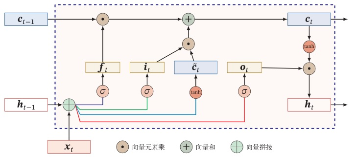

本文介绍了 LSTM （长短时记忆网络）的基本概念，以及正/反向传播的推导过程，然后分析了 LSTM 如何克服 RNN 的梯度消失问题，最后介绍了 PyTorch 的 LSTM 模块的实现。

<!--more-->

---

- [1. LSTM](#1-lstm)
  - [1.1. 概念](#11-概念)
  - [1.2. 模型](#12-模型)
  - [1.3. 前向传播](#13-前向传播)
  - [1.4. 如何解决梯度消失](#14-如何解决梯度消失)
  - [1.5. 如何解决梯度爆炸](#15-如何解决梯度爆炸)
- [PyTorch 实现](#pytorch-实现)
- [2. 参考文献](#2-参考文献)

# 1. LSTM

## 1.1. 概念

长短期记忆（Long short-term memory, LSTM）是一种特殊的RNN（Gers et al.,2000; Hochreiter et al., 1997），主要是为了解决长序列训练过程中的梯度消失和梯度爆炸问题。简单来说，就是相比普通的RNN，LSTM能够在更长的序列中有更好的表现。

LSTM 与 RNN 的主要输入输出区别如下图所示


## 1.2. 模型

LSTM 网络的循环单元结构如下图所示



其中，LSTM 引入三个门来控制信息的传递，分别为遗忘门 $\boldsymbol f_t$、输入门 $\boldsymbol i_t$、输出门 $\boldsymbol o_t$。三个门的作用是：

- 遗忘门 $\boldsymbol f_t$ 控制上一个时刻的内部状态 $\boldsymbol c_{t-1}$ 需要遗忘多少信息；
- 输入门 $\boldsymbol i_t$ 控制当前时刻的候选状态 $\tilde \boldsymbol c_t$ 有多少信息需要保存；
- 输出门 $\boldsymbol o_t$ 控制当前时刻的内部状态 $\boldsymbol c_t$ 有多少信息需要输出给外部状态 $\boldsymbol h_t$。

## 1.3. 前向传播

三个门的计算方式为：

$$
\begin{aligned}
\boldsymbol f_t &= \sigma(\boldsymbol W_f \boldsymbol h_{t-1} + \boldsymbol U_f \boldsymbol x_t + \boldsymbol b_f)=\sigma([\boldsymbol W_f, \boldsymbol U_f]\cdot[\boldsymbol h_{t-1}, \boldsymbol x_t]^T + \boldsymbol b_f)\\
\boldsymbol i_t &= \sigma(\boldsymbol W_i \boldsymbol h_{t-1} + \boldsymbol U_i \boldsymbol x_t + \boldsymbol b_i)=\sigma([\boldsymbol W_i, \boldsymbol U_i]\cdot[\boldsymbol h_{t-1}, \boldsymbol x_t]^T + \boldsymbol b_f)\\
\boldsymbol o_t &= \sigma(\boldsymbol W_o \boldsymbol h_{t-1} + \boldsymbol U_o \boldsymbol x_t + \boldsymbol b_o)=\sigma([\boldsymbol W_o, \boldsymbol U_o]\cdot[\boldsymbol h_{t-1}, \boldsymbol x_t]^T + \boldsymbol b_f)\\
\end{aligned}
$$

其中，$\sigma$ 为 $sigmoid$ 激活函数，输出区间为 $[0,1]$。也就是说，LSTM 网络中的“门”是一种“软”门，取值在 $[0,1]$ 之间，表示以一定的比例允许信息通过。注意到，等式右边包含一个对 $\boldsymbol h_{t-1}$ 和 $\boldsymbol x_t$ **向量拼接**的操作，相应的参数也因此进行了拼接。

相比 RNN，LSTM 引入了一个新的状态，称为细胞状态（cell state），表示为 $\boldsymbol c_t$，专门进行现行的循环信息传递，同时输出（非线性地）输出信息给隐层状态 $\boldsymbol h_t\in \mathbb R^D$。计算公式如下

$$
\begin{aligned}
\tilde \boldsymbol c_t &= tanh(\boldsymbol W_c \boldsymbol h_{t-1} + \boldsymbol U_c \boldsymbol x_t + \boldsymbol b_c)=\sigma([\boldsymbol W_c, \boldsymbol U_c]\cdot[\boldsymbol h_{t-1}, \boldsymbol x_t]^T + \boldsymbol b_f)\\
\boldsymbol c_t &= \boldsymbol f_t \odot \boldsymbol c_{t-1} + \boldsymbol i_t \odot \tilde \boldsymbol c_t\\
\boldsymbol h_t &= \boldsymbol o_t \odot tanh(\boldsymbol c_t)
\end{aligned}
$$

其中，$\tilde \boldsymbol c_t \in \mathbb R^D$ 是通过非线性函数（$tanh$）得到的候选状态，$\boldsymbol c_{t-1}$ 是上一时刻的记忆单元，$\odot$ 是向量的元素乘积。在每个时刻，LSTM 网络的细胞状态 $\boldsymbol c_t$ 记录了截至当前时刻的历史信息。

根据不同的门状态取值，可以实现不同的功能。当 $\boldsymbol f_t = 0,\boldsymbol i_t = 1$ 时，记忆单元将历史信息清空，并将候选状态向量 $\tilde \boldsymbol c_t$ 写入，但此时记忆单元 $\boldsymbol c_t$ 依然和上一时刻的历史信息相关。当$\boldsymbol f_t = 1,\boldsymbol i_t = 0$ 时，记忆单元将复制上一时刻的内容，不写入新的信息。

需要注意的是，**LSTM 中的 $\boldsymbol c_t$ 对应于传统 RNN 中的 $\boldsymbol h_t$**，通常是上一个传过来的历史状态乘以遗忘门后加上一些新信息得到，因此更新比较缓慢。而 LSTM 中的 $\boldsymbol h_t$ 则变化剧烈的多，在不同的时刻下的取值往往区别很大。

再次进行维度分析，$\boldsymbol h_t,\boldsymbol c_t,\boldsymbol i_t,\boldsymbol f_t,\boldsymbol o_t \in \mathbb R^D$ 且 $\boldsymbol b_f,\boldsymbol b_i,\boldsymbol b_o,\boldsymbol b_c \in \mathbb R^D$，$\boldsymbol x_t\in \mathbb R^M$，那么 $\boldsymbol W_f,\boldsymbol W_i,\boldsymbol W_o,\boldsymbol W_c \in \mathbb R^{D\times M}$， $\boldsymbol U_f,\boldsymbol U_i,\boldsymbol U_o,\boldsymbol U_c \in \mathbb R^{D\times D}$。则上面所有式子可简洁描述为

$$
\begin{aligned}
\begin{bmatrix}
 \tilde \boldsymbol c_t\\ 
 \boldsymbol o_t\\
 \boldsymbol i_t\\
 \boldsymbol f_t 
\end{bmatrix}=
\begin{bmatrix}
 tanh\\ 
 \sigma\\
 \sigma\\
 \sigma 
\end{bmatrix}\left( \boldsymbol W
\begin{bmatrix}
 \boldsymbol h_{t-1}\\ 
 \boldsymbol x_t
\end{bmatrix}+\boldsymbol b
 \right)
\end{aligned}
$$

其中

$$
\begin{aligned}
\boldsymbol W &=\begin{bmatrix}
 \boldsymbol W_c & \boldsymbol U_c\\ 
 \boldsymbol W_o & \boldsymbol U_o\\
 \boldsymbol W_i & \boldsymbol U_i\\ 
 \boldsymbol W_f & \boldsymbol U_f
\end{bmatrix} \in \mathbb R^{4D\times (D+M)}\\
\boldsymbol b &= \begin{bmatrix}
 \boldsymbol b_c\\ 
 \boldsymbol b_o\\
 \boldsymbol b_i\\
 \boldsymbol b_f 
\end{bmatrix}\in \mathbb R^{4D}
\end{aligned}
$$

循环神经网络中的隐状态 $\boldsymbol h$ 存储了历史信息，可以看作一种记忆（Memory）。在简单循环网络中，隐状态每个时刻都会被重写，因此可以看作一种短期记忆（Short-Term Memory）。在神经网络中，长期记忆（Long-Term Memory）可以看作网络参数，隐含了从训练数据中学到的经验，其更新周期要远远慢于短期记忆。

而在 LSTM 网络中，记忆单元 $\boldsymbol c$ 可以在某个时刻捕捉到某个关键信息，并有能力将此关键信息保存一定的时间间隔。记忆单元 $\boldsymbol c$ 中保存信息的生命周期要长于短期记忆 $\boldsymbol h$，但又远远短于长期记忆，**长短期记忆是指长的“短期记忆”。因此称为长短期记忆（Long Short-Term Memory）**。

## 1.4. 如何解决梯度消失

[LSTM如何来避免梯度弥散和梯度爆炸？](https://www.zhihu.com/question/34878706)

LSTM 通过引入门机制，把矩阵乘法变成了 element-wise 的 [Hadamard product](https://baike.baidu.com/item/%E5%93%88%E8%BE%BE%E7%8E%9B%E7%A7%AF)（哈达玛积，逐元素相乘）。这样做后，细胞状态 $\boldsymbol c_t$ （对应于 RNN 中的隐状态 $\boldsymbol h_t$）的更新公式变为

$$
\boldsymbol c_t = \boldsymbol f_t \odot \boldsymbol c_{t-1} + \boldsymbol i_t \odot tanh(\boldsymbol W_c \boldsymbol h_{t-1} + \boldsymbol U_c \boldsymbol x_t + \boldsymbol b_c)
$$

进一步推导

$$
\begin{aligned}
\frac{\partial \boldsymbol L}{\partial \boldsymbol c_{t-1}} &= \frac{\partial L}{\partial c_t}\frac{\partial c_t}{\partial c_{t-1}} = \frac{\partial L}{\partial c_t} \odot diag(f_t+\cdots)
\end{aligned}
$$

公式里其余的项不重要，这里就用省略号代替了。可以看出当 $f_t=1$ 时，就算其余项很小，梯度仍然可以很好地传导到上一个时刻，此时即使层数较深也不会发生 Gradient Vanish 的问题；当 $f_t=0$ 时，即上一时刻的信号不影响到当前时刻，则此项也会为0。$f_t$ 在这里控制着梯度传导到上一时刻的衰减程度，与它 Forget Gate 的功能一致。


这样的方式本质上类似 Highway Network 或者 ResNet（残差连接），使得梯度的信息可以“贯穿”时间线，缓解梯度消散。


这里需要强调的是：LSTM不是让所有远距离的梯度值都不会消散，而是只让具有时序关键信息位置的梯度可以一直传递。另一方面，仅在 $c_t$ 通路上缓解了梯度消失问题，而在 $h_t$ 通路上梯度消失依然存在。

## 1.5. 如何解决梯度爆炸

关于梯度爆炸问题： $f_t$ 已经在 $[0,1]$ 范围之内了。而且梯度爆炸爆炸也是相对容易解决的问题，可以用梯度裁剪(gradient clipping)来解决：只要设定阈值，当提出梯度超过此阈值，就进行截取即可。

# PyTorch 实现

官方文档链接[在此](https://pytorch.org/docs/stable/generated/torch.nn.LSTM.html)（https://pytorch.org/docs/stable/generated/torch.nn.LSTM.html ）

```python
CLASStorch.nn.LSTM(*args, **kwargs)
```

参数列表如下

- **input_size** – The number of expected features in the input *x*

- **hidden_size** – The number of features in the hidden state *h*

- **num_layers** – Number of recurrent layers. E.g., setting `num_layers=2` would mean stacking two LSTMs together to form a stacked LSTM, with the second LSTM taking in outputs of the first LSTM and computing the final results. Default: 1

- **bias** – If False, then the layer does not use bias weights *b_ih* and *b_hh*. Default: `True`

- **batch_first** – If `True`, then the input and output tensors are provided as (batch, seq, feature). Default: `False`

- **dropout** – If non-zero, introduces a Dropout layer on the outputs of each LSTM layer except the last layer, with dropout probability equal to `dropout`. Default: 0

- bidirectional – If `True`, becomes a bidirectional LSTM. Default: `False`

我们再次将 LSTM 的前向传播列写如下便于比对

$$
\begin{aligned}
\boldsymbol f_t &= \sigma(\boldsymbol W_f \boldsymbol h_{t-1} + \boldsymbol U_f \boldsymbol x_t + \boldsymbol b_f)\\
\boldsymbol i_t &= \sigma(\boldsymbol W_i \boldsymbol h_{t-1} + \boldsymbol U_i \boldsymbol x_t + \boldsymbol b_i)\\
\boldsymbol o_t &= \sigma(\boldsymbol W_o \boldsymbol h_{t-1} + \boldsymbol U_o \boldsymbol x_t + \boldsymbol b_o)\\
\tilde \boldsymbol c_t &= tanh(\boldsymbol W_c \boldsymbol h_{t-1} + \boldsymbol U_c \boldsymbol x_t + \boldsymbol b_c)\\
\boldsymbol c_t &= \boldsymbol f_t \odot \boldsymbol c_{t-1} + \boldsymbol i_t \odot \tilde \boldsymbol c_t\\
\boldsymbol h_t &= \boldsymbol o_t \odot tanh(\boldsymbol c_t)
\end{aligned}
$$

前面我们已经假设，$\boldsymbol h_t,\boldsymbol c_t,\boldsymbol i_t,\boldsymbol f_t,\boldsymbol o_t \in \mathbb R^D$ 且 $\boldsymbol b_f,\boldsymbol b_i,\boldsymbol b_o,\boldsymbol b_c \in \mathbb R^D$，$\boldsymbol x_t\in \mathbb R^M$，那么 $\boldsymbol W_f,\boldsymbol W_i,\boldsymbol W_o,\boldsymbol W_c \in \mathbb R^{D\times M}$， $\boldsymbol U_f,\boldsymbol U_i,\boldsymbol U_o,\boldsymbol U_c \in \mathbb R^{D\times D}$。

`input_size` 就是输入层维度 $M$，比如某个词或者某张图的 embedding dim （特征维度）。

`hidden_size` 就是隐层 $h_t$ 的维度 $D$。

`num_layers` 是 LSTM 堆叠的层数。LSTM 可以按照下图的形式进行堆叠。

# 2. 参考文献

<span id="ref1">[1]</span> 谓之小一. [LSTM如何解决RNN带来的梯度消失问题](https://zhuanlan.zhihu.com/p/136223550).

<span id="ref2">[2]</span> thinkando. [机器学习中的矩阵、向量求导](https://www.jianshu.com/p/2da10b181c59).

<span id="ref3">[3]</span> Leo蓝色. [RNN正向及反向传播](https://www.jianshu.com/p/43b7a927ae34).

<span id="ref4">[4]</span> 小米粥. [RNN的反向传播-BPTT](https://zhuanlan.zhihu.com/p/90297737).