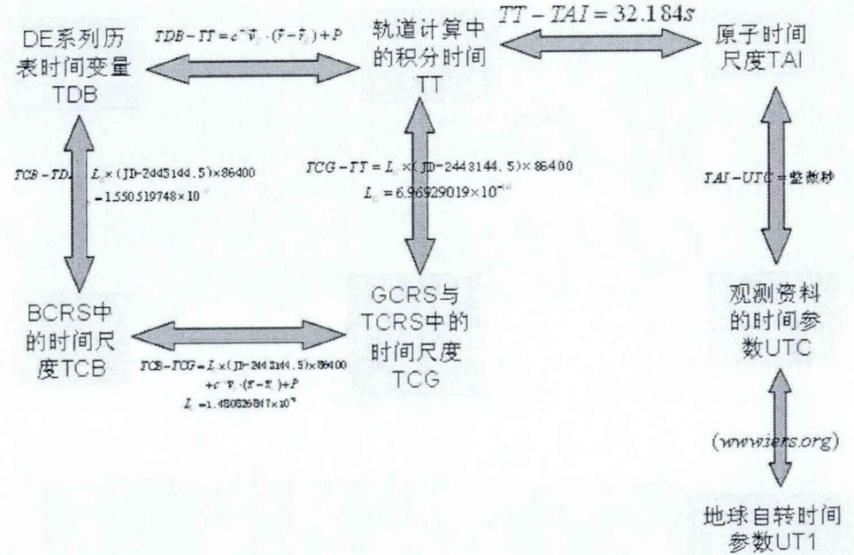

本文介绍了天文学中基本的时间和历法知识。

<!--more-->

---

- [1. 背景](#1-背景)
  - [1.1. 国际地球自转和参考系服务](#11-国际地球自转和参考系服务)
  - [1.2. 国际天文学联合会](#12-国际天文学联合会)
- [2. 时间](#2-时间)
  - [2.1. 平太阳时](#21-平太阳时)
  - [2.2. 世界时（UT）](#22-世界时ut)
  - [2.3. 原子时（TAI）](#23-原子时tai)
  - [2.4. 协调世界时（UTC）](#24-协调世界时utc)
  - [2.5. 格林尼治标准时（GMT）](#25-格林尼治标准时gmt)
  - [2.6. 力学时（TT）](#26-力学时tt)
  - [2.7. 太阳系质心力学时（TDB）](#27-太阳系质心力学时tdb)
  - [2.8. 各时间的转换关系](#28-各时间的转换关系)
- [3. 历法](#3-历法)
  - [3.1. 儒略历（Julian calendar）](#31-儒略历julian-calendar)
  - [3.2. 格里高利历（Gregory Calendar）](#32-格里高利历gregory-calendar)
  - [3.3. 儒略记日法（Julian Day）](#33-儒略记日法julian-day)
  - [3.4. 儒略日数（JDN）](#34-儒略日数jdn)
  - [3.5. 儒略日（JD）](#35-儒略日jd)
  - [3.6. 标准历元（J2000.0）](#36-标准历元j20000)
  - [3.7. 由格里历计算儒略日JD](#37-由格里历计算儒略日jd)
  - [3.8. 由格里历算简化的儒略日](#38-由格里历算简化的儒略日)
  - [3.9. 计算标准历元起的儒略日](#39-计算标准历元起的儒略日)
  - [3.10. 计算标准历元起的儒略世纪](#310-计算标准历元起的儒略世纪)
- [4. 参考文献](#4-参考文献)

# 1. 背景

## 1.1. 国际地球自转和参考系服务

[国际地球自转和参考系服务](https://www.iers.org/IERS/EN/Home/home_node.html)（International Earth Rotation and Reference System, IERS）（官网：https://www.iers.org/IERS/EN/Home/home_node.html ）的主要目标是通过提供国际陆空参考系统的入口来为天文学、测地学和地球物理学的研究团体服务。该网站提供了有关国际地球自转服务中心的任务、机构设置、成员以及相关产品的详细信息，同时还提供了通向其数据库和公告中的观测数据与研究结果的入口。

国际地球自转服务(International Earth Rotation Service-简称IERS)由国际大地测量学和地球物理学联合会及与国际天文学联合会联合创办，用以取代国际时间局(BIH)的地球自转部分和原有的国际极移服务(IPMS)。

## 1.2. 国际天文学联合会

[国际天文学联合会](https://www.iau.org/)（International Astronomical Union, IAU）（官网：https://www.iau.org/ ）是世界各国天文学术团体联合组成的非政府性学术组织，其宗旨是组织国际学术交流，推动国际协作，促进天文学的发展。国际天文学联合会于1919年7月在布鲁塞尔成立。
天文学联盟有73个成员国，其中包括专业天文学研究达到较高程度的大多数国家。天文学联盟的一个主要从事地面和空间天文学各学科的10528 多名成员的直接参与。

# 2. 时间

## 2.1. 平太阳时

地球表面活动的人们，习惯以太阳在天球上的位置来确定时间。太阳连续两次经过上中天的时间间隔，称为真太阳日。但是，但因为地球绕太阳公转运动的轨道是椭圆，太阳位于该椭圆的一个焦点上，所以地球在轨道上做的是不等速运动，真太阳周日视运动的速度是不均匀的，不易选做计时单位。

为了得到以真太阳周日视运动为基础而又克服其不均匀性的时间计量系统，人们引进了平均太阳日的概念。天文学上假定由一个太阳（平太阳）在天赤道上（而不是在黄赤道上）作等速运行，其速度等于运行在黄赤道上真太阳的平均速度，这个假想的太阳连续两次上中天的时间间隔，叫做一个平太阳日。这也相当于把一年中真太阳日的平均称为平太阳日，并且把1/24平太阳日取为1平太阳时。人们日常生活中使用的“日”和“时”，就是平太阳日和平太阳时的简称。

平太阳时的基本单位是平太阳日，1平均太阳日等于24平均太阳小时，1平均太阳小时等于86400平均太阳秒。


## 2.2. 世界时（UT）

Universal Time（UT），世界时，格林尼治平太阳时。

以地球自转为基础的时间计量系统。以平子夜作为 0 时开始的格林尼治平太阳时。（英国伦敦南郊原格林尼治天文台的所在地，它又是世界上地理经度的起始点）

UT 与 恒星时 有严格的转换关系，人们是通过在世界各地利用天文望远镜观测恒星后平均得到世界时的，其精度只能达到 $10^{-9}$。由于天体运行的一些不确定性(比如地球的自转并非匀速的，而是以复杂的方式进行着加速和减速)，所以UT时间并不是均匀流过的。

UT0：由于地极移动和地球自转的不均匀性，最初得到的世界时是不均匀的，记为 UT0 。与各地的天文站位置有关，不具有可比性。

UT1：在 UT0 的基础上加上极移修正，理论上仅包含测量误差，具有可比性。

UT2：在 UT 的基础上加上地球自转速率季节性变化的经验修正。

注意到，现在一般说世界时，均是指 **UT1**。

## 2.3. 原子时（TAI）

Temps Atomique International（TAI），国际原子时，原子时间计量标准在1967年正式取代了天文学的秒长的定义。

新秒长规定为：位于海平面上的铯Cs133原子基态的两个超精细能级间在零磁场中跃迁振荡9192631770个周期所持续的时间为一个原子时秒，我们称之为国际原子时（TAI），其稳定度可以达到 $10^{-14}$ 以上。

一堆专家开会讨论后规定，TAI 的起点在1958年1月1日0时（UT1），即在这一瞬间，TAI 和 UT1 重合。（后来发现，当初那个瞬间二者并非完全重合，差了0.0039秒。这个差值就被作为事实保留下来。0.0）


## 2.4. 协调世界时（UTC）

Coordinated Universal Time，法文Temps Universel Cordonné，由于英文（CUT）和法文（TUC）的缩写不同，作为妥协，简称 UTC。UTC 基于国际原子时 TAI，添加闰秒保持在 UT1 的 0.9s 内。UTC 是世界时间定义、时钟显示、程序输入的时刻。

引入 UTC 是为了兼顾均匀计量的 TAI 与反映了地球在空间真实运行周期的 UT1 。
UTC 的秒长规定与 TAI 的秒长相等，每当 UTC 与世界时 UT1 时刻之差超过 0.9 秒时，在当年的6月底或12月底的 UTC 时刻上增加一秒或减少一秒，这个操作称为**闰秒**。

$$
\rm UTC = UT1 + DUT1\quad (DUT1 < 0.9s)
$$

IERS 通过更新 `Bulletin D` 来发布最新的 $\rm DUT1$ ，查询链接如下


https://www.iers.org/SharedDocs/News/EN/BulletinD.html 

截至本文书写时间（2020年10月20日），`BulletinD` 的最后更新时间为2019年4月3日，最新结果如下

https://datacenter.iers.org/data/latestVersion/17_BULLETIN_D17.txt 

查得

$$
\rm DUT1 = -0.2s
$$

北京时间为 $\rm UTC^{+8}$，与 $\rm UTC$ 的关系为

$$
\rm UTC^{+8} = UTC + 8
$$

## 2.5. 格林尼治标准时（GMT）

Greenwich Mean Time，格林尼治标准时，老的时间计量标准。一般被作为 UTC 的民间名称，可以认为 $\rm GMT = UTC$ 。

## 2.6. 力学时（TT）

Terrestrial Time，力学时，旧时称为地球力学时（Terrestrial Dynamical Time, TDT）。用于星历、日月食、行星动态等，建立在 TAI 基础上。

在天文学中，天体的星历是根据天体动力学理论的运动方程而编算的，其中所采用的独立变量是时间，这个时间即为力学时。

$$
\rm TT = TAI + 32.184s
$$

而

$$
\rm TAI = TT - 32.184s = UTC + (dt)
$$

根据IERS查询，1999年最后一更新

https://www.iers.org/IERS/EN/Science/EarthRotation/TAI-UTC.html?nn=12932

有

$$
\rm dt = TAI – UTC = 32s
$$

（注意到从1972年后，TAI – UTC 为整数秒）

因此

$$
\rm TT = UTC + 64.184s
$$

## 2.7. 太阳系质心力学时（TDB）

Barycentric Dynamical Time, 有时被简称为质心力学时，一种用以解算坐标原点位于太阳系质心的运动方程（如行星运动方程）并编制其星表时所用的时间系统。

质心动力学时（TDB）和力学时的（TT）之间没有长期漂移，只有周期项变化，即

$$
\rm TDB = TT + 0.001658sin(M)+0.000014sin(2M)+\frac{V_e(X-X_0)}{c^2}
$$

其中，$M$ 为地球绕日公转的平近点角，$V_e$ 为地球质心在太阳系质心坐标系中的公转速度矢量，$X_0$ 为地心在太阳系质心坐标系中的位置矢量，$X$ 为地面钟在太阳系质心坐标系中的位置矢量，$X-X_0$ 实际上就是在太阳系质心坐标系下地面钟相对于地心的位置矢量，$c$ 为真空光速。

**可以采用TT代替TDB**，因为二者之间的差带来的影响可以忽略不计。所以虽然 JPL 星历使用 TDB ，但是我们直接用 TT 来代替。

参考：*赵玉晖《深空探测中的轨道设计和轨道力学》*

## 2.8. 各时间的转换关系

参考：*赵玉晖《深空探测中的轨道设计和轨道力学》*



# 3. 历法

## 3.1. 儒略历（Julian calendar）

儒略历（Julian calendar）是由罗马共和国独裁官儒略·凯撒采纳埃及亚历山大的数学家兼天文学家索西琴尼的计算后，于公元前45年1月1日起执行的取代旧罗马历法的一种历法。

儒略历中，一年被划分为12个月，大小月交替；四年一闰，平年365日，闰年366日为在当年二月底增加一闰日，年平均长度为365.25日。

由于实际使用过程中累积的误差随着时间越来越大，1582年教皇格里高利十三世颁布、推行了以儒略历为基础改善而来的格里历，即公历。

## 3.2. 格里高利历（Gregory Calendar）

是由意大利医生兼哲学家 Aloysius Lilius 对儒略历加以改革而制成的一种历法——《**格里历**》。1582年，时任罗马教皇的格列高利十三世予以批准颁行。

格里历即为现行的**公历**，日期包括年、月、日。格里历 + UTC 即为日常的日期时间的定义。


## 3.3. 儒略记日法（Julian Day）

Julian Day，儒略记日法是在儒略周期内以连续的日数计算时间的计时法，是一种不用年月的长期记日法。由 Joseph Justus Scaliger 发明，为了将所有历史日期用一个系统表述，天文学家经常用JD来赋予每天一个唯一的数字，方便追朔日期。

> https://en.wikipedia.org/wiki/Julian_day 
> Julian day is the continuous count of days since the beginning of the Julian Period and is used primarily by astronomers, and in software for easily calculating elapsed days between two events (e.g. food production date and sell by date).[1]

## 3.4. 儒略日数（JDN）

Julian Day Number，指从UT1时正午开始的一整天，是一个整数。

> https://en.wikipedia.org/wiki/Julian_day 
> The Julian Day Number (JDN) is the integer assigned to a whole solar day in the Julian day count starting from noon Universal time, with Julian day number 0 assigned to the day starting at noon on Monday, January 1, 4713 BC, proleptic Julian calendar (November 24, 4714 BC, in the proleptic Gregorian calendar),[2][3][4] a date at which three multi-year cycles started (which are: Indiction, Solar, and Lunar cycles) and which preceded any dates in recorded history.[5] For example, the Julian day number for the day starting at 12:00 UT on January 1, 2000, was 2 451 545.[6]


JDN0 指定为：

- 格里历4714BC的11月24日UT1时12:00:00开始的24小时

或

- 儒略历4713BC的1月1日UT1时12:00:00开始的24小时。

例如，格里历2000年1月1日UT1时12:00:00开始的JDN是2451545。

## 3.5. 儒略日（JD）

Julian Date，JD 等于 JDN 加上从 UT1 时 12 时起的小数日部分。

2013年1月1日UT1时00:30:00.000，JD = 2456293.520833

2020年3月30日UTC时01:35:00.000，JD = 2458937.62847

= 2020年3月30日UT1时01:35:00.200

历史上，儒略日基于GMT来记录，自1997来，IAU建议以TT为单位记录JD。Seidelmann指出儒略日期可以与国际原子时（TAI）、地球时间（TT）、协调质心时间（TCB）、协调世界时（UTC）一起使用，当差异显著时，应指示刻度。通过将中午后的小时、分钟和秒数转换为等效的小数部分，可以找到一天中的小数部分。

> https://en.wikipedia.org/wiki/Julian_day 
> The Julian date (JD) of any instant is the Julian day number plus the fraction of a day since the preceding noon in Universal Time. Julian dates are expressed as a Julian day number with a decimal fraction added.[7] For example, the Julian Date for 00:30:00.0 UT January 1, 2013, is 2 456 293.520 833.[8]
> Current value is as of 01:35, Monday, March 30, 2020 (UTC)


> Historically, Julian dates were recorded relative to Greenwich Mean Time (GMT) (later, Ephemeris Time), but since 1997 the International Astronomical Union has recommended that Julian dates be specified in Terrestrial Time.[12] Seidelmann indicates that Julian dates may be used with International Atomic Time (TAI), Terrestrial Time (TT), Barycentric Coordinate Time (TCB), or Coordinated Universal Time (UTC) and that the scale should be indicated when the difference is significant.[13] The fraction of the day is found by converting the number of hours, minutes, and seconds after noon into the equivalent decimal fraction. Time intervals calculated from differences of Julian Dates specified in non-uniform time scales, such as UTC, may need to be corrected for changes in time scales (e.g. leap seconds).[7]

## 3.6. 标准历元（J2000.0）

天文学上使用的历元，前缀J表示是一个儒略纪元。1994年IAU决议明确了新的标准历元为

```
  2000年1月1日 TT时  12:00:00
= 2000年1月1日 TAI时 11:59:27.816
= 2000年1月1日 UTC时 11:58:55.816
```

记为 **J2000.0**。

## 3.7. 由格里历计算儒略日JD

首先根据日期时间得到年 $Y$，月 $M$，日 $D$
然后调整 $Y$ 和 $M$

$$
\begin{aligned}
\left\{\begin{matrix}
&M = M+2, Y = Y - 1&\quad(M<3)\\ 
&M = M, Y = Y&\quad(M\geq3)
\end{matrix}\right.
\end{aligned}
$$

换句话说，如果日期在 1 月或者 2 月，则被看作时前一年的 13 月或 14 月。
然后计算辅助系数 $A$ 和 $B$

$$
\begin{aligned}
A &= floor(Y/100)\\
B &= 2-A+floor(A/4)
\end{aligned}
$$

然后计算 JD

$$
JD=floor(365.25\times (Y+4716))+floor(30.6001\times(M+1))+D+B-1524.5
$$

计时间为时 $H$，分 $N$，秒 $S$，毫秒 $MS$，微秒 $US$，将其转换为天为单位，叠加到 JD

$$
JD = JD + H/24 + N / 1440 + S/86400 + MS / 86400000 + US / 86400000000
$$

特别地，J2000.0 被定义为2000年1月1.5日（TT时），则J2000.0 的儒略日为

$$
JD_{J2000.0} = 2451545.0\quad TT
$$

由于儒略日JD是一个整数部分和小数部分均很长的double，按照本节直接计算得到的JD，其小数部分的有效位数会被整数部分挤占而不足15位，这在儒略日转为格里历日期时间时会出现精度损失，导致时间中的毫秒和微秒数据不对。

因此，不建议直接采用本节的计算方法计算JD，而是采用类似IAU的sofa程序包的方法，计算简化的儒略日MJD，并在计算过程中分别计算整数部分和小数部分。

同时，建议将儒略日的定义，从原先的一个double变为一个struct，struct包含两个double即整数部分double和小数部分double。相应的修改所有以JD作为形参的函数。

若需要完整的JD，则将整数部分和小数部分相加即可。

## 3.8. 由格里历算简化的儒略日

参考 sofa 程序 `iauCal2jd.c` 。

## 3.9. 计算标准历元起的儒略日


计算当前时刻的 `JD_Current_UTC`

将其转化为 TT 时

```
JD_Current_TT = JD_Current_UTC + 64.184 / 86400.0
```

计算 J2000.0 时刻的 JD_J2000_TT（因为 J2000.0 本身就定义在TT下）

作差，得到 `JD_FromJ2000`

```
JD_FromJ2000 = JD_Current_TT – JD_J2000_TT
```

## 3.10. 计算标准历元起的儒略世纪

```
JulianCentry = JDFromJ2000 / 365.25 / 100
```

其中365.25是儒略年。

# 4. 参考文献

无。