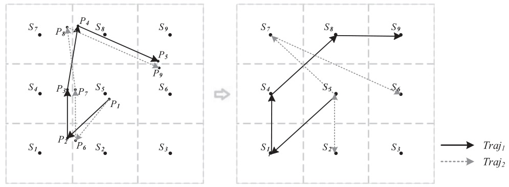
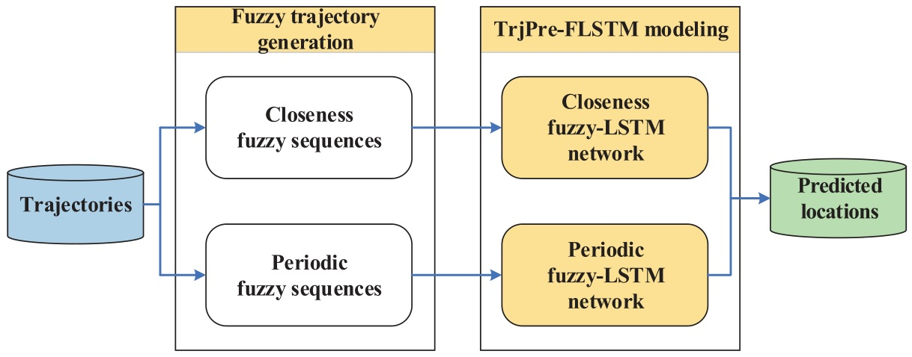
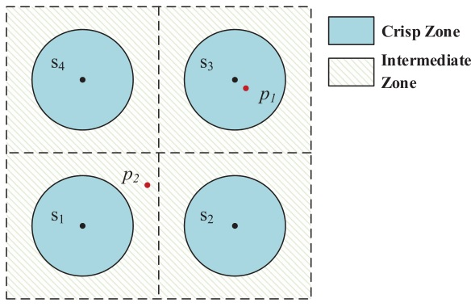

本文介绍了 LSTM （长短时记忆网络）的基本概念，以及正/反向传播的推导过程，然后分析了 LSTM 如何克服 RNN 的梯度消失问题，最后介绍了 PyTorch 的 LSTM 模块的实现。

<!--more-->

---

- [1. 引言](#1-引言)
- [2. 问题描述](#2-问题描述)
- [3. 方法](#3-方法)
  - [3.1. 模糊轨迹生成](#31-模糊轨迹生成)
  - [3.2. 模糊轨迹计算](#32-模糊轨迹计算)
- [4. 参考文献](#4-参考文献)

# 1. 引言

基于运动状态微分、基于频率模式挖掘、基于机器学习，三种运动位置预测方法。基于机器学习的方法已经称为主流。

目前的轨迹预测存在两个局限性：

- 考虑存储容量的制约，大量运动位置信息很难存储，一般将数字地图划分为网格或者类。这样，时序位置轨迹就可以转变为一系列时序网格编号。这样做的弊端在于，严格的边界约束可能会导致原本两个十分相近的轨迹因为归属的网格不同而完全不同。如图所示

- 城市居民的运行轨迹存在强烈的周期性特征，比如人们在连续工作日早高峰的晨跑轨迹可能每天都很类似。作者发现绝大多数轨迹预测模型只关注最近的运动模式，基本都用最近的历史轨迹来做预测，忽略了周期性运动模式。

为了解决上述问题，作者提出了一个新型预测模型，基于深度模糊 LSTM 模型（TrjPre-FLSTM）。贡献点如下

- 引入模糊空间分割方法，产证模糊轨迹，解决严格边界约束。大幅度提高轨迹预测的精度和可靠性。
- 提出了一种改进的 LSTM 细胞结构：fuzzy-LSTM，能够很好的适应模糊空间划分，有效学习长时间的历史轨迹中的时空模式。
- 考虑到人运动的连续性和周期性特点，作者提出的模型在预测轨迹时同时考虑了时间相近和周期运动模式，提高了预测精度。
- 用真实连续的运动交流信号数据库，与最新方法 NLPMM 和 naive LSTM 进行比较，具备优势。

# 2. 问题描述

轨迹被表示为位置的时间序列

$$
Traj = (p_1,t_1),(p_2,t_2),...,(p_n,t_n)
$$

其中 $t_i$ 时时间，$p_i$ 时经纬度信息 $(x_i, y_i)$。

将空间划分为若干单元后，轨迹可悲表示为

$$
G_{Traj} = (s_1,t_1),(s_2,t_2),...,(s_n,t_n)
$$

其中，$s_i$ 是位置 $p_i$ 所在的网格单元的编号。

相应的，轨迹预测问题可以转化为序列生成任务，目标是根据已有的知识，计算出下一个最可能的单元。

# 3. 方法

采用 TrjPre LSTM 的预测过程如下图所示。

## 3.1. 模糊轨迹生成

首先介绍模糊轨迹（fuzzy trajectory）。根据模糊集理论和前人研究，作者将传统的网格细胞划分为精确区域（crisp zone）和中间区域（intermediate zone），如下图所示。

当位置坐标 $p_i$ 位于精确区域中时，该坐标即属于该区域所在的网格。中间区域相当于一个模糊区域，当位置坐标位于该区域时，它属于最近的四个网格。

假设网格方块的边长为 $l$，精确区域半径为 $r$，有 $l > r$。位置坐标 $p_i$ 距离网格中心 $s_j$ 的距离为 $x_{ij}$

$$
x_{ij} = \vert p_i - s_j \vert \in [0,\sqrt 2 l]
$$

$x_{ij}=0$ 表示位置坐标位于网格 $j$ 中心，$x_{ij}$ 的取值上界可借助下图阐释。图中，红色的位置坐标属于四个相邻网格内，而绿色的坐标位置已经不属于图中所示的四个相邻网格了。可以看出，位置坐标距离网格中心最远不超过 $\sqrt 2 \cdot l$，即图中粉色方形的对角点距离。

设计基于距离的隶属度函数如下

$$
\begin{aligned}
M_{i,j}^{temp} = \left(\begin{matrix}
&1\quad &d \leq r\\ 
&e^{-(x_{ij}-r)} \quad & d > r
\end{matrix}\right.
\end{aligned}
$$

$$
M_{i,j} = \frac{M_{i,j}^{temp}}{\sum_{j}M_{i,j}^{temp}}
$$

其中 $M_{i,j}^{temp}$ 是临时隶属度函数，$M_{i,j}$ 是最终的隶属度函数，第二个式子进行了一个归一化操作。

需要提醒的是，作者假定如果坐标落在了精确区域，那么其只属于该区域中心且隶属度为 1，而不再进行归一化操作。换句话说，只有落在中间区域的位置坐标才需要进行上述隶属度函数计算。这个在后面的算法伪代码中可以看出来。

借助模糊集的概念来定义模糊轨迹位置：$F\_Loc_{p_i} =N\_Loc_{p_i},M\_Loc_{p_i}$。其中 $N\_Loc_{p_i}$ 是位置坐标的临近网格集合，$M\_Loc_{p_i}$ 是相应的隶属度。那么对于前面图中的位置坐标点 $p_1,p_2$，其模糊轨迹位置为

$$
\begin{aligned}
F\_Loc_{p_1} &= (s_3), (1)\\
F\_Loc_{p_2} &= (s_1, s_2, s_3, s_4), (0.2,0.25, 0.25, 0.3)
\end{aligned}
$$

进行模糊区域划分和求解模糊轨迹位置的算法伪代码如下所示

很奇怪的是，作者原文的伪代码中，当位置坐标处于中间区域时（也就是代码中的 ELSE 部分），并没有给出如何计算 $N\_Loc_{p_i}$ 的。

**注意**！$r$ 的选取对模糊空间划分影响很大。如果  选择一个较小的 $r$ 很难帮助捕捉落入中间区域的位置点，如果选择很大的 $r$ 会降低靠近网格中心的不同轨迹位置的相似度，还会增加计算代价。$r$ 的取值可以借助轨迹位置坐标的分布来标定。

## 3.2. 模糊轨迹计算

定义模糊轨迹为

$$
F\_Traj_i = N\_seq_{Traji},M\_seq_{Traji}
$$

其中，$N\_seq_{Traji}$ 是轨迹中每个位置坐标 $N\_Loc_{p_i}$ 的笛卡尔乘积（直积），相应的 $M\_seq_{Traji}$ 是坐标对应邻近网格的空间隶属度的乘积。那么对于包含 $n$ 个坐标点的轨迹 $S_{seq_m} = N\_seq_{Traji}$ 是一个 $4^n$ 项序列（$n$ 个位置坐标，每个位置坐标邻近 4 个网格单元，直积）

假设真实轨迹 $Traj_1 = (p_1, p_2)$，那么对应的模糊轨迹 $F\_Traj_1 = ( s_3s_2,s_3s_1,s_3s_3,s_3s_4 ),( 0.25,0.3,0.2,0.25 )$。

计算模糊轨迹的算法如下

- 首先根据算法 1 计算出每个轨迹位置的空间隶属度（line 2-5）。
- 然后计算邻域网格单元序列集，采用直积的形式计算（line 6）。
- 相应的隶属度序列通过矩阵乘法的形式计算（line 7-12）。

从算法和描述上很难看懂，大概理解了下，如下图所示。

序列 $S_{ij}$ 的第一个下标 $i$ 表示轨迹坐标点的编号，从 1 到 $n$ 。第二个下标 $j$ 表示轨迹坐标点的周围四个邻近网格单元编号，`1-左下，2-右下，3-右上，4-左上` 的顺序 。

前面已经分析过一共有 $4^n$ 中可能的模糊轨迹序列，比如其中一个模糊轨迹序列为

$$
S_{11}S_{22}S_{34}S_{43}...S_{n1}
 = 坐标1左下 - 坐标2右下 - 坐标3左上 - 坐标4右上...坐标n左下
$$

注意到，每个坐标对于邻近四个网格单元都可以根据 **算法1** 计算出相应的隶属度，那么对于一个具体的模糊轨迹序列，其隶属度就是每个坐标与其某个方向邻近网格单元的隶属度的乘积。

# 4. 参考文献

无。