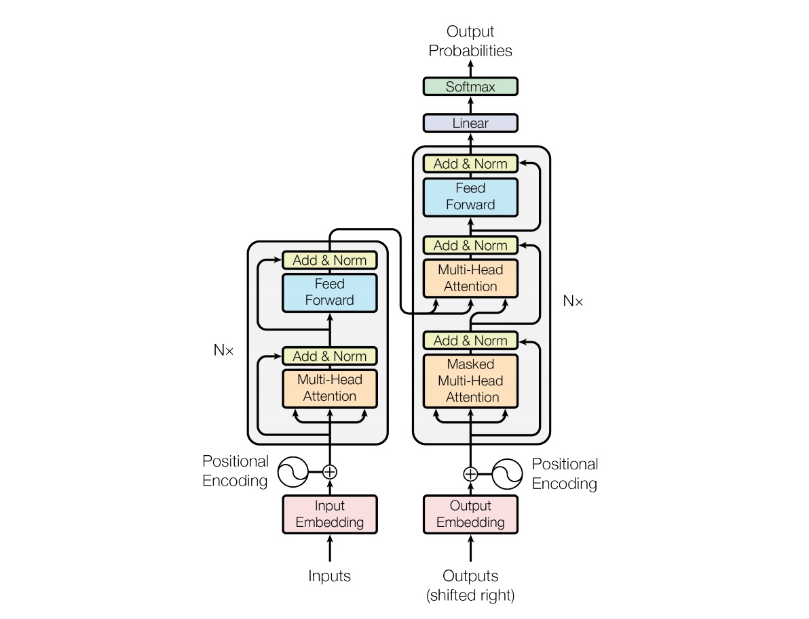

本文主要介绍 seq2seq learning 中的 Transformer 模型，由谷歌提出。

<!--more-->

---
- [3. Transformer](#3-transformer)
  - [3.1. 简介](#31-简介)
- [3. 参考文献](#3-参考文献)

# 3. Transformer

## 3.1. 简介

自 Attention 机制提出后，加入 attention 的 seq2seq 模型在各个任务上都有了提升，所以现在的 seq2seq 模型指的都是结合 RNN 和 attention 的模型。之后 google 又提出了解决 Seq2Seq 问题的 Transformer 模型，用全 attention 的结构代替了 lstm，在翻译任务上取得了更好的成绩。

Transformer 来自 Google 团队 2017 年的文章 《Attenion Is All You Need》（https://arxiv.org/abs/1706.03762 ），该文章的目的：减少计算量并且提高并行效率，同时不减弱最终的实验效果。

模型结构如下图所示

和大多数seq2seq模型一样，transformer的结构也是由encoder和decoder组成。

# 3. 参考文献

rumor. [【NLP】Transformer模型原理详解](https://zhuanlan.zhihu.com/p/44121378)

\_zhang_bei\_. [自然语言处理中的Transformer和BERT](https://blog.csdn.net/Zhangbei_/article/details/85036948)
