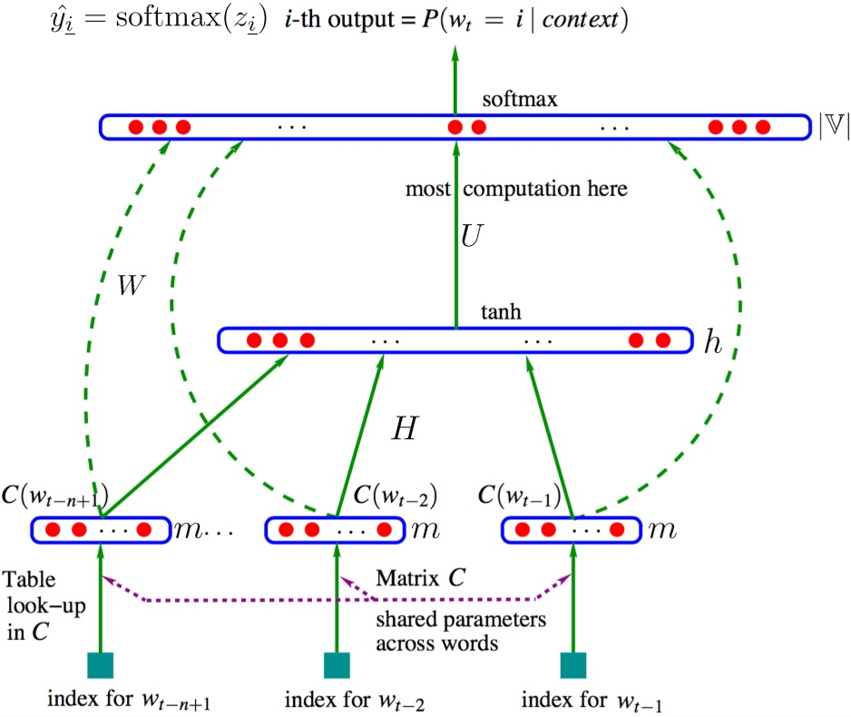
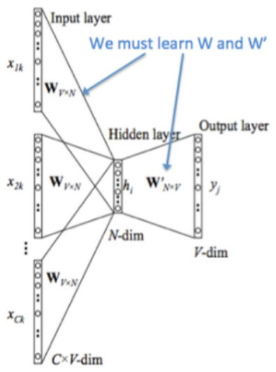
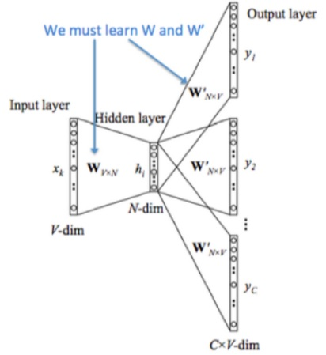

本文介绍了谷歌提出的 BERT 框架，基于 Transformer，在 NLP 领域的 11 个方向大幅刷新了精度，是近年来自残差网络最有突破性的一项技术。

<!--more-->

---
- [1. 简介](#1-简介)
- [2. 预备知识](#2-预备知识)
  - [2.1. 语言模型](#21-语言模型)
    - [2.1.1. N-gram](#211-n-gram)
    - [2.1.2. NNLM](#212-nnlm)
  - [2.2. 词向量模型](#22-词向量模型)
    - [2.2.1. CBoW](#221-cbow)
    - [2.2.2. Skip-gram](#222-skip-gram)
    - [2.2.3. 两个提速手段](#223-两个提速手段)
    - [2.2.4. ELMo](#224-elmo)
- [3. 总体结构](#3-总体结构)
- [4. 参考文献](#4-参考文献)


# 1. 简介

> Devlin J, Chang M W, Lee K, et al. **BERT: Pre-training of Deep Bidirectional Transformers for Language Understanding**[J]. arXiv preprint arXiv:1810.04805v2, 2018.

BERT（**B**idirectional **E**ncoder **R**epresentations from **T**ransformers）近期提出之后，作为一个 word2vec 的替代者，其在 NLP 领域的 11 个方向大幅刷新了精度，可以说是近年来自残差网络最优突破性的一项技术了。论文的主要特点以下几点：

- 使用了 Transformer 作为算法的主要框架，Transformer 能更彻底的捕捉语句中的双向关系；
- 使用了Mask Language Model(MLM) （Wilson L Taylor. 1953. cloze procedure: A new tool for measuring readability. Journalism Bulletin, 30(4):415–433.）和 Next Sentence Prediction(NSP) 的多任务训练目标；
- 使用更强大的机器训练更大规模的数据，使 BERT 的结果达到了全新的高度，并且 Google 开源了 BERT 模型，用户可以直接使用 BERT 作为 Word2Vec 的转换矩阵并高效的将其应用到自己的任务中。

**BERT 的本质上是通过在海量的语料的基础上运行自监督学习方法为单词学习一个好的特征表示，即 BERT 是一个<font color=red>词向量模型</font>**。所谓自监督学习是指在没有人工标注的数据上运行的监督学习。在以后特定的 NLP 任务中，我们可以直接使用 BERT 的特征表示作为该任务的词嵌入特征。**所以 BERT 提供的是一个供其它任务迁移学习的模型，该模型可以根据任务微调或者固定之后作为特征提取器**。BERT 的源码和模型2019年10月31号已经在 Github 上开源，简体中文和多语言模型也于11月3号开源。

# 2. 预备知识

## 2.1. 语言模型

语言模型是一个基于概率的判别模型，它的输入是一句话（单词的顺序序列），输出是这句话的概率，即这些单词的联合概率（joint probability）。

首先回顾一下自然语言处理中的一个基本问题：**如何计算一段文本序列在某种语言下出现的概率**？之所为称其为一个基本问题，是因为它在很多 NLP 任务中都扮演着重要的角色。例如，在机器翻译的问题中，如果我们知道了目标语言中每句话的概率，就可以从候选集合中挑选出最合理的句子做为翻译结果返回。

统计语言模型给出了这一类问题的一个基本解决框架。对于一段文本序列

$$
S=\omega_1,\omega_2,...,\omega_T
$$

它的概率可以表示为

$$
P(S) = P(\omega_1,\omega_2,...,\omega_T) = \prod_{t=1}^Tp(\omega_t\vert \omega_1,\omega_2,...,\omega_{t-1})
$$

也即假设，每一个单词 $w_i$ 都要依赖于从第一个单词 $w_1$ 到它之前一个单词 $w_{t-1}$ 的影响。问题变成了如何预测连乘中这些给定 previous words 下的条件概率。

上述概率衡量方法有两个缺陷

- 参数空间巨大，$p(\omega_t\vert \omega_1,\omega_2,...,\omega_{t-1})$ 的参数有 $O(n)$ 个；
- 数据稀疏严重，词同时出现的情况可能没有（条件概率为 0），组合阶数高时尤其明显。

### 2.1.1. N-gram

为了解决第一个问题，我们引入马尔科夫假设（Markov Assumption）：一个词的出现仅与它之前的若干个词有关。这就产生了 N-gram 模型

$$
p(\omega_t\vert \omega_1,\omega_2,...,\omega_{t-1}) = p(\omega_t\vert \omega_{t-N+1},...,\omega_{t-1})
$$

一般取 $N=2$ 或者 $N=3$，分别对应 Bi-gram 和 Tri-gram 模型，前者认为每个词只与前面一个词有关，后者认为与前两个词有关。比如一个句子，`I love deep learning` 分别分解为：

```
Bi-gram : {I, love}, {love, deep}, {love, deep}, {deep, learning}
Tri-gram : {I, love, deep}, {love, deep, learning}
```

### 2.1.2. NNLM

> 2003. A neural probabilistic language model
> 西多士NLP. [词向量(one-hot/SVD/NNLM/Word2Vec/GloVe)](https://www.cnblogs.com/sandwichnlp/p/11596848.html)

在N-gram 的基础上，Bengio 在 2003 年提出 NNLM 即 Neural Network based Language Model，并首次提出了 word embedding 的概念（虽然没有叫这个名字）。它是一个很简单的模型，由四层组成，输入层、嵌入层、隐层和输出层。模型接收的输入是长度为 $n$ 的词序列，输出是下一个词的类别。

NNLM模型的基本思想可以概括如下：

- 假定词表中的每一个 word 都对应着一个连续的特征向量；
- 假定一个连续平滑的概率模型，输入一段词向量的序列，可以输出这段序列的联合概率；
- 同时学习词向量的权重和 Ngram 概率模型里的参数。

Bengio等人采用了一个简单的前向反馈神经网络 $f(w_{t−n+1},...,w_t)$ 来拟合一个词序列的条件概率 $p(\omega_t\vert \omega_{t-N+1},...,\omega_{t-1})$。整个模型的网络结构为一个三层神经网络，第一层映射层，第二层隐层，第三层输出层。



用端到端的思想来看，我们输入一个词的 one-hot 向量表征，希望得到相应的相应词的条件概率，则**神经网络模型要做的就是拟合一个由 one-hot 向量映射为相应概率模型的函数**。我们将上图的网络结构拆成两部分来理解：

- 首先是一个线性的映射层。它将输入的 $N−1$ 个 one-hot 词向量，通过一个共享的 $D\times V$ 的矩阵 $C$，映射为 $N−1$ 个分布式的词向量（distributed vector）。其中，$V$ 是词典的大小，$D$ 是 embedding 向量的维度（一个先验参数）。

  $C$ 矩阵里存储了要学习的词向量，为什么这是我们需要的词向量呢？试想一下，当我们把 $n$ 个 one-hot 表征的词向量词典输入到神经网络中，单层的神经网络进行的运算无非就是 $Y=W^TX$，这个操作等效于查表操作，one-hot 向量将 $n$ 个词向量从 embedding 层中原封不动地提取出来，如下图所示。

  

  这样，我们在训练语言模型的过程中，映射层的权值就等效为我们需要的词向量表征。值得注意的一点是，这里的词向量也是要学习的参数，也就是说词向量是在训练的过程中自动生成的。

- 其次是一个简单的前向反馈神经网络 $g$。它是前面 embedding 层输出的直接拼接，由一个激活函数为 $tanh$ 的 $(N-1)\times D$ 维隐藏层和一个 $V$ 维 $softmax$ 输出（分类）层组成，可以将我们得到的一系列输出映射成对应概率。这样，通过将 embedding 层输出的 $N−1$ 个词向量映射为一个长度为 $V$ 的概率分布向量，从而对词典中的 word 在输入 context 下的条件概率做出预估

  $$
  p(\omega_t\vert \omega_1,...,\omega_{t-1}) \approx f(\omega_{t-n+1},...,\omega_{t-1})=g(C(\omega_{t-n+1}),...,C(\omega_{t-1}))
  $$

注意到，当词表长度 $V$ 和期望的词向量维度 $D$ 确定的时候，第一层映射层和 softmax 输出层的规模就已经确定了，而隐藏层打大小可以由我们自己指定。我们可以通过最小化一个带正则项的 cross-entropy 损失函数来调整神经网络的模型参数

$$
L(\theta) = \frac{1}{T}\sum_t logf(\omega_{t-n+1},...,\omega_{t-1})+R(\theta)
$$

上式包含一个巨大的参数空间。不过，在每次用 SGD 学习更新模型的参数时，并不是所有的参数都会进行调整，只有当前 context 包含词的词向量才会被更新（因为映射层的输出只会得到这些词的输出，并参与接下来的运算）。真正的计算瓶颈主要是在 softmax 层的归一化函数上（需要对词典中所有的 word 计算一遍条件概率）。

NNLM 解决了语言模型中的以下两个问题

- 条件概率 $p(\omega_t \vert context)$ 的计算；
- 向量空间模型（Vector Space Model，VSM）里词向量的表达；
  > 一个稠密连续向量也就是所谓的词向量的分布式表征。事实上，这个概念在信息检索（Information Retrieval）领域早就已经被广泛地使用了，当时，这个方法被称为向量空间模型（Vector Space Model，VSM）。VSM 主要基于两个假说：词袋假说（Bag of Words Hypothesis）和分布假说（Distributional Hypothesis）。前者是说，一篇文档的词频（而不是词序）代表了文档的主题；后者是说，上下文环境相似的两个词有着相近的语义。

NNLM模型仍然存在一系列问题：

- 由于NNLM模型使用的是全连接神经网络，因此只能处理定长的序列；
- 由于其巨大的参数空间，将NNLM的训练太慢了。即便是在百万量级的数据集上，即便是借助了40个CPU进行训练，NNLM也需要耗时数周才能给出一个稍微靠谱的解来。显然，对于现在动辄上千万甚至上亿的真实语料库，训练一个NNLM模型几乎是一个impossible mission。

针对第一个问题，Mikolov 在 2010 年提出了 RNNLM，其结构实际上是用 RNN 代替 NNLM 里的隐层，这样做的好处包括减少模型参数、提高训练速度、接受任意长度输入、利用完整的历史信息。同时，RNN的引入意味着可以使用 RNN 的其他变体，像 LSTM、BiLSTM、GRU 等等，从而在时间序列建模上进行更多更丰富的优化。

## 2.2. 词向量模型

针对 NNLM 的第二个问题，因此其经历了将近 10 年的左右才转变为我们所熟知的 word2vec。Mikolov 注意到，原始的NNLM模型的训练其实可以拆分成两个步骤：用一个简单模型训练出连续的词向量；基于词向量的表达，训练一个连续的Ngram神经网络模型。而NNLM模型的**计算瓶颈主要是在第二步**。如果我们只是想得到word的词向量，是不是可以对第二步里的神经网络模型进行简化呢？就这样，他在 2013 年一口气推出了两篇 paper，并开源了一款计算词向量的工具 —— 至此，word2vec 横空出世，主角闪亮登场。

词向量模型要做的事情是：学习一个从高维稀疏离散向量到低维稠密连续向量的映射。该映射的特点是，近义词向量的欧氏距离比较小，词向量之间的加减法有实际物理意义。

word2vec 包含两个模型

- 如果是用一个词语作为输入，来预测它周围的上下文，那这个模型叫做『**Skip-gram 模型**』

- 如果是拿一个词语的上下文作为输入，来预测这个词语本身，则是 『**CBoW 模型**（Continues Bag-of-Words Model）』

### 2.2.1. CBoW

在两个模型中，CBoW 与之前的 NNLM 更为相似，简单概括其思路就是：输入中间词前后共 $C$个词，预测中间词，在这个过程中训练出我们需要的词向量矩阵。其模型结构如下图所示



下面讲解一下该模型结构：

- 图中 $[x_{1k},...,x_{Ck}]$ 表示第 $k$ 个中心词的前后 $C$ 个上下文的 one-hot 向量
- 将 one-hot 向量输入存放词向量的矩阵 $W_{V\times N}$进行查表，$V$ 为词表的大小，$N$ 为词向量的维度
- 将查表得到的上下文向量直接进行求和，再通过一个 $N\times V$ 的矩阵映射到输出层

可以看出，CBoW 与 NNLM 的主要不同为

- 移除了 NNLM 中的隐层结构（tanh）；
- 直接将 embedding layer 的查表结果累加求和（NNLM 是拼接）
- 将下文单词纳入上下文环境，真正考虑了 context（NNLM的输入严格来说为上文文本）

### 2.2.2. Skip-gram

CBoW 模型依然是从 context 对 target word 的预测中学习到词向量的表达。反过来，我们能否从 target word 对context 的预测中学习到 word vector 呢？答案显然是可以的：这便是 Skip-gram 模型。其模型结构与 CBoW 模型大同小异，也包括输入层、隐层（其实是多余的，加上该层以便与与 CBoW 模型对比）和输出层



经过神经网络隐层的计算，输入词会从一个 $1\times V$ 的 one-hot 向量变成 $1\times N$ 的向量，再被输入到输出层。输出层是一个 softmax 回归分类器，它的每个结点将会输出一个 0 ~ 1 之间的值（概率），这些所有输出层神经元结点的概率之和为 1 。

Skip-gram 模型的本质是计算输入词的 input vector 与目标词的 output vector 之间的余弦相似度，并进行 softmax 归一化。我们要学习的模型参数正是这两类词向量。

### 2.2.3. 两个提速手段

然而，每当计算一个词的概率都要对词典里的 $V$ 个词计算相似度，然后进行归一化，这基本上时不现实的。为此，Mikolov 引入了两个提速手段：层次 Softmax（Hierarchical Softmax）和负采样（Negative Sampling）。普遍认为 Hierarchical Softmax 对低频词效果较好；Negative Sampling对高频词效果较好，向量维度较低时效果更好。

Hierarchical Softmax是word2vec中的一项关键技术，简单来说，其通过构造一个Huffman树，将复杂的归一化概率问题转化为一系列二分类的条件概率相乘的形式。首先，我们需要了解什么是Huffman树。

Huffman编码又称为最优二叉树，表示一种带权路径长度最短的二叉树。带权路径长度，指的就是叶子结点的权值乘以该结点到根结点的路径长度。而我们需要构造的Huffman树结构，是以词表为根结点，每一个子节点为父节点的不相交子集，词为叶节点的结构。我们将叶节点的权值转化为词频，则带权路径长度指的就是词频乘以路径的大小，带权路径最小的条件使得构造出来的霍夫曼树中，高频词离根结点更近，而低频词离根结点更远。其构造的Huffman树如下所示：


在构建Huffman树的同时，会为每一个非叶子节点初始化一个向量，该向量用于与预测向量求条件概率，假设我们的根结点表示原始字典D，则第二层的两个子节点表示D的两个子集D1和D2，则在给定context的条件下，目标词wt属于D1的条件概率可以转换为一个二分类的逻辑回归函数：

---

这里主要横向比较一下 word2vec，ELMo，BERT 这三个模型，着眼在模型亮点与差别处。

传统意义上来讲，词向量模型是一个工具，可以把真实世界抽象存在的文字转换成可以进行数学公式操作的向量，而对这些向量的操作，才是 NLP 真正要做的任务。因而某种意义上，NLP 任务分成两部分，预训练产生词向量，对词向量操作（下游具体NLP任务）。

从 word2vec 到 ELMo 到 BERT，做的其实主要是把下游具体 NLP 任务的活逐渐移到预训练产生词向量上。下面是一个大体概括，具体解释后面会写到。。

- word2vec $\rightarrow$ ELMo：

结果：上下文无关的 static 向量变成上下文相关的 dynamic 向量，比如苹果在不同语境 vector 不同。

操作：encoder 操作转移到预训练产生词向量过程实现。

- ELMo $\rightarrow$ BERT：

结果：训练出的 word-level 向量变成 sentence-level 的向量，下游具体 NLP 任务调用更方便，修正了 ELMo 模型的潜在问题。

操作：使用句子级负采样获得句子表示/句对关系，Transformer 模型代替 LSTM 提升表达和时间上的效率，masked LM 解决 “自己看到自己” 的问题。

### 2.2.4. ELMo


# 3. 总体结构

BERT的网络架构使用的是《Attention is all you need》中提出的多层 Transformer 结构，其最大的特点是抛弃了传统的 RNN 和 CNN，通过 Attention 机制将任意位置的两个单词的距离转换成 1，有效的解决了 NLP 中棘手的长期依赖问题。详细可参考[此处](./deep-learning-Transformer/)。


# 4. 参考文献

[1] 大师兄. [BERT详解](https://zhuanlan.zhihu.com/p/48612853)

[1] 不会停的蜗牛. [图解什么是 Transformer](https://www.jianshu.com/p/e7d8caa13b21)

[2] rumor. [【NLP】Transformer模型原理详解](https://zhuanlan.zhihu.com/p/44121378)

[3] \_zhang_bei\_. [自然语言处理中的Transformer和BERT](https://blog.csdn.net/Zhangbei_/article/details/85036948)

[4] Amirhossein Kazemnejad. [Transformer Architecture: The Positional Encoding](https://kazemnejad.com/blog/transformer_architecture_positional_encoding/)
