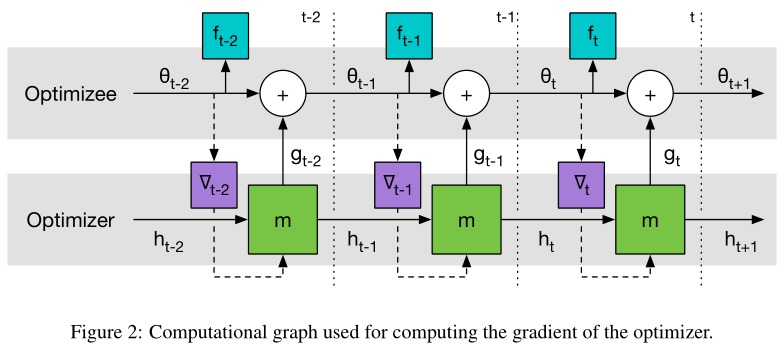
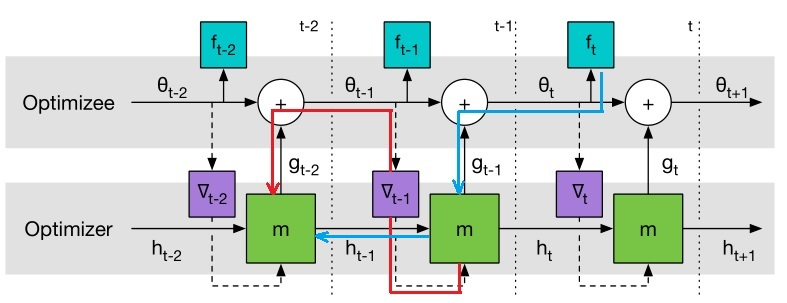
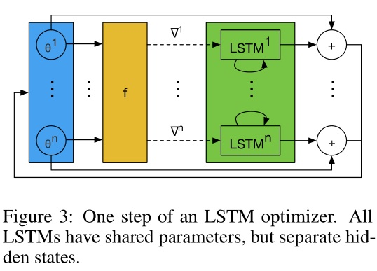
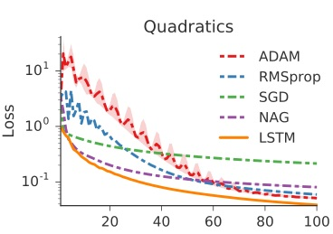
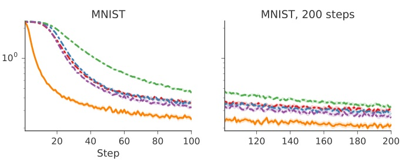

本文介绍了用梯度下降的方法学会了梯度下降的学习方法，用 LSTM 代替传统人设计的诸如RMSprop、ADAM 等优化方法去学习出一个针对特定任务的优化器。

<!--more-->

---
- [1. 简介](#1-简介)
  - [1.1. 迁移学习和泛化](#11-迁移学习和泛化)
  - [1.2. 相关工作](#12-相关工作)
- [2. 采用 RNN 实现学会学习](#2-采用-rnn-实现学会学习)
  - [2.1. 问题框架](#21-问题框架)
  - [2.2. coordinatewise LSTM 优化器](#22-coordinatewise-lstm-优化器)
  - [2.3. 预处理与后处理](#23-预处理与后处理)
- [3. 实验](#3-实验)
  - [3.1. 10 维函数](#31-10-维函数)
  - [3.2. MNIST](#32-mnist)
- [4. 参考文献](#4-参考文献)

# 1. 简介

> Marcin Andrychowicz1, Misha Denil1, Sergio Gómez Colmenarejo, Nando de Freitas, et al. **Learning to learn by gradient descent by gradient descent**[J]. NIPS 2016.

> Learning to learn is a very exciting topic for a host of reasons, not least of which is the fact that we know that the type of backpropagation currently done in neural networks is implausible as an mechanism that the brain is actually likely to use: there is no Adam optimizer nor automatic differentiation in the brain! Something else has to be doing the optimization of our brain’s neural network, and most likely that something else is itself a neural network!

目前深度学习的情况只是输入输出过程是神经网络，但调控神经网络的是人工设计！或者说这个学习机制是人工给定的。

本文解决的是优化算法的学习问题。具体来说，假设目标函数为 $f(\theta)$，机器学习中我们经常可以把优化目标表示成

$$
\theta^*=argmin_{\theta\in \Theta}f(\theta)
$$

对于连续的目标函数，标准的梯度下降序列式如下

$$
\theta_{t+1} - \theta_t - \alpha \nabla f(\theta_t)
$$

优化方面的许多现代工作都基于设计针对特定问题类别的更新规则，不同研究社区之间关注的问题类型不同。比如在深度学习领域，大量研究专门针对高维，非凸优化问题的优化方法，这些促使了**momentum** [Nesterov, 1983, Tseng, 1998], **Rprop** [Riedmiller and Braun, 1993], **Adagrad** [Duchi et al., 2011], **RMSprop** [Tieleman and Hinton, 2012], 和 **ADAM** [Kingma and Ba, 2015] 等优化方法的研究。

上述研究更多的关注各自问题结构本身，但往往存在潜在的较差泛化性能为代价。根据 *No Free Lunch Theorems for Optimization* [Wolpert and Macready, 1997] （天下没有免费的午餐）理论，组合优化设置下，没有一个算法可以绝对好过一个随机策略。因此，将研究局限于特定子问题的方式是 **唯一** 能提高性能的研究手段。

本文另辟蹊径，提出了一种【**基于学习的更新策略**】代替【**人工设计的更新策略**】（用一个可学习的梯度更新规则，替代手工设计的梯度更新规则），称之为（优化）优化器（optimizer） $g$，由其参数 $\phi$ 定义。

- （优化）优化器 optimizer：$g$，参数为 $\phi$
- （原始）优化器 optimizee：参数为 $\theta$

因此原始优化器（optimizee）的参数优化序列式形式为

$$
\theta_{t+1} - \theta_t + g_t ( \nabla f(\theta_t),\phi)
$$

也即用一个 optimizer 来直接给出 optimizee 的参数更新方式（大小和方向）。$g$ 的取值与目标函数 $f$ 的梯度 $\nabla f$ 以及自身参数 $\phi$。文中的 optimizer 采用 RNN 实现，具体而言采用 LSTM 实现。

>  RNN 存在一个可以保存历史信息的隐状态，LSTM 可以从一个历史的全局去适应这个特定的优化过程，LSTM 的参数对每个时刻节点都保持 “聪明”，是一种 “全局性的聪明”，适应每分每秒。

## 1.1. 迁移学习和泛化

【强烈怀疑本节是审稿人要求加的】

这项工作的目的是开发一种构建学习算法的程序，该算法在特定类别的优化问题上表现良好。通过将算法设计演化为学习问题，我们可以通过示例问题实例来指定我们感兴趣的问题类别。这与通常的方法不同，后者通常通过分析来表征有趣问题的特性，并利用这些分析见解来手动设计学习算法。【**个人理解，通过数据驱动来学习设计优化算法，而不是通过人工分析问题来设计优化算法**】

在普通的统计学习中，**泛化** 反映了目标函数在未知点处的行为进行预测的能力。 而在本文中，任务本身就是问题实例，这意味着泛化衡量了在不同问题之间传递知识的能力。问题结构的这种重用通常被称为**迁移学习**，并且通常被视为独立的主题。但是从元学习的观点出发，**我们可以认为迁移学习是一种泛化**，后者在机器学习领域中已有广泛的研究。

深度学习的成功之处就在于，我们可以依赖深度网络的泛化能力，通过学习感兴趣的子结构去适应新样本。本文旨在利用这种泛化能力，还将其从简单的监督学习提升到更广泛的优化设置。

> This is in contrast to the ordinary approach of characterizing properties of interesting problems analytically and using these analytical insights to design learning algorithms by hand.
> 
> The meaning of generalization in this framework is
> 
> - the ability to transfer knowledge between different problems
> - the way that learning some cmmon structures in different problems
> - the capability applied to more general optimization problem.

在本文的框架中，泛化的含义是

- 在不同问题之间传递知识的能力
- 学习不同问题中某些通用结构的方式
- 该能力适用于更一般的优化问题

## 1.2. 相关工作

略。

# 2. 采用 RNN 实现学会学习

## 2.1. 问题框架

假设最终的 optimizee 的参数为 $\theta^*(f,\phi)$，即其与 optimizer 参数 $\phi$ 和位置的目标函数 $f$ 有关。

提出以下问题：什么样的 optimizer 算是 “好” 的optimizer呢？当然是让 optimizee 的 loss 值越最小的 optimizer 最好。所以optimizer 的 loss 值应该是基于 optimizee 的 loss 值的。

再次回顾我们最终的目标

$$
\theta^*=argmin_{\theta\in \Theta}f(\theta)
$$

给定一个目标函数 $f$ 的分布，那么 optimizer 的损失定义为

$$
\mathcal L(\phi) = \mathbb E_f[f(\theta^*)]
$$

这里详细解读一下，对于某个具体的任务

- 目标函数 $f$ （个人理解就是 loss）
- 最终优化后的 optimizee 的参数为 $\theta^*$。写成 $\theta^*(f,\phi)$，与 $f$ 有关因为不同的 $f$ 会导致不同的最优参数；与 $\phi$ 有关因为最优的参数是依赖 optimizer 给出的，而 optimizer 的参数为 $\phi$
- 最终的损失为 $f(\theta^*)$
- 因此 optimizer 的损失就是上述最终损失的期望 $\mathbb E_f[f(\theta^*)]$，为啥求期望？

上式即为优化最终的 optimizee 的损失（optimizing for the best final result with our optimizee.）。注意，最终最优的参数 $\theta^*$ 我们还并不知道，它是通过一个优化过程得到的。因此虽然这样设计合理，但是给训练造成了很大麻烦（This seems reasonable, but it makes it much harder to train）。

假设经过 $T$ 次优化步骤，更加方便的做法是将 optimizer 的损失定义为整个优化过程的损失的加权和

$$
\mathcal L(\phi) = \mathbb E_f\left[ \sum_{t=1}^T\omega_tf(\theta_t) \right]
$$

其中

$$
\theta_{t+1} = \theta_t+g_t
$$

$$
[ g_t,h_{t+1} ] = {\rm lstm}(\nabla_t,h_t,\phi)
$$

$\omega_t \in \mathbb R_{\geq0}$ 是各个优化时刻的任意权重，$\nabla_t = \nabla_\theta f(\theta_t)$。

当 $t=T$ 且只有该时刻的 $\omega_t = 1$ 时

$$
\mathcal L(\phi) = \mathbb E_f[f(\theta^*(f,\phi))] = \mathbb E_f\left[ \sum_{t=1}^T\omega_tf(\theta_t) \right]
$$

对上面的过程进行详细解读：

- **Meta-optimizer 优化器**：目标函数整个优化周期的 loss 都要很小（加权和）
- **传统优化器**：对于当前的目标函数，只要这一步的 loss 比上一步的 loss 值要小就行

可以用 GD 来最小化 $\mathcal L(\phi)$，梯度估计 $\partial \mathcal L(\phi)/\partial\phi$ 可以通过采样随机的 $f$ 然后对计算图进行反向传播来求解。我们允许梯度沿着实线反传，但是丢弃了沿着虚线的路径。这种考虑相当于假设 $\partial \nabla_t/\partial \phi = 0$，这样可以避免计算 $f$ 的二阶导。

> 【**个人理解**】：从计算图上求$\partial \mathcal L(\phi)/\partial\phi$，需要沿着箭头方向反向流动，如果考虑虚线，那么就包括如下图所示的路径，这需要求 $\partial \nabla_t/\partial \theta \cdot \partial \theta / \partial \phi$，其中 $\theta$ 对 $\phi$ 包含三部分，一部分是 lstm 内直接相关的 $\partial \theta / \partial \phi$，另一部分是通过隐层回传的 $\partial \theta / \partial h_t$。第三一部分是随着 $\nabla_tf$ 往前回传的（$\partial \nabla_t/\partial \phi = \partial \nabla_t / \partial \theta \cdot \partial \theta / \partial \phi$），这一部分中包含 $f$ 的二阶导（$\partial \nabla_t / \partial \theta$），为了计算简便，作者假设该项等于 0，也即忽略了下图中梯度回传的虚线（红线）路径。
>
> 

从上面 LSTM 优化器的设计来看，我们几乎没有加入任何先验的人为经验在里面，只是用了长短期记忆神经网络的架构，优化器本身的参数 $\phi$ 即 LSTM 的参数，这个优化器的参数代表了我们的更新策略，后面我们会学习这个参数，即学习用什么样的更新策略。

## 2.2. coordinatewise LSTM 优化器

> One challenge in applying RNNs in our setting is that we want to be able to optimize at least tens of thousands of parameters. Optimizing at this scale with a fully connected RNN is not feasible as it would require a huge hidden state and an enormous number of parameters. To avoid this difficulty we will use an optimizer m which operates coordinatewise on the parameters of the objective function, similar to other common update rules like RMSprop and ADAM. **This coordinatewise network architecture allows us to use a very small network that only looks at a single coordinate to define the optimizer and share optimizer parameters across different parameters of the optimizee**.

采用 RNN（LSTM） 的一大挑战就是，我们想要优化成千上万的参数。采用全连接 RNN 需要巨大的隐层 $h_t$（假设输入向量 $\theta$ 维度为 $M$，则 $h_t \in \mathbb R^M$）和巨量的参数（假设隐层维度为 $D$，则参数 $W_f, W_i, W_o, W_c\in \mathbb R^{D\times (D+M)}$），这是不现实的。

为了克服这一点，我们只设计一个优化器 $m$ 对目标函数的每个参数分量进行操作。具体而言，每次只对 optimizee 的 **一个参数分量** $\theta_i$ 进行优化，这样只需要维持一个很小的 optimizer（lstm）就可以完成工作了。

对于每个参数分量 $\theta_i$ 而言，optimizer（lstm）的参数 $\phi$ 是共享的，但是隐层状态 $h_i$ 是不共享的。由于每个维度上的 optimizer（lstm）输入的 $h_i$ 和 $\nabla f(\theta_i)$ 是不同的，所以即使它们的 $\phi$ 相同，但是它们的输出却是不一样的。

换句话说，这样设计的 lstm 变相实现了优化与维度（顺序）无关。这与传统的 RMSprop 和 ADAM 的优化方式类似，它们也是为每个维度的参数施行同样的梯度更新规则。

> Adrien Lucas Ecoffet 的解读[[1](#ref1)]：
> The “coordinatewise” section is phrased in a way that is a bit confusing to me, but I think it is actually quite simple: what it means is simply this: **every single “coordinate” has its own state** (though **the optimizer itself is shared**), and information is not shared across coordinates.
> I wasn’t 100% sure about is what a “coordinate” is supposed to be. My guess, however, is that it is simply a weight or a bias, which I think is confirmed by my experiments. In other words, if we have a network with 100 weights and biases, there will be 100 hidden states involved in optimizing it, which means that effectively there will be 100 instances of our optimizer network running in parallel as we optimize.

## 2.3. 预处理与后处理

由于 optimizer（lstm） 的输入是梯度，梯度的幅值变化换位很大，而神经网络一般只对小范围的输入输出鲁棒，因此在实践中需要对 lstm 的输入输出进行处理。

直觉上，可以采用 log 来缩放输入。作者采用如下的方式

$$
\begin{aligned}
\nabla^k \rightarrow
\left\{
  \begin{matrix}
  \left( \frac{log(\vert\nabla\vert)}{p},sgn(\nabla) \right) &\quad if \vert\nabla\vert\geq e^{-p}\\
  (-1,e^{p}\nabla) &\quad otherwise\\
  \end{matrix}
\right.
\end{aligned}
$$

> $p>0$ is a parameter controlling how small gradients are disregarded

其中 $p>0$ 为任意一个参数（作者取 $p=10$），用来裁剪梯度。上式中取绝对值就丢失了符号信息，因此需要额外加一项输入记录符号信息。

> Adrien Lucas Ecoffet 的解读[[1](#ref1)]：
> With this formula, if the first parameter is greater than -1, it is a log of gradient, otherwise it is a flag indicating that the neural net should look at the second parameter. Likewise, if the second parameter is -1 or 1, it is the sign of the gradient, but if it is between -1 and 1 it is a scaled version of the gradient itself, exactly what we want!

如果第一个参数的取值大于 -1，那么它就代表梯度的 log ，第二个参数则是它的符号。如果第一个参数的取值等于 -1，那么它将作为一个标记告诉神经网络应该去寻找第二个参数，此时第二个参数就是对梯度的缩放。

变换后画图如下（图中 $p=1$）

# 3. 实验

## 3.1. 10 维函数

设计如下的目标函数

$$
f(\theta)=\vert\vert W\theta-y \vert\vert_2^2
$$

其中 $W,y\in \mathbb R^{10} \sim i.i.d\ Gaussian\ distribution$。目的是随机产生一个 $f$，通过训练找到最优的 $\theta$ 使得 $f$ 最小。而且这个目标函数是独立同分布采样的，意味着任意初始化一个优化问题模型的参数，我们都希望这个优化器能够找到一个优化问题的稳定的解。

> Adrien Lucas Ecoffet 的解读[[1](#ref1)]：
> These are pretty simple: our optimizer is supposed to find a 10-element vector called $\theta$ that, when multiplied by a $10\times 10$ matrix called $W$, is as close as possible to a 10-element vector called $y$. Both $y$ and $W$ are generated randomly. The error is simply the **squared error**.

从高斯分布中随机采样，得到一条曲线，然后**训练100次** optimizee，期间 **每 20 次** 收集一批 loss 用来训练 optimizer（lstm），然后更新一次 optimizee 的参数更新方式。

> 原文：
> Each function was optimized for 100 steps and the trained optimizers were unrolled for 20 steps.
> Adrien Lucas Ecoffet 的解读[[1](#ref1)]：
> I assume this means that **each epoch is made up of trying to optimize a new random function for 100 steps**, but we are doing an update of the optimizer every 20 steps. The number of epochs is thus unspecified, but according to the graphs it seems to be 100 too.

在本算例中没有采用任何预处理和后处理。

结果如下

## 3.2. MNIST

> In this experiment we test whether trainable optimizers can learn to optimize a small neural network on MNIST. We train the optimizer to optimize a base network and explore a series of modifications to the network architecture and training procedure at test time.

训练一个神经网络完成 MNIST 图片分类。目标函数 $f(\theta)$ 是交叉熵，optimizee 是一个单隐层 20 个神经元的 MLP，激活函数是 sigmoid。随机选取 128 个图片作为一个 minibatch 来计算 $\partial f(\theta)/ \partial \theta$。每次任务的唯一不同在于初始参数 $\theta_0$ 和随机选择的 minibatch。每个任务跑 100 步，每 20 步训练一次 optimizer。

采用前面设计的预处理，后处理给 lstm 的输出乘以 0.1。结果如下

下面研究对不同架构的泛化。

分别将训练好的 optimizer 用于

- 40 个隐层神经元的 optimizee
- 2 层/每层 20 个神经元的 optimizee
- 采用 ReLu 激活函数的 optimizee

结果如下

# 4. 参考文献

[1] Adrien Lucas Ecoffet. [Paper repro: “Learning to Learn by Gradient Descent by Gradient Descent”](https://becominghuman.ai/paper-repro-learning-to-learn-by-gradient-descent-by-gradient-descent-6e504cc1c0de)