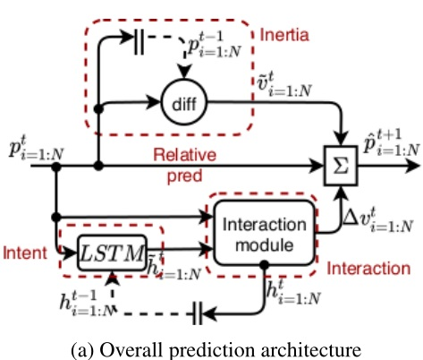
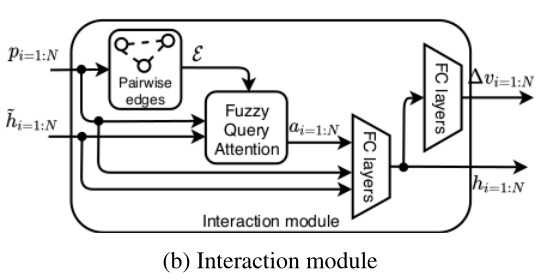

本文介绍了 2020 年 NIPS 上的一篇关于模糊注意力轨迹预测的文章，但是被骗啦（我大意了）。其实和 Fuzzy 并没有什么关系，反而是用的 Attention 机制。

<!--more-->

---
- [1. 引言](#1-引言)
  - [1.1. 归纳偏置](#11-归纳偏置)
- [2. 结构](#2-结构)
  - [2.1. 预测架构](#21-预测架构)
  - [2.2. 交互模块](#22-交互模块)
  - [2.3. 模糊查询注意力模块](#23-模糊查询注意力模块)
  - [2.4. 分析](#24-分析)
  - [2.5. 训练](#25-训练)
- [3. 实验](#3-实验)
- [4. 其它](#4-其它)
- [5. 参考文献](#5-参考文献)

> Nitin Kamra, et al. **Multi-agent Trajectory Prediction with Fuzzy Query Attention**. NIPS 2020.

# 1. 引言

## 1.1. 归纳偏置

inductive biases，归纳偏置。

> LinT. [如何理解Inductive bias？](https://www.zhihu.com/question/264264203/answer/830077823)
> 归纳偏置在机器学习中是一种很微妙的概念：在机器学习中，很多学习算法经常会对学习的问题做一些假设，这些假设就称为归纳偏置(Inductive Bias)。归纳偏置这个译名可能不能很好地帮助理解，不妨拆解开来看：归纳(Induction)是自然科学中常用的两大方法之一(归纳与演绎, induction and deduction)，指的是从一些例子中寻找共性、泛化，形成一个比较通用的规则的过程；偏置(Bias)是指我们对模型的偏好。因此，归纳偏置可以理解为，从现实生活中观察到的现象中归纳出一定的规则(heuristics)，然后对模型做一定的约束，从而可以起到“模型选择”的作用，即从假设空间中选择出更符合现实规则的模型。其实，贝叶斯学习中的“先验(Prior)”这个叫法，可能比“归纳偏置”更直观一些。
> 以神经网络为例，各式各样的网络结构/组件/机制往往就来源于归纳偏置。在卷积神经网络中，我们假设特征具有局部性(Locality)的特性，即当我们把相邻的一些特征放在一起，会更容易得到“解”；在循环神经网络中，我们假设每一时刻的计算依赖于历史计算结果；还有注意力机制，也是基于从人的直觉、生活经验归纳得到的规则。

- **惯性**（Inertia）：几乎所有无生命实体都按照匀速前进，除非收到外力作用。这个规则在作为一阶近似估计时，在段时间内同样适用于有生命实体（如行人），因为行人几乎也以匀速行走，除非需要转弯或减速以避免碰撞；
- **运动的相对性**（Motion is relative）：两个目标之间的运动是相对的，在预测未来轨迹时应该使用他们之间的相对位置和速度（相对观测，relative observations），对未来的预测也需要是相对于当前位置的偏差（相对预测，relative predictions）；
- **意图**（Intent）：有生命对象有自己的意图，运动会偏离惯性，需要在预测模型中进行考虑；
- **交互**（Interactions）：有生命对象和无生命对象可能偏离它们预期的运动，比如受到其它附近对象的影响。这种影响需要清晰的建模。

# 2. 结构

## 2.1. 预测架构

下图 (a) 为预测架构，输入 $t$ 时刻的所有对象的位置 $p^t_{i=1:N}$。使用 $t\leq T_{obs}$ 时刻的位置作为观测，对 $t\geq T_{obs}$ 时刻的位置进行预测。我们对每个对象的下一时刻位置 $\hat p^{t+1}_i$ 进行预测，预测量是相对于当前时刻 $p_i^t$ 的位置偏差（relative prediction）。

 

- **公式 1**：将位置偏差拆分为一阶常速度估计 $\tilde v_i^t$ （惯性）和速度修正项 $\Delta v_i^t$ （意图和对象间的交互）。
- **公式 2**：一阶常速度估计由当前时刻位置和前一时刻位置直接差分得到。
- **公式 3**：采用 LSTM 来捕捉每个对象的意图，其隐藏状态 $h_i^t$ 能够保存之前的轨迹信息。LSTM 的权重参数所有对象均共享。为了计算速度修正项 $\Delta v_i^t$，首先用 LSTM 根据每个对象的当前位置初步更新一个临时隐藏状态 $\tilde h_i^t$。
- **公式 4**：然后将对象当前位置和临时隐层状态 $h_i^t,$ 同时送入一个 「交互模块（Interaction module）」 来推理对象间的交互、合计他们的效果，然后更新每个对象的隐藏状态，同时计算对象的速度修正项。和所有对象的当前位置向量进一步被用于将来的对象间的交互，汇总其效果并更新每个对象的隐藏状态，

$$
\begin{aligned}
\hat p^{t+1}_i &= p_i^t + \tilde v_i^t + \Delta v_i^t,&\quad \forall i\in 1:N\\
(Inertia): \tilde v_i^t &= p_i^t - p_i^{t-1},&\quad \forall i\in 1:N\\
(Intents): \tilde h_i^t &= LSTM(p_i^t, h_i^{t-1}),&\quad \forall i\in 1:N\\
(Interactions): h_i^t,\Delta v_i^t&= InteractionModule(p_i^t, \tilde h_i^t)&
\end{aligned}
$$

由于所有的计算都在当前时刻 $t$ 下，因此后文可以略去该上标。

## 2.2. 交互模块

下图 (b) 作为交互模块。

 

- **公式 1**：在每两个对象间**产生一条有向边来建立一张图（creates a graph by generating directed edges between all pairs of agents）**（忽略自身与自身的边连接），得到边集合 $\varepsilon$。将边集合、所有对象的位置和临时隐藏状态（意图）估计送入 模糊查询注意力模块（Fuzzy Query Attention, FQA）得到每一个对象的注意力向量 $a_i$，该向量汇聚了其与其它所有对象的交互信息。
  有向边的方向如何确定的不明确。

- **公式 2，3**：将注意力向量、位置向量、临时隐藏状态（意图）送入随后的 2 层全连接层（ReLU），得到更新后的隐藏状态 $h_i$（且之后返传给 LSTM 作为上一时刻的隐藏状态），再次经过 2 层全连接层（ReLU）得到每个对象的速度修正项 $\Delta v_i$。

$$
\begin{aligned}
a&=FQA(p,\hat h, \varepsilon)&\\
h_i&= FC_2(ReLU(FC_1(p_i, h_i, a_i))),&\quad \forall i\in 1:N\\
\Delta v_i&= FC_4(ReLU(FC_3(p_i))),&\quad \forall i\in 1:N
\end{aligned}
$$

## 2.3. 模糊查询注意力模块

 

FQA 模块将有向边图看作 发送-接收 对象对（sender-receiver pairs of agents）。从高层来看，该模块建模了所有发送对象对一个特定接收对象的汇聚影响。基本想法是建立 key-query-value self attention 网络（Vaswani et al）。

> Ashish Vaswani, Noam Shazeer, Niki Parmar, Jakob Uszkoreit, Llion Jones, Aidan N. Gomez, Lukasz Kaiser, Illia Polosukhin. **Attention Is All You Need**[J]. arXiv preprint arXiv:1706.03762v5 [cs.CL], 2017. [Google Transformer]
> 
> **Self attention**: 输入一系列向量，输出所有向量对每个特定向量的 value 的加权和（注意力 / 重要性）。value 是每个向量乘以一个权重矩阵得到的，矩阵需要被训练。

- **产生独立特征**：复制 $p,\hat h$ 到每一条边，一条边两个对象，一个 sender 一个 receiver，那么就复制出 $p_s, p_r, h_s, h_r$。
- **产生相对特征**：$p_{sr} = p_s-p_r$ （相对位移），$h_{sr} = h_s-h_r$ （相对状态），$\hat p_{sr} = p_{sr}/\vert\vert p_{sr} \vert\vert$（单位化）,$\hat h_{sr} = h_{sr}/\vert\vert h_{sr} \vert\vert$（单位化）。这些特征用来捕捉相对观测归纳偏差。
- 对于每一条边，将上述所有**特征拼接** $f_{sr} = \{ p_s, p_r, p_sr, \hat p_{sr}, h_s, h_r, h_sr, \hat h_{sr} \}$，然后分别经过一个 **单层全连接层**，产生 $n$ 个 keys $K_{sr}\in \mathbb R^{n\times d}$ 和  $n$ 个 queries $Q_{sr}\in \mathbb R^{n\times d}$。$n$ 代表 $s-r$ 对的个数（个人理解也就是边的个数，也就是 $f_{sr} 的个数$），$d$ 应该是用户定义的维度。
- 将 $K_{sr}\in \mathbb R^{n\times d}$ 和 $Q_{sr}\in \mathbb R^{n\times d}$ 通过一个**点乘的变体**（元素积然后按行求和，row-wise dot-product），产生模糊决策 $D_{sr}\in \mathbb R^n$。
- 
$$
\begin{aligned}
K_{sr}&=FC_5(f_{sr}^\perp)&\ \forall (s,r)\in 1:N,s\neq r\\
Q_{sr}&=FC_6(f_{sr}^\perp)&\ \forall (s,r)\in 1:N,s\neq r\\
D_{sr}&= \sigma(K_{sr}\star Q_{sr}+B)=\left( \sum_{dim=1} K_{sr}\odot Q_{sr}+B\right),&\ \forall (s,r)\in 1:N,s\neq r
\end{aligned}
$$

注：作者说的模糊决策不是模糊逻辑，而是浮点数取值的决策，相对于离散取值的布尔决策。「大意了！」

其中 $B$ 是一个待优化的偏差参数矩阵，$\sigma$ 是 sigmoid 激活函数，$\perp$ 是分离运算符（detach operator）。[不允许梯度从 $Q,K$ 回传，只能从 $V$ 回传]

> The detach operator acts as identity for the forward-pass but prevents any gradients from propagating back through its operand. This allows us to learn feature representations only using responses while the keys and queries make useful decisions from the learnt features.
> we learn the sender-receiver features by backpropagating only through the responses ($V_sr$) while features are detached to generate the keys and queries. This additionally allows us to inject human knowledge into the model via handcrafted non-learnable decisions, IF such decisions are available 

最终得到的模糊决策 $D_{sr} \in [0,1]^n$ 可以解释为一组 $n$个 连续取值的决策，反应了 sender 对象和 receiver 对象之间的交互。这个决策可以用来影响（select）receiver 对象对 sender 对象当前状态的应答。

- **确定性应答（公式 1，2）**：相对特征并行的通过两个 2 层全连接层（第一层包含 ReLU 激活函数）产生 yes-no 应答 $V_{y,sr},V_{n,sr}\in \mathbb R^{n\times d_v}$，与 $D_{sr}=1\ or\ D_{sr}=0$ 对应。虽然可以使用全部特征 $f_{sr}$，但实验表明只用一部分特征（$p_{sr},h_s$）的表现就很好了，还能节约参数。
- **模糊应答（公式 3）**：将上述确定性应答模糊化，根据模糊决策 $D_{sr}$ 和其补集 $\overline D_{sr}= 1 - D_{sr}$ 通过 fuzzy IF-else 产生最终的模糊应答。

$$
\begin{aligned}
V_{y,sr}&=FC_8(ReLU(FC_7(p_{sr},h_s))),&\quad \forall (s,r)\in 1:N,s\neq r\\
V_{n,sr}&=FC_{10}(ReLU(FC_9(p_{sr},h_s))),&\quad \forall (s,r)\in 1:N,s\neq r\\
V_{sr}&=D_{sr}V_{y,sr}+\overline D_{sr}V_{n,sr}&\quad \forall (s,r)\in 1:N,s\neq r\\
\end{aligned}
$$

最后得到 $n$ 个对象对的应答 $V_{sr}\in \mathbb R^{n\times d_v}$。

- **公式 1**：将应答拼接 $\in \mathbb R^{nd_v}$，然后过一个全连接层，提高向量维度增加信息量，以弥补后续最大池化带来的信息丢失。
- **公式 2**：对上述步骤的输出进行最大池化，将所有对 receiver 对象的交互的影响累积。
- **公式 3**：最后再通过一个全连接层降维（与之前升维对应）。

$$
\begin{aligned}
V_{proc,sr} &= FC_{11}(concat(V_{sr}))\\
V_{proc,r} &= maxpool_{s:(s-r)\in\varepsilon}V_{proc,sr}\\
a_r&=FC_{12}(V_{proc,r}),\quad \forall r\in 1:N
\end{aligned}
$$

## 2.4. 分析

上述架构受到 multi-head self-attention 的启发，但是经过了大量改造。

- 从 self-attention 改成 pairwise-attention；
- 包括一个可学习的 $B$ 使得模型能力更高；
- 从矩阵元素积变为元素积然后按行求和，降低计算量和硬件性能要求，同时保证了性能；
- 只允许梯度从 $V_{sr}$ 回传。这使得额外增加不可学习的人类知识成为可能（section 4.3）？

FQA 能学到：

- 靠近（Proximity）：假设 $K,Q$ 是 $p_{sr}$ 且对应的 $B$ 是 $-d_{th}^2$ 那么决策 $D = \sigma(p_{sr}^Tp_{sr}-d_{th}^2)$ 逼近 0 表示两个对象 $s$ 和 $r$ 间的距离小于 $d_{th}$。注意到上述决策依赖 $B$ 的存在，即 $B$ 赋予模型更灵活的能力；
- 接近（Approach）：由于部分隐藏状态内部能够学习如何对对象的速度进行建模，FQA 可能可以学习到一种 $K_{sr} = v_{sr},Q_{sr} = \hat p_{sr},B=0$ 形式，这种形式逼近 0 表示两个对象相互直接接近对方。虽然我们并没有直接要求 FQA 学习这些可解释的决策，但是实验表明 FQA 学习到的模糊决策能够高度预测对象间的交互（section 4.3）。

## 2.5. 训练

用 MSE，评估下一时刻所有对象的预测位置与真实位置的偏差，用 Adam，batch size = 32， 初始学习率 0.001，每 5 epoch 乘以 0.8 下降。所有待比较的模型都训练至少 50 epoch，然后当连续 10 epoch 的验证 MSE 不下降时激活 early stopping，最多进行 100 epochs 训练。

所有样本的 $T_{obs} = \frac{2T}{5}$，我们遵循动态时间表，允许所有模型查看 $T_{temp}$ 时间步长的真实观测值，然后预测 $T-Ttemp$ 时间步长。在起始阶段，$T_{temp} = T$，然后每次减 1 直到 $T_{temp} = T_{obs}$。发现这样操作可以提高所有模型的预测性能：

- 观察 $T$ 个步长，预测 $T-T=0$ 个步长；
- 观察 $T-1$ 个步长，预测 $T-(T-1)=1$ 个步长；
- 观察 $T-2$ 个步长，预测 $T-(T-2)=2$ 个步长；
- ......； 
- 观察 $T_{obs}$ 个步长，预测 $T-(T-T_{obs})=T_{obs}$ 个步长； 

# 3. 实验

采用以下几个前人研究的数据集（包含不同种类的交互特征）。如果数据集没有划分，那么我们按照 $70:15:15$ 来划分训练集、验证集和测试集。

- ETH-UCY：3400 场景，T = 20；
- Collisions：9500 场景，T = 25；
- NGsim：3500 场景，T = 20；
- Charges：3600 场景，T = 25；
- NBA：7500 场景，T = 30。

baselines：

- Vanilla LSTM：
- Social LSTM：
- GraphSAGE：
- Graph Networks：
- Neural Relational Inference：
- Graph Attention Networks：

# 4. 其它
> Robust ${L_1}$ Observer-Based Non-PDC Controller Design for Persistent Bounded Disturbed TS Fuzzy Systems

# 5. 参考文献

无。