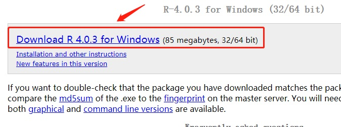
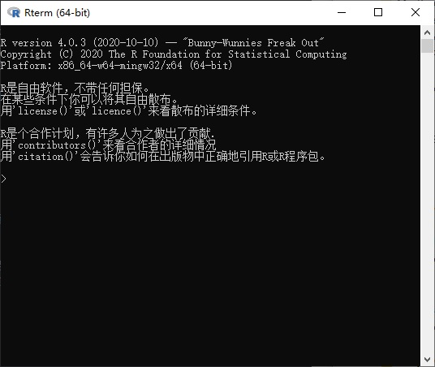
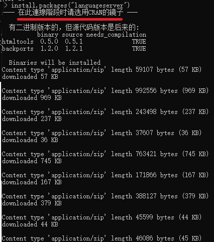
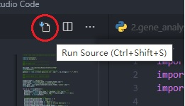
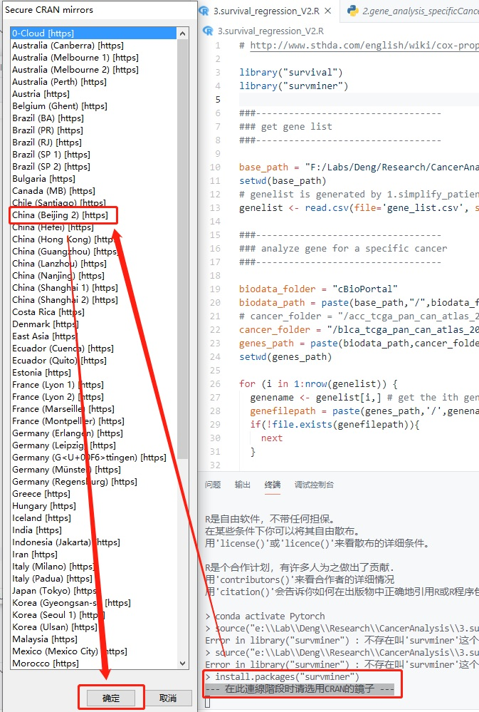

本文介绍了基于 VSCode 的 R 开发环境的搭建方法。

<!--more-->

 ---
 
- [1. 简介](#1-简介)
- [2. 下载与安装](#2-下载与安装)
- [3. 配置 R 开发环境](#3-配置-r-开发环境)
  - [3.1. 安装 R 语言](#31-安装-r-语言)
  - [3.2. 安装 LanguageServer](#32-安装-languageserver)
  - [3.3. 安装扩展](#33-安装扩展)
  - [3.4. 测试 R 环境](#34-测试-r-环境)
- [4. 安装 R 程辑包](#4-安装-r-程辑包)
- [5. 参考文献](#5-参考文献)

# 1. 简介

[VSCode](https://code.visualstudio.com/)是微软推出的一款跨平台开源编辑器，凭借强大的第三方插件支持C/C++、Python、Java等众多语言，体积小巧功能丰富，适合小型工程项目的开发调试。下面简单介绍VSCode开发环境的部署。

注意，VSCode仅仅是一个前端文本**编辑器**，本质上与记事本并无不同，在没有插件和编译器的情况下只能进行文件的读写，并不能进行源程序编译调试。与之相对，微软自家的Visual Studio是一个**集成开发环境（IDE）**，下载安装后可以直接进行源程序的编译调试。

一个现代编译器的主要工作流程如下： [源代码](http://zh.wikipedia.org/wiki/源代码) (source code) => [预处理器](http://zh.wikipedia.org/wiki/预处理器) (preprocessor) => [编译器](http://zh.wikipedia.org/wiki/编译器) (compiler) => [汇编程序](http://zh.wikipedia.org/wiki/汇编程序) (assembler) => [目标代码](http://zh.wikipedia.org/wiki/目标代码) (object code) => [链接器](http://zh.wikipedia.org/wiki/链接器) (Linker) => [可执行文件](http://zh.wikipedia.org/wiki/執行檔) (executables)。VSCode 本身仅仅是一个源代码编辑器。不过，当配合插件和编译器后，VSCode也能够完成绝大部分的源代码编译调试工作。

# 2. 下载与安装

前往[官网](https://code.visualstudio.com/)（https://code.visualstudio.com）下载安装，支持Windows、Linux和Mac系统。可以下载安装版，也可以选择解压即用的绿色版。区别在于安装板会向系统路径写入配置信息，绿色版所有的依赖信息和配置信息均存放于一个目录中。安装版可以在线下载更新和安装更新，绿色版只能下载新版本的绿色安装包解压后覆盖来更新。

安装完成后，点击左侧的扩展商店，搜索chinese，下载中文简体汉化包（可能需要翻墙）。


安装完成后重启VSCode，即可发现所有界面均已汉化。

注意：

- VSCode基于文件夹进行编译和调试，每个项目必须对应一个文件夹作为工作路径（根目录），根目录内包含一个.vscode文件夹存放配置文件（json格式）；

- VSCode默认编码为UTF8，对中文支持并不完美，特别是打开已有的包含中文注释的源代码文件时要特别注意，可能导致中文乱码，且在保存文件时弹出警告。因此，对于包含中文注释的已有文件，一般需要新建一个空白文件，保存为UTF8编码格式，然后重新输入中文注释部分再进行保存。

# 3. 配置 R 开发环境

**<font color=red>注意，R 的开发环境还可以选用 RStudio。</font>**

## 3.1. 安装 R 语言

前往[官网](https://www.r-project.org/)（https://www.r-project.org/） 下载R语言的安装包。


然后选择任意一个中国镜像（比如第一个清华镜像）


然后根据自己的平台选择安装包（比如 Windows）


首次安装，请选择 **base**


最后点击下载安装包，下载完毕后安装即可。



## 3.2. 安装 LanguageServer

LanguageServer 是 R 语言端配合 VSCode 进行可视化的 Language Server Protocol 插件。

> LSP 是Language Server Protocol 的缩写。简单来说，LSP 为不同语言在不同编辑器或IDE 中的自动补全、查找定义、悬停查看函数文档等功能搭建了桥梁，使得开发者可以减少针对不同语言和不同编辑器的重复开发。对用户来说，使用这一功能意味着可以获得更好的自动补全、查看帮助文档等特性。由于LSP 本身也是微软的项目，在VSCode 中的使用体验也会更好一些。R LSP Client 便是R 语言在这方面的实现，通过安装这个插件，可以弥补自动补全等功能的不足。

前往 R 安装的路径，进入 `bin` 文件夹（比如 `C:\Program Files\R\R-4.0.3\bin`），双击 `R.exe` 启动 R 环境。



输入

```c
install.packages("languageserver")
```

提示选择一个镜像（忽略 R 官方那蹩脚的中文），选择中国镜像后（比如在北京就选择 `China,Beijing`）开始疯狂下载依赖包。



等待下载完毕即可。

## 3.3. 安装扩展

可能需要翻墙。在 VSCode 的扩展列表中搜索并安装 R 和 R LSP Client 两个扩展。


安装完毕后，分别点击两个扩展的齿轮按钮，进入扩展设置。

首先确定安装 R 的 `R.exe` 所在的路径，比如

```
C:\Program Files\R-4.0.3\bin\R.exe
```

对于 R 扩展，设置 `R › Rpath: Windows` 为安装 R 的 `R.exe` 所在的路径。

对于 R 扩展，设置 `R › Rterm: Windows` 为安装 R 的 `R.exe` 所在的路径。

对于 R LSP Client 扩展，同样设置 `R › Rpath: Windows` 为安装 R 的 `R.exe` 所在的路径。

## 3.4. 测试 R 环境

打开一个 R 文件，随便写个

```r
1/3
```

右上角出现一个新图标按钮，如下图所示，点击即可运行 R 文件。




# 4. 安装 R 程辑包

和前面安装 LanguageServer 类似，可以从 R 提供的 R 环境来安装，也可以随便打开一个 .r 文件，点击右上角按钮或者快捷键 `Ctrl+Shift+S` 进入 R 运行环境安装。

输入

```r
install.packages("survminer")
```

提示

```
--- 在此連線階段时请选用CRAN的鏡子 ---
```

稍等片刻后弹出选择 CRAN 镜像的列表，选择一个中国镜像，比如北京镜像



点击确定后就会自动开始进行安装操作。

# 5. 参考文献

无。