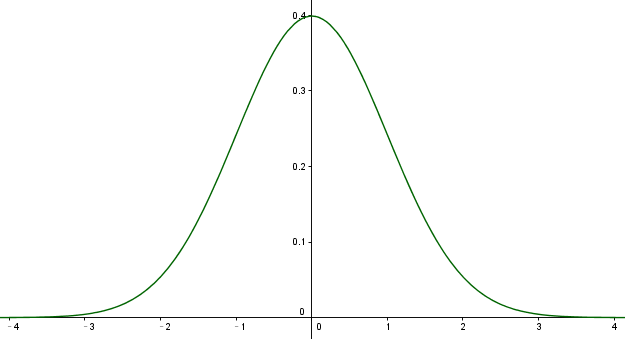
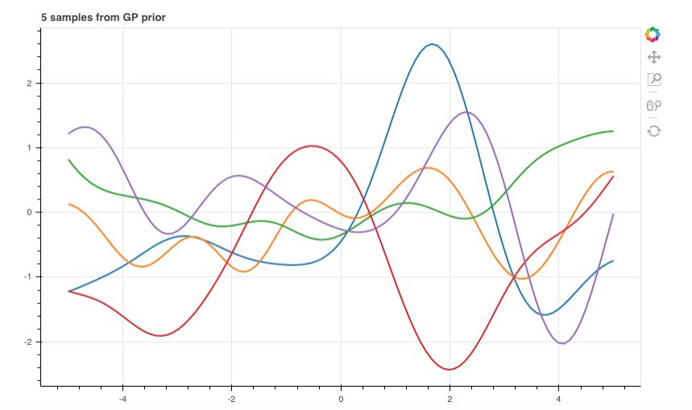
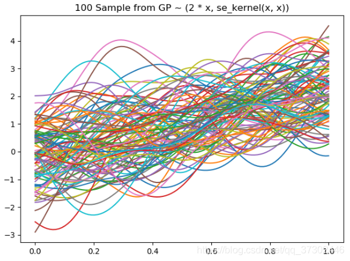
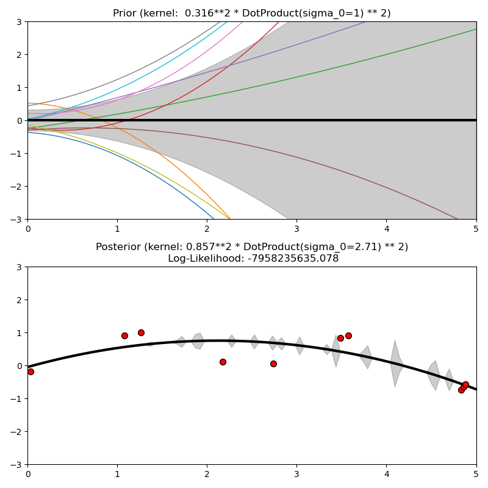
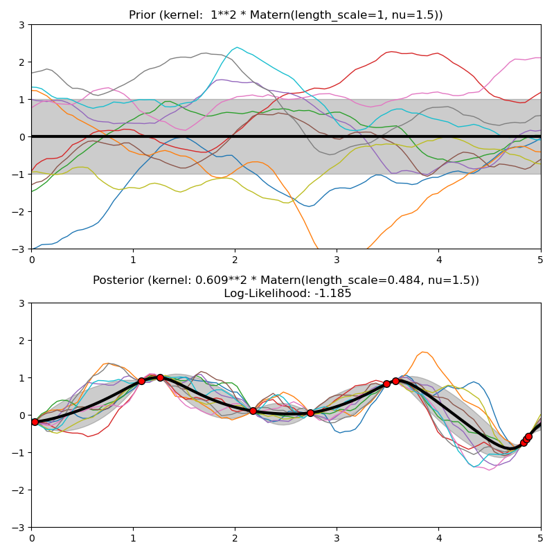
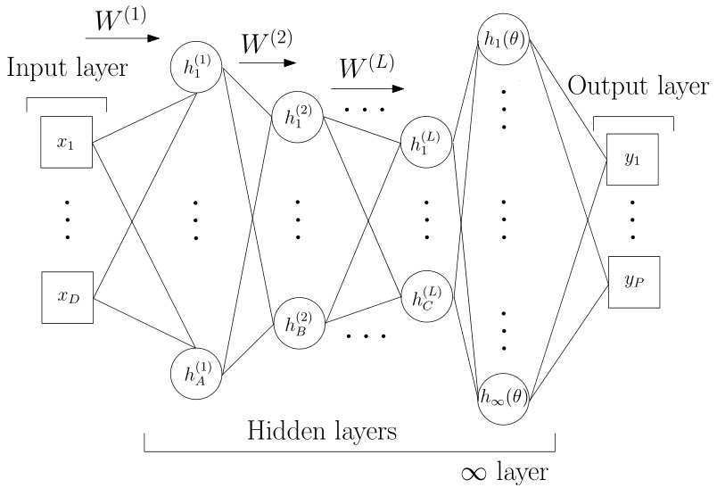
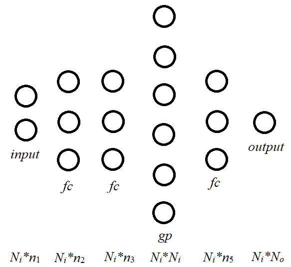

本文介绍了高斯过程，包括高斯函数、多元高斯分布、高斯过程。

<!--more-->

 ---
- [1. 一元高斯分布](#1-一元高斯分布)
- [2. 多元高斯分布](#2-多元高斯分布)
- [3. 高斯过程](#3-高斯过程)
  - [3.1. 概念](#31-概念)
  - [3.2. 举例](#32-举例)
  - [3.3. 高斯过程回归](#33-高斯过程回归)
    - [3.3.1. 构建高斯过程先验](#331-构建高斯过程先验)
    - [3.3.2. 求解超参数](#332-求解超参数)
    - [3.3.3. 测试样本预测](#333-测试样本预测)
  - [3.4. 深度核回归](#34-深度核回归)
    - [3.4.1. 初始化](#341-初始化)
    - [3.4.2. 前向传播](#342-前向传播)
    - [3.4.3. 反向传播](#343-反向传播)
    - [3.4.4. 预测](#344-预测)
- [4. 参考文献](#4-参考文献)
# 1. 一元高斯分布

**高斯分布又称正态分布。**

标准高斯函数为

$$
f(x) = \frac{1}{\sqrt{2\pi}}e^{-\frac{x^2}{2}}
$$

函数图像为



这个函数描述了变量 $x$ 的一种分布特性，变量 $x$ 的分布有如下特点：

- 均值 = 0
- 方差 = 1
- 概率密度和 = 1

一元高斯函数的一般形式为

$$
f(x) = \frac{1}{\sqrt{2\pi}\sigma}e^{-\frac{1}{2\sigma^2}(x-\mu)^2}
$$

这里指数函数的参数 $-\frac{1}{2\sigma^2}(x-\mu)^2$ 是一个关于 $x$ 的二项式函数。由于系数为负，所以是抛物线开口向下的函数。此外，由于最前面的系数与 $x$ 无关，因此可以把它当作是一个正规化因子（normalization factor），以保证

$$
\frac{1}{\sqrt{2\pi}\sigma}\int_{-\infty}^{\infty}{exp(-\frac{1}{2\sigma^2}(x-\mu)^2)}dx=1
$$

<!-- 函数图像为

 -->

若令

$$
z = \frac{x-\mu}{\sigma}
$$

称这个过程为标准化

$$
\begin{aligned}
  x &= z\cdot \sigma + \mu\\
  \Rightarrow p(x) &= \frac{1}{\sqrt{2\pi}\sigma}e^{-\frac{1}{2}(z)^2}\\
  \Rightarrow 1 &=\int_{-\infty}^{\infty}{p(x)dx}\\
  &=\int_{-\infty}^{\infty}{\frac{1}{\sqrt{2\pi}\sigma}e^{-\frac{1}{2}(z)^2}dx}\\
  &=\int_{-\infty}^{\infty}{\frac{1}{\sqrt{2\pi}\sigma}e^{-\frac{1}{2}(z)^2}\sigma\cdot dz}\\
  &=\int_{-\infty}^{\infty}{\frac{1}{\sqrt{2\pi}}e^{-\frac{1}{2}(z)^2} dz}\\
\end{aligned}
$$

即 $z\sim N(0,1)$。

随机变量 $x$ 标准化的过程, 实际上的消除量纲影响和分布差异的过程. 通过将随机变量的值减去其均值再除以标准差, 使得随机变量与其均值的差距可以用若干个标准差来衡量, 从而实现了不同随机变量与其对应均值的差距, 可以以一种相对的距离来进行比较。

<!-- 唯一不太好理解的是前面的系数， 为什么多了一个 $\sigma$， 不是 $2\sigma$  或其他。直观理解如下图


实线代表的函数是标准高斯函数，虚线代表的是标准高斯函数在 $x$ 轴方向 2 倍延展，效果如下

$$
\begin{aligned}
A(x = 1) &= D(x = 2)\\
E(x = 1.5) &= F(x = 3)\\
G(x = 2) &= H(x = 4)\\
\end{aligned}
$$

横向拓宽了，纵向还是保持不变，可以想象，最后的函数积分肯定不等于 1。区域的面积可以近似采用公式：$面积 = 底 × 高$ 求得：从 $AQRS -> DTUV$， 底乘以 2 倍，高维持不变，所以，要保持变化前后面积不变，函数的高度应该变为原来的 1/2。所以高斯函数在 $x$ 轴方向做 2 倍延展的同时，纵向应该压缩为原来的一半，才能重新形成新的高斯分布函数

扩展到一般情形，$x$ 轴方向做 $\sigma$ 倍延拓的同时， $y$ 轴应该压缩 $\sigma$ 倍（乘以 $1/\sigma$ ） -->

# 2. 多元高斯分布

> 钱默吟. [多元高斯分布完全解析](https://zhuanlan.zhihu.com/p/58987388)

多元高斯分布是一元高斯分布在向量形式的推广。

假设随机向量 $\boldsymbol Z = [z_1,\cdots,z_n]$，其中 $z_i\sim \mathcal N(0,1)(i=1,\cdots,n)$ 且彼此独立，则随机向量的联合概率密度函数为

$$
\begin{aligned}
  p(z_1, \cdots, z_n) &= \prod_{i=1}^n \frac{1}{\sqrt{2\pi}}e^{-\frac{1}{2}(z_i)^2}\\
  &=\frac{1}{2\pi^{n/2}}e^{-1/2\cdot Z^TZ}\\
1&=\int_{-\infty}^{\infty}\cdots\int_{-\infty}^{\infty} p(z_1,\cdots,z_n)dz_1\cdots dz_n
\end{aligned}
$$

称随机向量 $\boldsymbol Z\sim \mathcal N(\boldsymbol 0,\boldsymbol I)$，即服从均值为零向量，协方差矩阵为单位矩阵的高斯分布。

对于向量 $X=[x_1,\cdots,x_n]$，其概率密度函数的形式为

$$
\begin{aligned}
p(x_1,x_2,\cdots,x_n) &=\prod_{i=1}^n p(x_i)\\
&=\frac{1}{(2\pi)^{n/2}\sigma_1\cdots\sigma_n}exp\left( -\frac{1}{2} \left[ \frac{(x_1-\mu_1)^2}{\sigma^2_1}+\cdots+\frac{(x_n-\mu_n)^2}{\sigma^2_n} \right] \right)\\
\end{aligned}
$$

其中 $\mu_i, \sigma_i$ 为第 $i$ 维的均值和方差。按照矩阵表示

$$
\begin{aligned}
  \boldsymbol x - \boldsymbol \mu &= [x_1-\mu_1,\cdots,x_n-\mu_n]^T\\
  \Sigma &= \left[
    \begin{matrix}
      \sigma_1^2&0&\cdots&0\\
      0&\sigma_2^2&\cdots&0\\
      \vdots&\vdots&\ddots&0\\
      0&0&\cdots&\sigma_n^2\\
    \end{matrix}
    \right]
\end{aligned}
$$

那么有

$$
\begin{aligned}
\sigma_1\cdots\sigma_n &= \vert\Sigma\vert^\frac{1}{2}\\
\frac{(x_1-\mu_1)^2}{\sigma^2_1}+\cdots+\frac{(x_n-\mu_n)^2}{\sigma^2_n} &= (\boldsymbol x - \boldsymbol \mu)^T\Sigma^{-1}(\boldsymbol x - \boldsymbol \mu)
\end{aligned}
$$

代入得

$$
\begin{aligned}
p(x_1,x_2,\cdots,x_n) &=p(\boldsymbol x\vert \boldsymbol \mu, \Sigma)\\
&= \frac{1}{(2\pi)^{n/2}\vert\Sigma\vert^{1/2}}exp(-\frac{1}{2}(\boldsymbol x-\boldsymbol \mu)^T\Sigma^{-1}(\boldsymbol x-\boldsymbol \mu))\\
\end{aligned}
$$

则称 $X$ 为具有均值 $\boldsymbol \mu \in \mathbb R^n$，协方差矩阵为 $\Sigma \in S^n$ 的多元高斯分布。


# 3. 高斯过程

## 3.1. 概念

首先简单理解高斯过程，比如你有 $(t_1,t_2,\cdots,t_N)=\boldsymbol T$ 个时间点，每个时间点的观测值都是高斯分布的，并且任意 $k$ 个时间点的观测值的组合都是联合高斯分布。这样的一个过程称为高斯过程。高斯过程通常可以用来表示一个**函数的分布**。

高斯过程，从字面上分解，我们就可以看出他包含两部分：
- 高斯，指的是高斯分布
- 过程，指的是随机过程

> 当随机变量是 1 维时，我们称之为一维高斯分布，概率密度函数 $p(x)=N(\mu,\sigma^2)$
> 当随机变量是有限的 $p$ 维时，我们称之为高维高斯分布， $p(x) = N(\mu, \Sigma_{p \times p})$
> 当随机变量是连续域上的无限多个高斯随机变量组成的随机过程，称之为无限维的高斯分布，即高斯过程


通常如果我们要学习一个函数（或者说学习一个映射），首先定义函数的参数，然后根据训练数据来学习这个函数的参数。例如我们做线性回归，学习这样一个函数就相当于训练回归参数（权重、偏置）。这种方法叫做**参数化的方法**。但是这种做法就把可学习的函数的范围限制死了，无法学习任意类型的函数。非参数化的方法就没有这个缺点。用高斯过程来建模函数，就是一种**非参数方法**。

## 3.2. 举例

**举一个简单的例子**，下面的图中，横轴 $T$ 是一个关于时间的连续域，表示人的一生，而纵轴表示的是体能值 $\xi$。对于一个人而言，在任意不同的时间点体能值都服从正态分布，但是不同时间点分布的均值和方差不同。一个人的一生的体能曲线就是一个**函数**（体能关于时间的函数），该函数的分布就是高斯过程。


对于任意 $t\in T, \xi_t \sim N(\mu_t,\sigma_t^2)$ ，也就是对于一个确定的高斯过程而言，对于任意时刻 $t$ ，他的 $\mu_t$ 和 $\sigma_t$ 都已经确定了。而像上图中，我们对同一人体能值在关键节点进行采样，然后平滑连接，也就是图中的两条虚线，就形成了这个高斯过程中的两个样本。

回顾 $p$ 维度高斯分布，决定他的分布是两个参数，一个是 $p$ 维的均值向量 $\mu_p$ ，他反映了 $p$ 维高斯分布中每一维随机变量的期望，另一个就是 $p\times p$ 的协方差矩阵 $\Sigma_{p\times p}$ ，他反映了高维分布中，每一维自身的方差，以及不同维度之间的协方差。

定义在连续域 $T$ 上的高斯过程其实也是一样，他是无限维的高斯分布，他同样需要描述每一个时间点 $t$ 上的均值，但是这个时候就不能用向量了，因为是在连续域上的，维数是无限的，因此就应该定义成一个关于时刻 $t$ 的**函数** $m(t)$。

协方差矩阵也是同理，无限维的情况下就定义为一个**核函数** $k(t_i,t_j)$ ，其中 $t_i$ 和 $t_j$ 表示任意两个时刻。核函数也称协方差函数，是一个高斯过程的核心，他决定了高斯过程的性质。在研究和实践中，核函数有很多种不同的类型，他们对高斯过程的衡量方法也不尽相同，最为常见的一个核函数是**径向基（RBF）函数**，其定义如下：

$$
k_\lambda(t_i,t_j)=\sigma^2 exp(-\frac{\vert\vert t_i-t_j\vert\vert^2}{2l^2})
$$

$\sigma$ 和 $l$ 是径向基函数的**超参数**，是我们提前可以设置好的。径向基函数输出的是一个标量，他代表的就是两个时间点各自所代表的高斯分布之间的协方差值，很明显径向基函数是一个关于距离 $\vert\vert x_i-x_j\vert\vert$ 负相关的函数，两个点距离越大，两个分布之间的协方差值越小，即相关性越小，反之越靠近的两个时间点对应的分布其协方差值就越大。

由此，高斯过程的两个核心要素：均值函数和核函数的定义我们就描述清楚了，按照高斯过程存在性定理，一旦这两个要素确定了，那么整个高斯过程就确定了：

$$
\xi_t \sim GP(m(t),k(t_i,t_j))
$$

------

**另一个简单的例子**，假设我们有**两个点** $x_0=0$ 和 $x_1=1$ ，对应这两个点的函数值服从二维高斯分布（高斯过程中“高斯”二字的由来）

$$
\begin{aligned}
\left(
  \begin{matrix}
  y_0\\
  y_1
  \end{matrix}
\right)
\sim \mathcal N
\left(
  \begin{matrix}
  \left(
  \begin{matrix}
  0\\
  1
  \end{matrix}
  \right),
  \left(
  \begin{matrix}
  1&0\\
  0&1
  \end{matrix}
  \right)
  \end{matrix}
\right)
\end{aligned}
$$

从这个二维高斯分布中采样 10 组数据，其中两个点在 $x$ 轴上的两端，采样得到的两个 $y$ 对应在 $y$ 轴取值，可以得到下图所示的结果


每条直线可以被认为是从**一个线性函数分布**中采样出来的线性函数。

如果我们有**20个 $x$ 点**，对应这 20 个 $x$ 的函数值符合均值为 0，协方差矩阵为单位矩阵的联合高斯分布。和上面一样采样 10 组数据，得到下图


每一条线都是一个函数，是从某个**函数分布**中采样得到的。但是这样的函数看上去一点也不平滑，并且显得杂乱无章，距离很近的两个 $x$ 对应的函数值 $y$ 可以相差很大。

直观来说，两个 $x$ 离得越近，对应的函数值应该相差越小，也就是说这个函数应该是平滑的，而不是像上图那样是突变的。所以我们应该通过两个 $x$ 之间的某种距离来定义这两个 $x$ 对应的函数值之间的协方差。两个 $x$ 离得越近，对应函数值之间的协方差应该越大，意味着这两个函数值的取值可能越接近。

我们引入核函数（以高斯核为例，也可以用其他核，并不是说我们在讲高斯过程所以这里就一定用高斯核）：

$$
k_\lambda(x_i,x_j)=exp(-\frac{\vert\vert \boldsymbol x_i-\boldsymbol x_j\vert\vert^2}{\lambda})
$$

和函数可以表示两个点 $x_i,x_j$ 之间的距离。此时，若我们有N个数据点( $x_1,\cdots,x_N$ )，则这个 $N$ 个数据点对应的 $N$ 个函数值服从 $N$ 维高斯分布，这个高斯分布的均值是 0，协方差矩阵是 $K$，$K$ 里的每一个元素对应

$$
K_{nm} = k(\boldsymbol x_n,\boldsymbol x_m)
$$

此时，再以刚才 20 个数据点的情况为例，我们采样 10 组，得到下图，现在看起来函数就平滑多了


如果数据点再多点，例如 100 个数据点，则采样 10 组，得到下图：



上图每条曲线就是一个高斯过程的采样，每个数据点上的函数值都是高斯分布。且任意k个数据点对应的函数值的组合都是联合高斯分布。

## 3.3. 高斯过程回归

高斯过程回归可以看作是一个根据先验与观测值推出后验的过程。一版遵循以下三步

- 构建高斯过程先验
- 求解超参数
- 对测试样本进行预测

### 3.3.1. 构建高斯过程先验

假设一组 $n$ 个观测值，每个观测值为 $D$ 维向量 $\boldsymbol X=\{\boldsymbol x_1, \cdots, \boldsymbol x_n\}$，对应的值为 $n$ 个 1 维目标向量 $\boldsymbol Y=\{y_1,\cdots, y_n\}$。假设回归残差 $\boldsymbol \varepsilon=[\varepsilon_1,\cdots,\varepsilon_n]$ 服从 $iid$ 正态分布 $p(\varepsilon)=\mathcal N(0,\sigma^2_{noise})$，则回归问题就是希望我们通过 $\boldsymbol X,\boldsymbol Y$ 学习一个由 $\boldsymbol X$ 到 $\boldsymbol Y$ 的映射函数 $f$

$$
\boldsymbol Y=f(\boldsymbol X)+\boldsymbol \varepsilon,\quad where\quad \varepsilon_i\sim \mathcal N(0,\sigma^2_{noise}), i=1,\cdots,n
$$

未知映射 $f$ 遵循高斯过程，通过 $\boldsymbol \mu = [\mu(x_1),\cdots,\mu(x_n)]$ 与 $k(\boldsymbol x_i,\boldsymbol x_j)$ 定义一个高斯过程，但是因为此时没有任何观测值，所以这是一个先验。

$$
f(\boldsymbol X) \sim \mathcal{GP}[\boldsymbol \mu,\boldsymbol K(\boldsymbol X, \boldsymbol X)]
$$

> 注意：经典高斯过程输入可以是多维，但输出只有 1 维（即单输出）。如果需要多维输出，当输出分量之间不相关时，可以分别设计多个高斯过程模型进行回归。当输出分量之间相关时，可以参考一些paper和工具包来实现，比如：
> https://github.com/SheffieldML/multigp
> https://github.com/SheffieldML/GPy/blob/devel/GPy/models/gp_multiout_regression.py

高斯过程由其数学期望 $\boldsymbol \mu$ 和协方差函数 $\boldsymbol K$ 完全决定。常见的选择是平稳高斯过程，即数学期望为一**常数**，协方差函数取平稳高斯过程可用的核函数。

高斯过程的均值函数决定着曲线的走势，常数均值相当于起了一个平移作用，均值函数不再是常数时，曲线将围绕着均值函数这条曲线而波动。

$\mu = 1$ 时


$\mu = 2x$ 时



但是一般情况下，我们都会对数据集的输出进行标准化处理来达到去均值的目的，这样做的好处就是我们只需要设置 $\boldsymbol \mu=\boldsymbol 0$ 即可，而无需猜测输出大致的模样，并且在后面的超参数寻优的过程中也可以减少我们需要优化的超参数的个数。

使用最多的核函数是 **RBF 核**。

$$
k_\lambda(t_i,t_j)=\sigma^2 exp(-\frac{\vert\vert t_i-t_j\vert\vert^2}{2l^2})
$$

方差（variance） $\sigma$ 和长度尺度（length scale） $l$ 是径向基函数的**超参数**。如果 $t_i$ 和 $t_j$ 很接近，那么指数近似等于 1。这确保了附近的点高度相关，从而使所有高概率函数变得平滑。当两测试点远离时，距离的衰减速率由长度尺度 $l$ 控制。如果 $l$ 很大（小），曲线将在一个很长（短）的距离上平滑。

下面是径向基核的先验和后验图比较。


下面是其它不同核的先验和后验图比较。






### 3.3.2. 求解超参数

高斯过程回归的求解也被称为超参学习（hyper-parameter learning），是按照贝叶斯方法通过学习样本确定核函数的超参数 $\boldsymbol \theta$ 的过程。根据贝叶斯定理，高斯过程回归的超参数的后验表示如下

$$
p(\boldsymbol \theta \vert \boldsymbol X,\boldsymbol Y) = \frac{p(\boldsymbol Y\vert \boldsymbol X,\boldsymbol \theta)p(\boldsymbol \theta)}{p(\boldsymbol Y\vert \boldsymbol X)}
$$

其中，$\boldsymbol \theta$ 包括核函数的超参数和残差的方差 $\sigma^2_{noise}$。

$p(\boldsymbol Y\vert\boldsymbol X,\boldsymbol \theta)$ 是似然，是对高斯过程回归的输出边缘化得到的边缘似然：

$$
p(\boldsymbol Y\vert\boldsymbol X,\boldsymbol \theta) = \int p(\boldsymbol Y\vert f, \boldsymbol X,\boldsymbol \theta)p(f\vert\boldsymbol X,\boldsymbol \theta)df
$$

高斯分布的边缘分布也是高斯分布，因此边缘似然也服从高斯分布，则概率可写为

$$
p(\boldsymbol Y\vert\boldsymbol X,\boldsymbol \theta) = \frac{1}{(2\pi)^{n/2}\vert\Sigma\vert^{1/2}}exp(-\frac{1}{2}(\boldsymbol Y-\mu(\boldsymbol X))^T\Sigma^{-1}(\boldsymbol Y-\mu(\boldsymbol X)))
$$

采用最大似然估计来对高斯过程的超参数进行估计。

$$
\begin{aligned}
 \Rightarrow L = {\rm ln}\ p(\boldsymbol Y\vert\boldsymbol X,\boldsymbol \theta) &= -\frac{1}{2}{\rm ln}{\vert\Sigma\vert}-\frac{n}{2}{\rm ln}(2\pi)-\frac{1}{2}(\boldsymbol Y-\mu(\boldsymbol X))^T\Sigma^{-1}(\boldsymbol Y-\mu(\boldsymbol X))\\
&= -\frac{1}{2}{\rm ln}{\vert\Sigma\vert}-\frac{n}{2}{\rm ln}(2\pi)-\frac{1}{2}\boldsymbol Y^T\Sigma^{-1}\boldsymbol Y\quad \boldsymbol (\boldsymbol \mu = 0)
\end{aligned}
$$

上式第一项仅与回归模型有关，回归模型的核矩阵越复杂其取值越高，反映了模型的结构风险（structural risk）。第三项包含学习成本，是数据拟合项，表示模型的经验风险（empirical risk）。

其中，$\Sigma=k(\boldsymbol X,\boldsymbol X)+\sigma^2_{noise}\boldsymbol I$，与超参数 $\boldsymbol \theta$ 有关。利用梯度下降的方法更新超参数，上述式子对超参数 $\boldsymbol \theta$ 求导

$$
\begin{aligned}
\frac{\partial L}{\partial \boldsymbol \theta} = \frac{\partial {\rm ln}\ p(\boldsymbol Y\vert\boldsymbol X,\boldsymbol \theta)}{\partial \boldsymbol \theta} &= 
-\frac{1}{2}tr(\Sigma^{-1}\frac{\partial \Sigma}{\partial \boldsymbol \theta}) + \frac{1}{2}(\boldsymbol Y-\mu(\boldsymbol X))^T\Sigma^{-1}\frac{\partial \Sigma}{\partial \boldsymbol \theta}(\boldsymbol Y-\mu(\boldsymbol X))\\
&=-\frac{1}{2}tr(\Sigma^{-1}\frac{\partial \Sigma}{\partial \boldsymbol \theta}) + \frac{1}{2}\boldsymbol Y^T\Sigma^{-1}\frac{\partial \Sigma}{\partial \boldsymbol \theta}\boldsymbol Y\quad \boldsymbol (\boldsymbol \mu = 0)
\end{aligned}
$$

注意，高斯过程回归中的目标函数不是凸的，因而带来的问题就是：通过求解这个最优化问题，我们可以得到的只能是一个局部最小值，而非真正的全局最小值。局部最小不能保证是全局最优时，初始值的选择变得非常的重要。因为一个初始值可能会走向一个具体的极小值，而不同的初始值或许可以得到不同最优值。一种解决方案就是，多次产生不同的初始超参数，然后操作一次最优化问题的求解，然后比较这些最优化，挑选得出其中最小的值。

### 3.3.3. 测试样本预测

接着，给定其它 $m$ 个测试观测值 $\boldsymbol X^*$，预测 $\boldsymbol Y^*=f(\boldsymbol X^*)$ 。

我们希望对 $\boldsymbol Y^*\vert \boldsymbol Y$ 的条件概率 $p(\boldsymbol Y^*\vert \boldsymbol X, \boldsymbol Y,\boldsymbol X^*)$ 进行建模，即给定观察到的所有数据 $\boldsymbol X, \boldsymbol Y,\boldsymbol X^*$，确定预测样本的预测值 $\boldsymbol Y^*$ 的分布。

高斯过程并没有直接对这个条件概率分布进行建模，而是从联合概率分布出发，对 $\boldsymbol Y^*$ 的联合概率 $p(\boldsymbol Y,\boldsymbol Y^*\vert\boldsymbol X,\boldsymbol X^*)$ 进行建模。当这个概率已知时，可以通过下面的式子得到新样本预测值的条件概率

$$
p(\boldsymbol Y^*\vert\boldsymbol X,\boldsymbol Y,\boldsymbol X^*)
= \frac{p(\boldsymbol Y,\boldsymbol Y^*\vert \boldsymbol X,\boldsymbol X^*)}{p(\boldsymbol Y\vert \boldsymbol X,\boldsymbol X^*)}
= \frac{p(\boldsymbol Y,\boldsymbol Y^*\vert \boldsymbol X,\boldsymbol X^*)}{\int _{Y^*}p(\boldsymbol Y,\boldsymbol Y^*\vert \boldsymbol X,\boldsymbol X^*)dY^*}
$$

显然，核心是建立 $p(\boldsymbol Y,\boldsymbol Y^*\vert \boldsymbol X,\boldsymbol X^*)$ 的具体形式，然后通过上式求出关于 $\boldsymbol Y^*$ 的条件概率。

根据回归模型核高斯过程的定义，$\boldsymbol Y$ 和 $\boldsymbol Y^*$ 的概率分布为

$$
\begin{aligned}
\boldsymbol Y&\sim \mathcal N(\mu(\boldsymbol X),k(\boldsymbol X, \boldsymbol X)+\sigma^2_{noise}\boldsymbol I)\\
\boldsymbol Y^* &\sim \mathcal N(\mu(\boldsymbol X^*),k(\boldsymbol X^*, \boldsymbol X^*))
\end{aligned}
$$

二者的联合分布满足无限维高斯分布

$$
\begin{aligned}
  \left[\begin{matrix}
    \boldsymbol Y\\\boldsymbol Y^*
  \end{matrix}\right]
  \sim
  N(
  \left[\begin{matrix}
    \mu(\boldsymbol X)\\\mu(\boldsymbol X^*)
  \end{matrix}\right],
  \left[\begin{matrix}
    k(\boldsymbol X,\boldsymbol X)+\sigma^2_{noise} \boldsymbol I & k(\boldsymbol X,\boldsymbol X^*)\\ k(\boldsymbol X^*,\boldsymbol X)&k(\boldsymbol X^*,\boldsymbol X^*)
  \end{matrix}\right]
  )
\end{aligned}
$$

从这个联合分布中派生出来的条件概率 $\boldsymbol Y^*\vert \boldsymbol Y$ 同样也服从无限维高斯分布。套用高维高斯分布的公式

$$
\begin{aligned}
  \boldsymbol Y^*\vert \boldsymbol Y &\sim N(\mu^*,k^*) \Rightarrow p(\boldsymbol Y^*\vert \boldsymbol X,\boldsymbol Y,\boldsymbol X^*)= N(\mu^*,k^*)\\
  \mu^* &= k(\boldsymbol X^*,\boldsymbol X)[k(\boldsymbol X,\boldsymbol X)+\sigma^2_{noise}\boldsymbol I]^{-1}(\boldsymbol Y-\mu(\boldsymbol X))+\mu(\boldsymbol X^*)\\
  &= k(\boldsymbol X^*,\boldsymbol X)k(\boldsymbol X,\boldsymbol X)^{-1}\boldsymbol Y\\
  k^* &= k(\boldsymbol X^*,\boldsymbol X^*)-k(\boldsymbol X^*,\boldsymbol X)[k(\boldsymbol X,\boldsymbol X)+\sigma^2_{noise}\boldsymbol I]^{-1}k(\boldsymbol X,\boldsymbol X^*)\\
  &=k(\boldsymbol X^*,\boldsymbol X^*)-k(\boldsymbol X^*,\boldsymbol X)k(\boldsymbol X,\boldsymbol X)^{-1}k(\boldsymbol X,\boldsymbol X^*)
\end{aligned}
$$

均值 $\mu^*$ 实际上是观测点 $\boldsymbol Y^*$ 的一个线性函数。

协方差项 $k^*$ 的第一部分是我们的先验的协方差，减掉的后面的那一项实际上表示了观测到数据后函数分布不确定性的减少。如果第二项非常接近于 0，说明观测数据后我们的不确定性几乎不变，反之如果第二项非常大，则说明不确定性降低了很多。

> **PS1：**
> 高斯分布有一个很好的特性，即高斯分布的联合概率、边缘概率、条件概率仍然是满足高斯分布的，假设 $n$ 维随机变量满足高斯分布  $\boldsymbol x \sim N(\mu,\Sigma_{n\times n})$
> 
> 把随机变量分成两部分：$p$ 维 $\boldsymbol x_a$ 和 $q$ 维 $\boldsymbol x_b$，满足 $n=p+q$，按照分块规则可以写成
$$
\begin{aligned}
  x=\left[\begin{matrix}
    x_a\\x_b
  \end{matrix}\right],
  \mu=\left[\begin{matrix}
    \mu_a\\\mu_b
  \end{matrix}\right],
  \Sigma=\left[\begin{matrix}
    \Sigma_{aa} & \Sigma_{ab}\\\Sigma_{ba}&\Sigma_{bb}
  \end{matrix}\right]
\end{aligned}
$$
> 则下列条件分布依然是高维高斯分布
$$
\begin{aligned}
x_b\vert x_a &\sim N(\mu_{b\vert a},\Sigma_{b\vert a})\\
\mu_{b\vert a} &= \Sigma_{ba}\Sigma_{aa}^{-1}(x_a-\mu_a)+\mu_b\\
\Sigma_{b\vert a} &= \Sigma_{bb}-\Sigma_{ba}\Sigma_{aa}^{-1}\Sigma_{ab}
\end{aligned}
$$
由此可推广到高斯过程。

下图是高斯过程的可视化，其中绿线是高斯过程的均值，浅绿色区域 95% 置信区间（由协方差矩阵的对角线得到），红色虚线代表采样的函数，红色的点是从红色曲线采样的样本。。图中展示了当观测到新的数据点的时候，高斯过程如何更新自身的均值函数和协方差函数。


## 3.4. 深度核回归

> Andrew Gordon Wilson, et al. Deep Kernel Learning. 2016.

数据集如下，输入 $n$ 个 $D$ 维数据 $\boldsymbol X=[\boldsymbol x_1,\cdots,\boldsymbol x_n]$，输出 $n$ 个 1 维数据 $\boldsymbol Y = [y(\boldsymbol x_1),\cdots,y(\boldsymbol x_n)]$。

网络结构如下：



$n<6000$ 时网络为 $[D-1000-500-50-2-gp]$ 结构，$n\leq 6000$ 时网络为 $[D-1000-1000-500-50-2-gp]$ 结构。

其中前面为全连接的 MLP，输入 $D$ 维数据，输出 2 维特征，最后一层为高斯过程回归层，

### 3.4.1. 初始化

```python
NNRegressor.fit()
|--first_run()
    |--layers[i].initialize_ws()
```

- **全连接层**

 `Dense()`，初始化为

```python
def initialize_ws(self):
  self.W=numpy.random.randn(self.n_inp,self.n_out)*numpy.sqrt(1.0/self.n_inp)
  self.b=numpy.zeros((1,self.n_out))
  self.dW=numpy.zeros((self.n_inp,self.n_out))
  self.db=numpy.zeros((1,self.n_out))
```

即

$$
\begin{aligned}
\boldsymbol w&\sim N(0,\sqrt{\frac{1}{D}}) \in \mathbb R^{D_i\times D_o}\\
\boldsymbol b &= [0,\cdots,0] \in \mathbb R^{D_o}\\
d\boldsymbol w &= \left[\begin{matrix}
  0&\cdots&0\\
  \vdots&\ddots&\vdots\\
  0&\cdots&0\\
  \end{matrix}
\right] \in \mathbb R^{D_i\times D_o}\\
d\boldsymbol b &= [0,\cdots,0] \in \mathbb R^{D_o}
\end{aligned}
$$

- **高斯层**

`CovMat()`，初始化为

```python
def initialize_ws(self):
  self.W=numpy.ones((1,2))*numpy.array([[numpy.log(self.s_alpha/(1.0-self.s_alpha)),numpy.sqrt(self.var)]])
  self.b=numpy.zeros((1,1))
  self.dW=numpy.zeros((1,2))
  self.db=numpy.zeros((1,1))
```

即

$$
\begin{aligned}
\boldsymbol w &= [w_1,w_2] = [{\rm ln}\frac{\alpha}{1-\alpha},\sqrt{var}],\quad \alpha = 0.1,\; var = 1\\
b &= [0]\\
dw &= [0,0]\\
db &= [0]
\end{aligned}
$$

### 3.4.2. 前向传播

```python
NNRegressor.fit()
|--Adam.fit()
    |--NNRegressor.update()
        |--CoreNN.forward()
            |--layers[i].forward(X)
```

- **全连接层**

`Dense()`，前向传播为

```python
def forward(self,X):
  self.inp=X
  self.out=numpy.dot(self.inp,self.W)+self.b
  return self.out
```

即

$$
\boldsymbol {o} = \boldsymbol x_{ND_i} \cdot \boldsymbol w_{D_iD_o} + \boldsymbol b_{D_o}\; \in \mathbb R^{N\times D_o}
$$

其中，$N$ 是样本数量；$D_i$ 是该层输入维度；$D_o$ 是该层输出维度，也是下一层输入维度。

经过多层全连接的 MLP，输入数据集从 $N\times D$ 维变为 $N\times M$ 维特征。

- **高斯层**

`CovMat()`，前向传播为

```python
def forward_rbf(self,X):
  self.inp=X
  
  #Calculate distances
  ll=[]
  for i in range(0,X.shape[1]):
    tmp=X[:,i].reshape(1,-1)-X[:,i].reshape(-1,1)
    ll.append(tmp.reshape(X.shape[0],X.shape[0],1))
  self.z=numpy.concatenate(ll,-1)
  
  #Apply RBF function to distance
  self.s0=numpy.exp(-0.5*numpy.sum(self.z**2,-1))
  
  #Multiply with variance
  self.var=self.W[0,1]**2
  self.s=self.var*self.s0
  
  #Add noise / whitekernel
  self.s_alpha=1.0/(numpy.exp(-self.W[0,0])+1.0)
  self.out=self.s+(self.s_alpha+1e-8)*numpy.identity(X.shape[0])
  return self.out
```

首先**计算每个样本对所有样本的距离矩阵**：

第一步 `X[:,i].reshape(1,-1)-X[:,i].reshape(-1,1)`，对数据的每一列转置成行，然后扩充成方阵，然后减去直接对列扩充成的方阵。这里相当于对数据的每一列逐一减去各个列元素形成一个矩阵。

>  $1m$ 维行向量减 $n1$ 维列向量时，python 会把 $1m$ 维行向量自动扩充为 $nm$ 维，每一行都是行向量的复制； 把 $n1$ 维列向量扩充为 $nm$ 维，增加的每一列都是列向量的复制，然后做差得到 $nm$ 维矩阵。
 


第二步，把上述矩阵重新排列为 $N\times N\times 1$ 的形式；

第三步，逐一遍历所有列，得到 $M$ 个 $N\times N\times 1$ 的矩阵组成的列表，重新拼接为 $N\times N\times M$ 维矩阵。

其实本**质上就是做了对数据集中的每个样本对所有其它样本做差的操作**，假设输入高斯过程的数据集为经过 MLP 的 $N\times M$ 维特征 $\boldsymbol x$

$$
\boldsymbol x = 
\left[
  \begin{matrix}
    \boldsymbol x_1\\
    \boldsymbol x_2\\
    \vdots\\
    \boldsymbol x_N
  \end{matrix}
\right]
= \left[
  \begin{matrix}
    x_{11}&x_{12}&\cdots&x_{1M}\\
    x_{21}&x_{22}&\cdots&x_{2M}\\
    \vdots\\
    x_{N1}&x_{N2}&\cdots&x_{NM}\\
  \end{matrix}
\right]\in \mathbb R^{N\times M}
$$

那么距离为

$$
\boldsymbol z =
\left[
\left[
  \begin{matrix}
    \boldsymbol x_1 - \boldsymbol x_1\\
    \boldsymbol x_2 - \boldsymbol x_1\\
    \vdots\\
    \boldsymbol x_N - \boldsymbol x_1\\
  \end{matrix}
\right],
\left[
  \begin{matrix}
    \boldsymbol x_1 - \boldsymbol x_2\\
    \boldsymbol x_2 - \boldsymbol x_2\\
    \vdots\\
    \boldsymbol x_N - \boldsymbol x_2\\
  \end{matrix}
\right],
\cdots,
\left[
  \begin{matrix}
    \boldsymbol x_1 - \boldsymbol x_N\\
    \boldsymbol x_2 - \boldsymbol x_N\\
    \vdots\\
    \boldsymbol x_N - \boldsymbol x_N\\
  \end{matrix}
\right]
\right]\in \mathbb R^{N\times N\times M}
$$

对 $\boldsymbol z$ 的前两维每个元素，沿着最后一维（$M$ 维）计算二范数的平方

$$
\vert\vert\boldsymbol z\vert\vert^2 = 
\left[
\begin{matrix}
  \vert\vert\boldsymbol x_1 - \boldsymbol x_1\vert\vert^2 & \cdots & \vert\vert\boldsymbol x_1 - \boldsymbol x_N\vert\vert^2\\
  \vert\vert\boldsymbol x_2 - \boldsymbol x_1\vert\vert^2 & \cdots & \vert\vert\boldsymbol x_2 - \boldsymbol x_N\vert\vert^2\\
  \vdots&\ddots&\vdots\\
  \vert\vert\boldsymbol x_N - \boldsymbol x_1\vert\vert^2 & \cdots & \vert\vert\boldsymbol x_N - \boldsymbol x_N\vert\vert^2\\
\end{matrix}
\right]\in \mathbb R^{N\times N}
$$

其中二范数为

$$
\vert\vert\boldsymbol x_i - \boldsymbol x_j\vert\vert = \sqrt{\sum_{k=1}^M (x_{ik}-x_{jk})^2}
$$

注意，$\vert\vert z\vert\vert$ 并不是矩阵的二范数，求导时别按照相应法则去计算。

其次**计算RBF**：

$$
\boldsymbol s_0 = e^{-0.5\cdot \vert\vert\boldsymbol z\vert\vert^2}\quad\in \mathbb R_{N\times N}
$$

乘以方差（之前定义的第 2 个权重系数 $w_2$）

$$
\boldsymbol s = w_2^2 \cdot \boldsymbol s_0  = var\cdot \boldsymbol s_0\quad\in \mathbb R_{N\times N}
$$

加噪声（之前定义的第 1 个权重系数 $w_1$）

$$
\begin{aligned}
s_\alpha &= 1/{(e^{-w_1}+1}) = 1/({\frac{1-\alpha}{\alpha}}+1) = \alpha\\
\boldsymbol {out} &= \boldsymbol s + (s_\alpha+10^{-8})\cdot \boldsymbol I_{N\times N}
\end{aligned}
$$

形式上等效于

$$
\boldsymbol K = var\cdot \boldsymbol K(X,X) + \alpha\cdot \boldsymbol I
$$

核函数**参数**分别为两个权重 $var, \alpha$，最后输出 $N\times N$ 维的核矩阵 $\boldsymbol {out} = \boldsymbol K$。

### 3.4.3. 反向传播

首先计算损失函数。根据前文，极大似然估计的损失函数为：

$$
loss = -\frac{1}{2}{\rm ln}{\vert\boldsymbol K\vert}-\frac{n}{2}{\rm ln}(2\pi)-\frac{1}{2}\boldsymbol Y^T\boldsymbol K^{-1}\boldsymbol Y
$$

> **定理1**：设 $\boldsymbol K$ 为一 $n\times n$ 正定对称矩阵矩阵，对 $\boldsymbol K$ 进行 Cholesky 分解
> 
> $$\vert\boldsymbol K\vert=\boldsymbol L \boldsymbol L^T$$
> > 
> 因为三角矩阵的行列式 $\vert\boldsymbol L\vert = \prod_{i=1}^n L_{ii}$，而 $\vert\boldsymbol K\vert = \vert\boldsymbol L\vert\vert\boldsymbol L^T\vert$，则有
> 
> $$\vert\boldsymbol K\vert=\prod_{i=1}^n L_{ii}^2$$
> 
> $${\rm ln}\vert\boldsymbol K\vert=2\sum_{i=1}^n {\rm ln}L_{ii}$$

则 $loss$ 可改写为

$$
loss = -\sum_{i=1}^n {\rm ln}L_{ii}-\frac{n}{2}{\rm ln}(2\pi)-\frac{1}{2}\boldsymbol Y^T\boldsymbol K^{-1}\boldsymbol Y
$$

主要计算量在于求解核矩阵的逆 $\boldsymbol K^{-1}$。下面结合代码进行说明。

---

根据代码分析损失函数的计算：

> ```python
> NNRegressor.fit(self,X,Y,...)
> |--Adam.fit(self,X,Y):
>   |--NNRegressor.update(self,X,Y):
>     |--CoreNN.backward(self,Y):
>       self.j,err=self.cost(Y,self.layers[-1].out)
>       for i in reversed(range(0,len(self.layers))):
>         err=self.layers[i].backward(err)
>       return err
> ```


```python
NNRegressor.__init__()
  if gp:
    self.cost=self.gp_loss
NNRegressor.gp_loss(self,y,K):
  self.y=y
  self.A=self.layers[-2].out
  self.K=K

  self.L_ = cholesky(K, lower=True)
  L_inv = solve_triangular(self.L_.T,numpy.eye(self.L_.shape[0]))
  self.K_inv = L_inv.dot(L_inv.T)
  
  self.alpha_ = cho_solve((self.L_, True), y)
  self.nlml=0.0
  self.nlml_grad=0.0
  for i in range(0,y.shape[1]):
    gg1=numpy.dot(self.alpha_[:,i].reshape(1,-1),y[:,i].reshape(-1,1))[0,0]
    self.nlml+=0.5*gg1+numpy.sum(numpy.log(numpy.diag(self.L_)))+K.shape[0]*0.5*numpy.log(2.0*numpy.pi)
    yy=numpy.dot(y[:,i].reshape(-1,1),y[:,i].reshape(1,-1))
    self.nlml_grad += -0.5*( numpy.dot(numpy.dot(self.K_inv,yy),self.K_inv)-self.K_inv)*K.shape[0]

  return self.nlml,self.nlml_grad
```

设 $\boldsymbol K \in \mathbb R^{N\times N}$ 是高斯层最终输出的核矩阵，$\boldsymbol A\in \mathbb R^{N\times M}$ 是全连接层输出的特征。

对核矩阵求逆得到  $\boldsymbol K^{-1}$ 。因为 $\boldsymbol K$ 为对称正定矩阵，可采用 Cholesky 矩阵分解加速求逆过程（`cholesky()` 和 `solve_triangular()`）。

> Cholesky 分解是把一个对称正定的矩阵表示成一个下三角矩阵 $\boldsymbol L$ 和其转置的乘积的分解。
> 
> $$\boldsymbol K = \boldsymbol L\boldsymbol L^T$$
> 
> 它要求矩阵的所有特征值必须大于零，故分解的下三角的对角元也是大于零的。
> 由于 $L$ 是可逆方阵，因此求逆和转置可以交换次序，则
> 
> $$
\boldsymbol K^{-1} = (\boldsymbol L^T)^{-1}\boldsymbol L^{-1} = (\boldsymbol L^T)^{-1}[{(\boldsymbol L^T)^{-1}}]^T
$$
> 
> 那么只需要求 $(\boldsymbol L^T)^{-1}$ 就可以求出 $\boldsymbol K^{-1}$。

设 $\boldsymbol y\in \mathbb R^{N\times 1}$ 是训练集标签，根据 $\boldsymbol L\boldsymbol \alpha=\boldsymbol y$ 求出 $\boldsymbol \alpha$（`cho_solve()`）。

$$
\boldsymbol \alpha = \boldsymbol L^{-1} \boldsymbol y  \in \mathbb R^{N\times 1}
$$

则

$$
gg1 = \boldsymbol \alpha^T\boldsymbol y = \boldsymbol y^T (\boldsymbol L^{-1})^T\boldsymbol y \\
$$

有负对数似然（negative log marginal likelihood, nlml）

$$
\begin{aligned}
nlml &= \frac{1}{2}gg1 + \sum_{i=1}^N {\rm ln}L_{ii} + \frac{N}{2}{\rm ln} 2\pi\\
&=\frac{1}{2}\boldsymbol y^T (\boldsymbol L^{-1})^T\boldsymbol y + \sum_{i=1}^N {\rm ln}L_{ii} + \frac{N}{2}{\rm ln} 2\pi\\
&= -loss\quad ?
\end{aligned}
$$

**【WARNING】**：关于为啥公式是 $y^TK^{-1}y$ 而代码是 $y^TL^{-1}y$ 没想明白。但是无所谓了，这里只是计算出 loss 的值用来打印显示，在实际反向传播中仍然是对 $K$ 求偏导的。

---

要使得极大似然估计最大也就是 $loss$ 最大，就要使得 $nlml$ 最小，二者相差一个负号。采用梯度下降的方式，对参数求偏导来求极值。

因为核矩阵可表示为

$$
k(\boldsymbol x_i, \boldsymbol x_j\vert\boldsymbol \theta) \rightarrow k(g(\boldsymbol x_i,\boldsymbol w), g(\boldsymbol x_j,\boldsymbol w)\vert\boldsymbol \theta)
$$

其中 $g(\boldsymbol x,\boldsymbol w)$ 是深度神经网络的映射，那么参数为 $\boldsymbol \theta, \boldsymbol w$， 则

$$
\begin{aligned}
L = -loss &= \frac{1}{2}{\rm ln}{\vert \boldsymbol K\vert}+\frac{n}{2}{\rm ln}(2\pi)+\frac{1}{2}\boldsymbol Y^T\boldsymbol K^{-1}\boldsymbol Y\\
\frac{\partial L}{\partial \boldsymbol \theta} &= \frac{\partial L}{\partial \boldsymbol K}\frac{\partial \boldsymbol K}{\partial \boldsymbol \theta}\\
\frac{\partial L}{\partial \boldsymbol w} &= \frac{\partial L}{\partial \boldsymbol K}\frac{\partial \boldsymbol K}{\partial g(\boldsymbol x,\boldsymbol w)}\frac{\partial g(\boldsymbol x,\boldsymbol w)}{\partial \boldsymbol w}\\
\end{aligned}
$$

首先求解共同的第一项

$$
\begin{aligned}
\frac{\partial L}{\partial \boldsymbol K} &= -\frac{N}{2}[\boldsymbol K^{-1}\boldsymbol Y\boldsymbol Y^T\boldsymbol K^{-1} - \boldsymbol K^{-1}]\equiv \boldsymbol {err}\\
\end{aligned}
$$

> 常用公式 1 （matrix cookbook 124）：
> $$\frac{\partial }{\partial \boldsymbol X}Tr(\boldsymbol A\boldsymbol X^{-1}\boldsymbol B) = -(\boldsymbol X^{-1})^T\boldsymbol A^T\boldsymbol B(\boldsymbol X^{-1})^T$$
> 常用公式 1 （网络）：
> $$\frac{\partial }{\partial \boldsymbol A}(\boldsymbol x^T\boldsymbol A^{-1}\boldsymbol x) = -(\boldsymbol A^{-1})^T\boldsymbol x\boldsymbol x^T(\boldsymbol A^{-1})^T$$
> 常用公式 2 （matrix cookbook 141）（对应第二项）：
> $$\frac{\partial {\rm ln\ det}(\boldsymbol X)}{\partial \boldsymbol X} = 2\boldsymbol X^{-1}-(\boldsymbol X^{-1}\cdot \boldsymbol I)$$
> 常用公式 2 （维基百科）（对应第二项）：
> $$\frac{\partial {\rm ln\ det}(\boldsymbol X)}{\partial \boldsymbol X} = \boldsymbol X^{-1}$$

**【WARNING】**：多余的 $N$ 怎么来的？

---

继续对高斯层反向传播，高斯层参数为 $\boldsymbol \theta = [w_1, w_2]$

```python
def backward_rbf(self,err):
  #Update trainable weight gradients (if applicable) I.e. noise and variance.
  if not self.alpha_fixed:
    a_err=err*self.s_alpha*(1.0-self.s_alpha)
    self.dW[0,0]=numpy.mean(numpy.diag(a_err))
    self.dW[0,1]=numpy.mean(err*self.s0)*err.shape[0]*2.0*self.W[0,1]
    
  #Backprop through multiplication with variance
  err=self.var*err
  
  #Backprop through RBF function
  err=-err[:,:,numpy.newaxis]*self.z*self.s0[:,:,numpy.newaxis]
  
  #Backprop through distance calculation
  err2=numpy.zeros_like(self.inp)
  X=self.inp
  for i in range(0,X.shape[1]):
    err2[:,i]=numpy.sum(err[:,:,i]-err[:,:,i].T,0)/X.shape[0]
    
  return err2
```

对于噪声参数 $w_1$，偏导为

$$
\frac{\partial \boldsymbol L}{\partial w_1} = \frac{\partial L}{\partial \boldsymbol K}\frac{\partial \boldsymbol K}{\partial s_\alpha}\frac{\partial s_\alpha}{\partial w_1}
$$

根据前述定义

$$
\begin{aligned}
\boldsymbol K &= w_2^2\boldsymbol s_0 + (s_\alpha+10^{-8})\cdot \boldsymbol I\\
s_\alpha &= 1/{(e^{-w_1}+1})\\
\end{aligned}
$$

那么

$$
\begin{aligned}
\frac{\partial \boldsymbol K}{\partial s_\alpha} &= \boldsymbol I\\
\frac{\partial s_\alpha}{\partial w_1} &= s_\alpha(1-s_\alpha)\\
\frac{\partial \boldsymbol K}{\partial w_2} &= 2w_2\cdot \boldsymbol s_0\\
\end{aligned}
$$

所以有

$$
\frac{\partial \boldsymbol L}{\partial w_1} \equiv \boldsymbol a_{err} = \boldsymbol {err}\cdot\boldsymbol I\cdot(s_\alpha)(1-s_\alpha)\in \mathbb R^{N\times N}
$$

因为噪声只影响矩阵的对角线元素，所以对矩阵对角线元素求均值，作为权重的偏导

$$
{\rm d}w_1 = \frac{1}{N}\sum_{i=1}^N a_{err,ii}
$$


对于标准差参数 $w_2$，偏导为

$$
\frac{\partial L}{\partial w_2} = \frac{\partial L}{\partial \boldsymbol K}\frac{\partial \boldsymbol K}{\partial w_2} = \boldsymbol {err}\cdot 2w_2\cdot \boldsymbol s_0\in \mathbb R^{N\times N}
$$

矩阵运算提到前边，对整个矩阵求均值

$$
{\rm d}w_2 = \left(\frac{1}{NN}\sum [\boldsymbol {err}\cdot \boldsymbol s_0]_{ij}\right)\cdot N\cdot 2w_2
$$

**【WARNING】**：为啥计算 ${\rm d}w_2$ 时，代码中要额外乘以一个样本个数 $N$？

---

误差随后需要穿过高斯层，继续反向传播到全连接层，全连接层参数为 $\boldsymbol w$，此时我们假设高斯层的参数固定。根据之前的定义，有

$$
\begin{aligned}
\boldsymbol s_0 &= e^{-0.5\cdot \vert\vert\boldsymbol z\vert\vert^2}\\
\boldsymbol K &= var\cdot \boldsymbol s_0 + (s_\alpha+10^{-8})\cdot \boldsymbol I
\end{aligned}
$$

则

$$
\frac{\partial \boldsymbol K}{\partial \boldsymbol w} = \frac{\partial \boldsymbol K}{\partial \boldsymbol s_0}\frac{\partial \boldsymbol s_0}{\partial \boldsymbol \vert\vert z\vert\vert}\frac{\partial \boldsymbol \vert\vert z\vert\vert}{\partial \boldsymbol w}
$$

首先看前两项，为

$$
\begin{aligned}
&\frac{\partial \boldsymbol K}{\partial \boldsymbol s_0}\frac{\partial \boldsymbol s_0}{\partial \boldsymbol \vert\vert z\vert\vert}=var\cdot (-\boldsymbol s_0 \cdot \boldsymbol \vert\vert z\vert\vert)\\
\Rightarrow &\frac{\partial L}{\partial \vert\vert z\vert\vert} = \boldsymbol {err}\cdot var\cdot (-\boldsymbol s_0 \cdot \boldsymbol \vert\vert z\vert\vert)\equiv \boldsymbol e\in \mathbb R^{N\times N\times M}
\end{aligned}
$$

因为 $\vert\vert z\vert\vert\in\mathbb R^{N\times N\times M}$。

继续传播至距离计算项

```python
err2=numpy.zeros_like(self.inp)
X=self.inp
for i in range(0,X.shape[1]):
  err2[:,i]=numpy.sum(err[:,:,i]-err[:,:,i].T,0)/X.shape[0]
```

$\boldsymbol e_2,\boldsymbol X\in \mathbb R^{N\times M},\ \boldsymbol e\in \mathbb R^{N\times N\times M}$ 这里的 $\boldsymbol X$ 是高斯层的输入特征向量，也是全连接层的输出特征向量。

$$
\frac{\partial L}{\partial \boldsymbol X} = (\boldsymbol e - \boldsymbol e^T)/N \equiv \boldsymbol e_2
$$

继续传播至全连接层

```python
def backward(self,err):
  self.db=numpy.sum(err,axis=0).reshape(1,-1)
  self.dW=numpy.dot(self.inp.T,err)
  return numpy.dot(err,self.W.T) 
```

因为

$$
\boldsymbol X_{i+1} = \boldsymbol X_i\boldsymbol W_i+\boldsymbol B_i
$$

> https://zhuanlan.zhihu.com/p/47002393

则有

$$
\begin{aligned}
\frac{\partial L}{\partial \boldsymbol X_i} &= \boldsymbol e_2\cdot \frac{\partial \boldsymbol X_{i+1}}{\partial \boldsymbol X_i} = \boldsymbol e_2\cdot \boldsymbol W^T\quad \Rightarrow\quad error\ propagation\\
\frac{\partial L}{\partial \boldsymbol W_i} &= \boldsymbol e_2\cdot \frac{\partial \boldsymbol X_{i+1}}{\partial \boldsymbol W_i} =  \boldsymbol X_i^T\cdot\boldsymbol e_2\\
\frac{\partial L}{\partial \boldsymbol B_i} &= \boldsymbol e_2\cdot \frac{\partial \boldsymbol X_{i+1}}{\partial \boldsymbol W_i} =  \boldsymbol I^T\cdot\boldsymbol e_2\\
\end{aligned}
$$

----

若高斯过程仅作为中间层进行特征变换，后续还接有全连接层，如下图：



记样本个数为 $N$，样本（输入）特征维度为 $N_i$，各层输入输出特征维度为 $n_i$，输出层特征维度为 $N_o$，注意特征维度就是神经元个数。

采用 $MSE$ 损失函数，则反向传播为：

$$
\begin{aligned}
L &= \frac{1}{2N}\sum_{i=1}^{N} \vert\vert \boldsymbol y - \boldsymbol y_{pred}\vert\vert^2\\
\frac{\partial L}{\partial \boldsymbol y_{pred}} &= \boldsymbol y_{pred} - \boldsymbol y\equiv \boldsymbol e_3\in \mathbb R^{N_i\times N_o}\quad \Rightarrow\quad error\ propagation
\end{aligned}
$$

传播至最后一层全连接层， $\boldsymbol x_{i+1} \in \mathbb R^{N_i\times n_{i+1}}, \boldsymbol w_{i+1}\in \mathbb R^{n_{i+1}\times N_o}, , \boldsymbol b_{i+1}\in \mathbb R^{N_i\times N_o}$

$$
\begin{aligned}
\boldsymbol y_{pred} &= \boldsymbol x_{i+1}\cdot \boldsymbol w_{i+1}+\boldsymbol b_{i+1}\\
\frac{\partial L}{\partial \boldsymbol w_{i+1}} &= \frac{\partial L}{\partial \boldsymbol y_{pred}}\frac{\partial \boldsymbol y_{pred}}{\partial \boldsymbol w_{i+1}}=\boldsymbol x^T_{i+1}\cdot\boldsymbol e_3 \\
\frac{\partial L}{\partial \boldsymbol b_{i+1}} &= \frac{\partial L}{\partial \boldsymbol y_{pred}}\frac{\partial \boldsymbol y_{pred}}{\partial \boldsymbol b_{i+1}}=\boldsymbol I^T\cdot\boldsymbol e_3 
\end{aligned}
$$

穿过最后一层全连接层

$$
\begin{aligned}
\frac{\partial L}{\partial \boldsymbol x_{i+1}} &= \frac{\partial L}{\partial \boldsymbol y_{pred}}\frac{\partial \boldsymbol y_{pred}}{\partial \boldsymbol x_{i+1}}= \boldsymbol e_3 \cdot \boldsymbol w_{i+1}^T\quad \Rightarrow\quad error\ propagation
\end{aligned}
$$

以此类推，逐一穿过全连接层

$$
\begin{aligned}
\boldsymbol x_{i+1} &= \boldsymbol x_i\cdot \boldsymbol w_i + \boldsymbol b_i\\
\frac{\partial L}{\partial \boldsymbol x_i} &= \boldsymbol e_3\cdot \frac{\partial \boldsymbol x_{i+1}}{\partial \boldsymbol x_i} = \boldsymbol e_3\cdot \boldsymbol w^T_i\quad \Rightarrow\quad error\ propagation\\
\frac{\partial L}{\partial \boldsymbol w_i} &= \boldsymbol e_3\cdot \frac{\partial \boldsymbol x_{i+1}}{\partial \boldsymbol w_i} =  \boldsymbol x_i^T\cdot\boldsymbol e_3\\
\frac{\partial L}{\partial \boldsymbol b_i} &= \boldsymbol e_3\cdot \frac{\partial \boldsymbol x_{i+1}}{\partial \boldsymbol b_i} =  \boldsymbol I^T\cdot\boldsymbol e_3\\
\end{aligned}
$$

反向传播至高斯层。根据之前的定义，有

$$
\begin{aligned}
\boldsymbol s_0 &= e^{-0.5\cdot \vert\vert\boldsymbol z\vert\vert^2}\\
\boldsymbol K &= var\cdot \boldsymbol s_0 + (s_\alpha+10^{-8})\cdot \boldsymbol I
\end{aligned}
$$

则

$$
\frac{\partial \boldsymbol K}{\partial \boldsymbol w} = \frac{\partial \boldsymbol K}{\partial \boldsymbol s_0}\frac{\partial \boldsymbol s_0}{\partial \boldsymbol \vert\vert z\vert\vert}\frac{\partial \boldsymbol \vert\vert z\vert\vert}{\partial \boldsymbol w}
$$

首先看前两项，为

$$
\begin{aligned}
&\frac{\partial \boldsymbol K}{\partial \boldsymbol s_0}\frac{\partial \boldsymbol s_0}{\partial \boldsymbol \vert\vert z\vert\vert}=var\cdot (-\boldsymbol s_0 \cdot \boldsymbol \vert\vert z\vert\vert)\\
\Rightarrow &\frac{\partial L}{\partial \vert\vert z\vert\vert} = \boldsymbol {err}\cdot var\cdot (-\boldsymbol s_0 \cdot \boldsymbol \vert\vert z\vert\vert)\equiv \boldsymbol e\in \mathbb R^{N\times N\times M}
\end{aligned}
$$

因为 $\vert\vert z\vert\vert\in\mathbb R^{N\times N\times M}$。

继续传播至距离计算项

```python
err2=numpy.zeros_like(self.inp)
X=self.inp
for i in range(0,X.shape[1]):
  err2[:,i]=numpy.sum(err[:,:,i]-err[:,:,i].T,0)/X.shape[0]
```

$\boldsymbol e_2,\boldsymbol X\in \mathbb R^{N\times M},\ \boldsymbol e\in \mathbb R^{N\times N\times M}$ 这里的 $\boldsymbol X$ 是高斯层的输入特征向量，也是全连接层的输出特征向量。

$$
\frac{\partial L}{\partial \boldsymbol X} = (\boldsymbol e - \boldsymbol e^T)/N \equiv \boldsymbol e_2
$$

继续传播至全连接层

### 3.4.4. 预测

对于 **全连接层**，在 `first_run()` 中，直接定义调用 `forward()` 函数进行预测（`predict = forward`）。

```python
NNRegressor.fit()
|--first_run()
    for i in range(0,len(self.layers)):
      if type(self.layers[i]) != Dropout and type(self.layers[i]) != CovMat:
        self.layers[i].predict=self.layers[i].forward
```

对于**高斯层**，预测代码如下

```python
NNRegressor.predict(self,X):
  A=X
  A2=self.x
  for i in range(0,len(self.layers)-1):
    A2=self.layers[i].predict(A2)
    A=self.layers[i].predict(A)
    
  self.K=self.layers[-1].forward(A2)
  self.L_ = cholesky(self.K, lower=True)
  
  L_inv = solve_triangular(self.L_.T,numpy.eye(self.L_.shape[0]))
  self.K_inv = L_inv.dot(L_inv.T)
  
  self.alpha_ = cho_solve((self.L_, True), self.y)
  
  
  K2=numpy.zeros((X.shape[0],X.shape[0]))
  K3=numpy.zeros((X.shape[0],self.K.shape[0]))
  
  if self.layers[-1].kernel=='rbf':
    d1=0.0
    d2=0.0
    for i in range(0,A.shape[1]):
      d1+=(A[:,i].reshape(-1,1)-A[:,i].reshape(1,-1))**2
      d2+=(A[:,i].reshape(-1,1)-A2[:,i].reshape(1,-1))**2
    K2=self.layers[-1].var*numpy.exp(-0.5*d1)+numpy.identity(A.shape[0])*(self.layers[-1].s_alpha+1e-8)
    K3=self.layers[-1].var*numpy.exp(-0.5*d2)
  elif self.layers[-1].kernel=='dot':
    K2=numpy.dot(A,A.T)+numpy.identity(A.shape[0])*(self.layers[-1].s_alpha+1e-8) + self.layers[-1].var
    K3=numpy.dot(A,A2.T) + self.layers[-1].var
    
  preds=numpy.zeros((X.shape[0],self.y.shape[1]))
  for i in range(0,self.alpha_.shape[1]):
    preds[:,i]=numpy.dot(K3,self.alpha_[:,i].reshape(-1,1))[:,0]
  
  return preds, numpy.sqrt(numpy.diagonal(K2-numpy.dot(K3,numpy.dot(self.K_inv,K3.T))))
```

设 $\boldsymbol A=\boldsymbol X\in \mathbb R^{n\times D}$ 为测试集，$\boldsymbol A_2=\boldsymbol x\in \mathbb R^{N\times D}$ 为训练集.

首先经过全连接层前向传播后特征维度为 $M$，得到的输出分别依然记作 $\boldsymbol A\in \mathbb R^{n\times M}, \boldsymbol A_2\in \mathbb R^{N\times M}$。

对于训练集 $\boldsymbol A_2$，调用高斯层的前向传播函数，计算出训练集的核矩阵

$$
\boldsymbol K = \boldsymbol s + (s_\alpha+10^{-8})\cdot \boldsymbol I_{N\times N}
$$

然后对核矩阵求逆。因为 $\boldsymbol K$ 为对称正定矩阵，可采用 Cholesky 矩阵分解加速求逆过程（`cholesky()` 和 `solve_triangular()`）。

设 $\boldsymbol y\in \mathbb R^{N\times1}$ 是训练集的标签，则根据 $\boldsymbol L\boldsymbol \alpha=\boldsymbol y$ 求出 $\boldsymbol \alpha$（`cho_solve()`）。

$$
\boldsymbol \alpha = \boldsymbol y \boldsymbol L^{-1}  \in \mathbb R^{N\times 1}
$$

和高斯层的前向传播类似，分别计算测试集的核函数 $\boldsymbol K_2 \in \mathbb R^{n\times n}$，以及测试集与训练集之间的核函数 $\boldsymbol K_3 \in \mathbb R^{n\times N}$。

$$
\begin{aligned}
\vert\vert\boldsymbol d_1\vert\vert^2 &= 
\left[
\begin{matrix}
  \vert\vert\boldsymbol X_1 - \boldsymbol X_1\vert\vert^2 & \cdots & \vert\vert\boldsymbol X_1 - \boldsymbol X_n\vert\vert^2\\
  \vert\vert\boldsymbol X_2 - \boldsymbol X_1\vert\vert^2 & \cdots & \vert\vert\boldsymbol X_2 - \boldsymbol X_n\vert\vert^2\\
  \vdots&\ddots&\vdots\\
  \vert\vert\boldsymbol X_n - \boldsymbol X_1\vert\vert^2 & \cdots & \vert\vert\boldsymbol X_n - \boldsymbol X_n\vert\vert^2\\
\end{matrix}
\right]\in \mathbb R^{n\times n}\\
\vert\vert\boldsymbol d_2\vert\vert^2 &= 
\left[
\begin{matrix}
  \vert\vert\boldsymbol X_1 - \boldsymbol x_1\vert\vert^2 & \cdots & \vert\vert\boldsymbol X_1 - \boldsymbol x_N\vert\vert^2\\
  \vert\vert\boldsymbol X_2 - \boldsymbol x_1\vert\vert^2 & \cdots & \vert\vert\boldsymbol X_2 - \boldsymbol x_N\vert\vert^2\\
  \vdots&\ddots&\vdots\\
  \vert\vert\boldsymbol X_n - \boldsymbol x_1\vert\vert^2 & \cdots & \vert\vert\boldsymbol X_n - \boldsymbol x_N\vert\vert^2\\
\end{matrix}
\right]\in \mathbb R^{n\times N}\\
\boldsymbol K_2 &= var\cdot e^{-0.5\cdot \vert\vert\boldsymbol d_1\vert\vert^2} + (s_\alpha + 10^{-8})\boldsymbol I_{n\times n}\\
\boldsymbol K_3 &= var\cdot e^{-0.5\cdot \vert\vert\boldsymbol d_2\vert\vert^2}\\
\end{aligned}
$$

预测输出的值为

$$
\begin{aligned}
\boldsymbol Y &= \boldsymbol K_3 \cdot \boldsymbol \alpha\\
std &= \sqrt{diag[\boldsymbol K_2-\boldsymbol K_3\boldsymbol K^{-1}\boldsymbol K_3^T]}
\end{aligned}
$$


# 4. 参考文献

[1] bingjianing. [多元高斯分布（The Multivariate normal distribution）](https://www.cnblogs.com/bingjianing/p/9117330.html)

[2] 论智. [图文详解高斯过程（一）——含代码](https://zhuanlan.zhihu.com/p/32152162)

[3] 我能说什么好. [通俗理解高斯过程及其应用](https://zhuanlan.zhihu.com/p/73832253)

[4] 石溪. [如何通俗易懂地介绍 Gaussian Process](https://www.zhihu.com/question/46631426)

[5] 钱默吟. [多元高斯分布完全解析](https://zhuanlan.zhihu.com/p/58987388)

[6] li Eta. [如何通俗易懂地介绍 Gaussian Process？](https://www.zhihu.com/question/46631426/answer/102314452)

[7] 蓦风星吟. [Gaussian process 的最后一步——话说超参学习](https://zhuanlan.zhihu.com/p/39118553)

[7] 蓦风星吟. [【答疑解惑III】说说高斯过程中的多维输入和多维输出](https://zhuanlan.zhihu.com/p/51012226)

