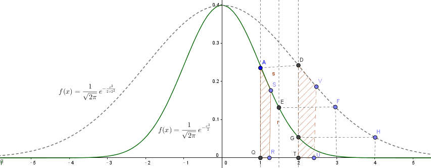
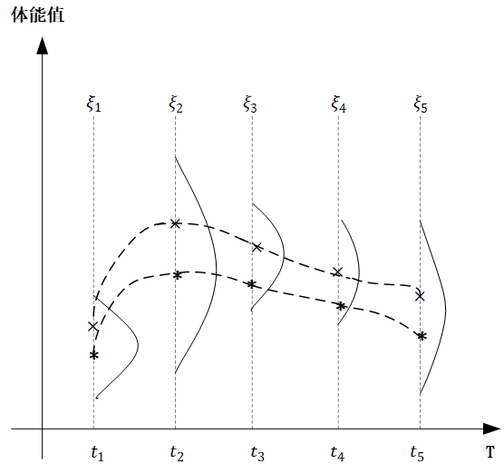

本文介绍了高斯过程，包括高斯函数、多元高斯分布、高斯过程。

<!--more-->

 ---
 
- [1. 一元高斯分布](#1-一元高斯分布)
- [2. 多元高斯分布](#2-多元高斯分布)
- [3. 高斯过程](#3-高斯过程)
  - [3.1. 概念](#31-概念)
  - [3.2. 举例](#32-举例)
  - [3.3. 高斯过程回归](#33-高斯过程回归)
- [\right)^{-1}](#right-1)
- [4. 参考文献](#4-参考文献)

# 1. 一元高斯分布

**高斯分布又称正态分布。**

标准高斯函数为

$$
f(x) = \frac{1}{\sqrt{2\pi}}e^{-\frac{x^2}{2}}
$$

函数图像为

这个函数描述了变量 $x$ 的一种分布特性，变量 $x$ 的分布有如下特点：

- 均值 = 0
- 方差 = 1
- 概率密度和 = 1

一元高斯函数的一般形式为

$$
f(x) = \frac{1}{\sqrt{2\pi}\sigma}e^{-\frac{1}{2\sigma^2}(x-\mu)^2}
$$

这里指数函数的参数 $-\frac{1}{2\sigma^2}(x-\mu)^2$ 是一个关于 $x$ 的二项式函数。由于系数为负，所以是抛物线开口向下的函数。此外，由于最前面的系数与 $x$ 无关，因此可以把它当作是一个正规化因子（normalization factor），以保证

$$
\frac{1}{\sqrt{2\pi}\sigma}\int_{-\infty}^{\infty}{exp(-\frac{1}{2\sigma^2}(x-\mu)^2)}dx=1
$$

<!-- 函数图像为

 -->

若令

$$
z = \frac{x-\mu}{\sigma}
$$

称这个过程为标准化

$$
\begin{aligned}
  x &= z\cdot \sigma + \mu\\
  \Rightarrow p(x) &= \frac{1}{\sqrt{2\pi}\sigma}e^{-\frac{1}{2}(z)^2}\\
  \Rightarrow 1 &=\int_{-\infty}^{\infty}{p(x)dx}\\
  &=\int_{-\infty}^{\infty}{\frac{1}{\sqrt{2\pi}\sigma}e^{-\frac{1}{2}(z)^2}dx}\\
  &=\int_{-\infty}^{\infty}{\frac{1}{\sqrt{2\pi}\sigma}e^{-\frac{1}{2}(z)^2}\sigma\cdot dz}\\
  &=\int_{-\infty}^{\infty}{\frac{1}{\sqrt{2\pi}}e^{-\frac{1}{2}(z)^2} dz}\\
\end{aligned}
$$

即 $z\sim N(0,1)$。

随机变量 $x$ 标准化的过程, 实际上的消除量纲影响和分布差异的过程. 通过将随机变量的值减去其均值再除以标准差, 使得随机变量与其均值的差距可以用若干个标准差来衡量, 从而实现了不同随机变量与其对应均值的差距, 可以以一种相对的距离来进行比较。

<!-- 唯一不太好理解的是前面的系数， 为什么多了一个 $\sigma$， 不是 $2\sigma$  或其他。直观理解如下图

实线代表的函数是标准高斯函数，虚线代表的是标准高斯函数在 $x$ 轴方向 2 倍延展，效果如下

$$
\begin{aligned}
A(x = 1) &= D(x = 2)\\
E(x = 1.5) &= F(x = 3)\\
G(x = 2) &= H(x = 4)\\
\end{aligned}
$$

横向拓宽了，纵向还是保持不变，可以想象，最后的函数积分肯定不等于 1。区域的面积可以近似采用公式：$面积 = 底 × 高$ 求得：从 $AQRS -> DTUV$， 底乘以 2 倍，高维持不变，所以，要保持变化前后面积不变，函数的高度应该变为原来的 1/2。所以高斯函数在 $x$ 轴方向做 2 倍延展的同时，纵向应该压缩为原来的一半，才能重新形成新的高斯分布函数

扩展到一般情形，$x$ 轴方向做 $\sigma$ 倍延拓的同时， $y$ 轴应该压缩 $\sigma$ 倍（乘以 $1/\sigma$ ） -->

# 2. 多元高斯分布

> 钱默吟. [多元高斯分布完全解析](https://zhuanlan.zhihu.com/p/58987388)

多元高斯分布是一元高斯分布在向量形式的推广。

假设随机向量 $\boldsymbol Z = [z_1,\cdots,z_n]$，其中 $z_i\sim \mathcal N(0,1)(i=1,\cdots,n)$ 且彼此独立，则随机向量的联合概率密度函数为

$$
\begin{aligned}
  p(z_1, \cdots, z_n) &= \prod_{i=1}^n \frac{1}{\sqrt{2\pi}}e^{-\frac{1}{2}(z_i)^2}\\
  &=\frac{1}{2\pi^{n/2}}e^{-1/2\cdot Z^TZ}\\
1&=\int_{-\infty}^{\infty}\cdots\int_{-\infty}^{\infty} p(z_1,\cdots,z_n)dz_1\cdots dz_n
\end{aligned}
$$

称随机向量 $\boldsymbol Z\sim \mathcal N(\boldsymbol 0,\boldsymbol I)$，即服从均值为零向量，协方差矩阵为单位矩阵的高斯分布。

对于向量 $X=[x_1,\cdots,x_n]$，其概率密度函数的形式为

$$
\begin{aligned}
p(x_1,x_2,\cdots,x_n) &=\prod_{i=1}^n p(x_i)\\
&=\frac{1}{(2\pi)^{n/2}\sigma_1\cdots\sigma_n}exp\left( -\frac{1}{2} \left[ \frac{(x_1-\mu_1)^2}{\sigma^2_1}+\cdots+\frac{(x_n-\mu_n)^2}{\sigma^2_n} \right] \right)\\
\end{aligned}
$$

其中 $\mu_i, \sigma_i$ 为第 $i$ 维的均值和方差。按照矩阵表示

$$
\begin{aligned}
  \boldsymbol x - \boldsymbol \mu &= [x_1-\mu_1,\cdots,x_n-\mu_n]^T\\
  \Sigma &= \left[
    \begin{matrix}
      \sigma_1^2&0&\cdots&0\\
      0&\sigma_2^2&\cdots&0\\
      \vdots&\vdots&\ddots&0\\
      0&0&\cdots&\sigma_n^2\\
    \end{matrix}
    \right]
\end{aligned}
$$

那么有

$$
\begin{aligned}
\sigma_1\cdots\sigma_n &= \vert\Sigma\vert^\frac{1}{2}\\
\frac{(x_1-\mu_1)^2}{\sigma^2_1}+\cdots+\frac{(x_n-\mu_n)^2}{\sigma^2_n} &= (\boldsymbol x - \boldsymbol \mu)^T\Sigma^{-1}(\boldsymbol x - \boldsymbol \mu)
\end{aligned}
$$

代入得

$$
\begin{aligned}
p(x_1,x_2,\cdots,x_n) &=p(\boldsymbol x\vert \boldsymbol \mu, \Sigma)\\
&= \frac{1}{(2\pi)^{n/2}\vert\Sigma\vert^{1/2}}exp(-\frac{1}{2}(\boldsymbol x-\boldsymbol \mu)^T\Sigma^{-1}(\boldsymbol x-\boldsymbol \mu))\\
\end{aligned}
$$

则称 $X$ 为具有均值 $\boldsymbol \mu \in \mathbb R^n$，协方差矩阵为 $\Sigma \in S^n$ 的多元高斯分布。

# 3. 高斯过程

## 3.1. 概念

首先简单理解高斯过程，比如你有 $(t_1,t_2,\cdots,t_N)=\boldsymbol T$ 个时间点，每个时间点的观测值都是高斯分布的，并且任意 $k$ 个时间点的观测值的组合都是联合高斯分布。这样的一个过程称为高斯过程。高斯过程通常可以用来表示一个**函数的分布**。

高斯过程，从字面上分解，我们就可以看出他包含两部分：
- 高斯，指的是高斯分布
- 过程，指的是随机过程

> 当随机变量是 1 维时，我们称之为一维高斯分布，概率密度函数 $p(x)=N(\mu,\sigma^2)$
> 当随机变量是有限的 $p$ 维时，我们称之为高维高斯分布， $p(x) = N(\mu, \Sigma_{p \times p})$
> 当随机变量是连续域上的无限多个高斯随机变量组成的随机过程，称之为无限维的高斯分布，即高斯过程

通常如果我们要学习一个函数（或者说学习一个映射），首先定义函数的参数，然后根据训练数据来学习这个函数的参数。例如我们做线性回归，学习这样一个函数就相当于训练回归参数（权重、偏置）。这种方法叫做**参数化的方法**。但是这种做法就把可学习的函数的范围限制死了，无法学习任意类型的函数。非参数化的方法就没有这个缺点。用高斯过程来建模函数，就是一种**非参数方法**。

## 3.2. 举例

**举一个简单的例子**，下面的图中，横轴 $T$ 是一个关于时间的连续域，表示人的一生，而纵轴表示的是体能值 $\xi$。对于一个人而言，在任意不同的时间点体能值都服从正态分布，但是不同时间点分布的均值和方差不同。一个人的一生的体能曲线就是一个**函数**（体能关于时间的函数），该函数的分布就是高斯过程。

对于任意 $t\in T, \xi_t \sim N(\mu_t,\sigma_t^2)$ ，也就是对于一个确定的高斯过程而言，对于任意时刻 $t$ ，他的 $\mu_t$ 和 $\sigma_t$ 都已经确定了。而像上图中，我们对同一人体能值在关键节点进行采样，然后平滑连接，也就是图中的两条虚线，就形成了这个高斯过程中的两个样本。

回顾 $p$ 维度高斯分布，决定他的分布是两个参数，一个是 $p$ 维的均值向量 $\mu_p$ ，他反映了 $p$ 维高斯分布中每一维随机变量的期望，另一个就是 $p\times p$ 的协方差矩阵 $\Sigma_{p\times p}$ ，他反映了高维分布中，每一维自身的方差，以及不同维度之间的协方差。

定义在连续域 $T$ 上的高斯过程其实也是一样，他是无限维的高斯分布，他同样需要描述每一个时间点 $t$ 上的均值，但是这个时候就不能用向量了，因为是在连续域上的，维数是无限的，因此就应该定义成一个关于时刻 $t$ 的**函数** $m(t)$。

协方差矩阵也是同理，无限维的情况下就定义为一个**核函数** $k(t_i,t_j)$ ，其中 $t_i$ 和 $t_j$ 表示任意两个时刻。核函数也称协方差函数，是一个高斯过程的核心，他决定了高斯过程的性质。在研究和实践中，核函数有很多种不同的类型，他们对高斯过程的衡量方法也不尽相同，最为常见的一个核函数是径向基函数，其定义如下：

$$
k_\lambda(t_i,t_j)=\sigma^2 exp(-\frac{\vert\vert t_i-t_j\vert\vert^2}{2l^2})
$$

$\sigma$ 和 $l$ 是径向基函数的超参数，是我们提前可以设置好的。径向基函数输出的是一个标量，他代表的就是两个时间点各自所代表的高斯分布之间的协方差值，很明显径向基函数是一个关于距离 $\vert\vert x_i-x_j\vert\vert$ 负相关的函数，两个点距离越大，两个分布之间的协方差值越小，即相关性越小，反之越靠近的两个时间点对应的分布其协方差值就越大。

由此，高斯过程的两个核心要素：均值函数和核函数的定义我们就描述清楚了，按照高斯过程存在性定理，一旦这两个要素确定了，那么整个高斯过程就确定了：

$$
\xi_t \sim GP(m(t),k(t_i,t_j))
$$

------

**另一个简单的例子**，假设我们有**两个点** $x_0=0$ 和 $x_1=1$ ，对应这两个点的函数值服从二维高斯分布（高斯过程中“高斯”二字的由来）

$$
\begin{aligned}
\left(
  \begin{matrix}
  y_0\\
  y_1
  \end{matrix}
\right)
\sim \mathcal N
\left(
  \begin{matrix}
  \left(
  \begin{matrix}
  0\\
  1
  \end{matrix}
  \right),
  \left(
  \begin{matrix}
  1&0\\
  0&1
  \end{matrix}
  \right)
  \end{matrix}
\right)
\end{aligned}
$$

从这个二维高斯分布中采样 10 组数据，其中两个点在 $x$ 轴上的两端，采样得到的两个 $y$ 对应在 $y$ 轴取值，可以得到下图所示的结果

每条直线可以被认为是从**一个线性函数分布**中采样出来的线性函数。

如果我们有**20个 $x$ 点**，对应这 20 个 $x$ 的函数值符合均值为 0，协方差矩阵为单位矩阵的联合高斯分布。和上面一样采样 10 组数据，得到下图

每一条线都是一个函数，是从某个**函数分布**中采样得到的。但是这样的函数看上去一点也不平滑，并且显得杂乱无章，距离很近的两个 $x$ 对应的函数值 $y$ 可以相差很大。

直观来说，两个 $x$ 离得越近，对应的函数值应该相差越小，也就是说这个函数应该是平滑的，而不是像上图那样是突变的。所以我们应该通过两个 $x$ 之间的某种距离来定义这两个 $x$ 对应的函数值之间的协方差。两个 $x$ 离得越近，对应函数值之间的协方差应该越大，意味着这两个函数值的取值可能越接近。

我们引入核函数（以高斯核为例，也可以用其他核，并不是说我们在讲高斯过程所以这里就一定用高斯核）：

$$
k_\lambda(x_i,x_j)=exp(-\frac{\vert\vert \boldsymbol x_i-\boldsymbol x_j\vert\vert^2}{\lambda})
$$

和函数可以表示两个点 $x_i,x_j$ 之间的距离。此时，若我们有N个数据点( $x_1,\cdots,x_N$ )，则这个 $N$ 个数据点对应的 $N$ 个函数值服从 $N$ 维高斯分布，这个高斯分布的均值是 0，协方差矩阵是 $K$，$K$ 里的每一个元素对应

$$
K_{nm} = k(\boldsymbol x_n,\boldsymbol x_m)
$$

此时，再以刚才 20 个数据点的情况为例，我们采样 10 组，得到下图，现在看起来函数就平滑多了

如果数据点再多点，例如 100 个数据点，则采样 10 组，得到下图：

上图每条曲线就是一个高斯过程的采样，每个数据点上的函数值都是高斯分布。且任意k个数据点对应的函数值的组合都是联合高斯分布。

## 3.3. 高斯过程回归

高斯过程回归可以看作是一个根据先验与观测值推出后验的过程。

假设一组 $n$ 个观测值，每个观测值为 $D$ 维向量 $\boldsymbol X=\{\boldsymbol x_1, \cdots, \boldsymbol x_n\}$，对应的值为 $n$ 个 $M$ 维目标向量 $\boldsymbol Y=\{\boldsymbol y_1,\cdots, \boldsymbol y_n\}$。假设回归残差 $\boldsymbol \varepsilon=[\varepsilon_1,\cdots,\varepsilon_n]$ 服从 $iid$ 正态分布 $p(\varepsilon)=\mathcal N(0,\sigma^2_{noise})$，则回归问题就是希望我们通过 $\boldsymbol X,\boldsymbol Y$ 学习一个由 $\boldsymbol X$ 到 $\boldsymbol Y$ 的映射函数 $f$

$$
\boldsymbol Y=f(\boldsymbol X)+\boldsymbol \varepsilon,\quad where\quad \varepsilon_i\sim \mathcal N(0,\sigma^2_{noise}), i=1,\cdots,n
$$

未知映射 $f$ 遵循高斯过程，通过 $\boldsymbol \mu = [\mu(x_1),\cdots,\mu(x_n)]$ 与 $k(\boldsymbol x_i,\boldsymbol x_j)$ 定义一个高斯过程，但是因为此时没有任何观测值，所以这是一个先验。

$$
f(\boldsymbol X) \sim \mathcal{GP}[\boldsymbol \mu,k(\boldsymbol X, \boldsymbol X)]
$$

接着，给定其它 $m$ 个测试观测值 $\boldsymbol X^*$，预测 $\boldsymbol Y^*=f(\boldsymbol X^*)$ 。

我们希望对 $\boldsymbol Y^*\vert \boldsymbol Y$ 的条件概率 $p(\boldsymbol Y^*\vert \boldsymbol X, \boldsymbol Y,\boldsymbol X^*)$ 进行建模，即给定观察到的所有数据 $\boldsymbol X, \boldsymbol Y,\boldsymbol X^*$，确定预测样本的预测值 $\boldsymbol Y^*$ 的分布。

高斯过程并没有直接对这个条件概率分布进行建模，而是从联合概率分布出发，对 $\boldsymbol Y^*$ 的联合概率 $p(\boldsymbol Y,\boldsymbol Y^*\vert\boldsymbol X,\boldsymbol X^*)$ 进行建模。当这个概率已知时，可以通过下面的式子得到新样本预测值的条件概率

$$
p(\boldsymbol Y^*\vert\boldsymbol X,\boldsymbol Y,\boldsymbol X^*)
= \frac{p(\boldsymbol Y,\boldsymbol Y^*\vert \boldsymbol X,\boldsymbol X^*)}{p(\boldsymbol Y\vert \boldsymbol X,\boldsymbol X^*)}
= \frac{p(\boldsymbol Y,\boldsymbol Y^*\vert \boldsymbol X,\boldsymbol X^*)}{\int _{Y^*}p(\boldsymbol Y,\boldsymbol Y^*\vert \boldsymbol X,\boldsymbol X^*)dY^*}
$$

显然，核心是建立 $p(\boldsymbol Y,\boldsymbol Y^*\vert \boldsymbol X,\boldsymbol X^*)$ 的具体形式，然后通过上式求出关于 $\boldsymbol Y^*$ 的条件概率。

根据回归模型核高斯过程的定义，$\boldsymbol Y$ 和 $\boldsymbol Y^*$ 的概率分布为

$$
\begin{aligned}
\boldsymbol Y&\sim \mathcal N(\mu(\boldsymbol X),k(\boldsymbol X, \boldsymbol X)+\sigma^2_{noise}\boldsymbol I)\\
\boldsymbol Y^* &\sim \mathcal N(\mu(\boldsymbol X^*),k(\boldsymbol X^*, \boldsymbol X^*))
\end{aligned}
$$

二者的联合分布满足无限维高斯分布

$$
\begin{aligned}
  \left[\begin{matrix}
    \boldsymbol Y\\\boldsymbol Y^*
  \end{matrix}\right]
  \sim
  N(
  \left[\begin{matrix}
    \mu(\boldsymbol X)\\\mu(\boldsymbol X^*)
  \end{matrix}\right],
  \left[\begin{matrix}
    k(\boldsymbol X,\boldsymbol X)+\sigma^2_{noise} \boldsymbol I & k(\boldsymbol X,\boldsymbol X^*)\\ k(\boldsymbol X^*,\boldsymbol X)&k(\boldsymbol X^*,\boldsymbol X^*)
  \end{matrix}\right]
  )
\end{aligned}
$$

从这个联合分布中派生出来的条件概率 $\boldsymbol Y^*\vert \boldsymbol Y$ 同样也服从无限维高斯分布。套用高维高斯分布的公式

$$
\begin{aligned}
  \boldsymbol Y^*\vert \boldsymbol Y &\sim N(\mu^*,k^*) \Rightarrow p(\boldsymbol Y^*\vert \boldsymbol X,\boldsymbol Y,\boldsymbol X^*)= N(\mu^*,k^*)\\
  \mu^* &= k(\boldsymbol X^*,\boldsymbol X)[k(\boldsymbol X,\boldsymbol X)+\sigma^2_{noise}\boldsymbol I]^{-1}(\boldsymbol Y-\mu(\boldsymbol X))+\mu(\boldsymbol X^*)\\
  k^* &= k(\boldsymbol X^*,\boldsymbol X^*)-k(\boldsymbol X^*,\boldsymbol X)[k(\boldsymbol X,\boldsymbol X)+\sigma^2_{noise}\boldsymbol I]^{-1}k(\boldsymbol X,\boldsymbol X^*)
\end{aligned}
$$

高斯过程回归的求解也被称为超参学习（hyper-parameter learning），是按照贝叶斯方法通过学习样本确定核函数的超参数 $\boldsymbol \theta$ 的过程。根据贝叶斯定理，高斯过程回归的超参数的后验表示如下

$$
p(\boldsymbol \theta \vert \boldsymbol X,\boldsymbol Y) = \frac{p(\boldsymbol Y\vert \boldsymbol X,\boldsymbol \theta)p(\boldsymbol \theta)}{p(\boldsymbol Y\vert \boldsymbol X)}
$$

其中，$\boldsymbol \theta$ 包括核函数的超参数和残差的方差 $\sigma^2_{noise}$。

$p(\boldsymbol Y\vert\boldsymbol X,\boldsymbol \theta)$ 是似然，是对高斯过程回归的输出边缘化得到的边缘似然：

$$
p(\boldsymbol Y\vert\boldsymbol X,\boldsymbol \theta) = \int p(\boldsymbol Y\vert f, \boldsymbol X,\boldsymbol \theta)p(f\vert\boldsymbol X,\boldsymbol \theta)df
$$

采用最大似然估计来对高斯过程的超参数进行估计。

$$
\begin{aligned}
  p(\boldsymbol Y\vert\boldsymbol X,\boldsymbol \theta) =& \frac{1}{(2\pi)^{n/2}\vert\Sigma\vert^{1/2}}exp(-\frac{1}{2}(\boldsymbol Y-\mu(\boldsymbol X))^T\Sigma^{-1}(\boldsymbol Y-\mu(\boldsymbol X)))\\
 \Rightarrow {\rm ln}\ p(\boldsymbol Y\vert\boldsymbol X,\boldsymbol \theta)
 =&
 -\frac{1}{2}{\rm ln}{\vert\Sigma\vert}-\frac{n}{2}{\rm ln}(2\pi)-\frac{1}{2}(\boldsymbol Y-\mu(\boldsymbol X))^T\Sigma^{-1}(\boldsymbol Y-\mu(\boldsymbol X))\\
\end{aligned}
$$

上式第一项仅与回归模型有关，回归模型的核矩阵越复杂其取值越高，反映了模型的结构风险（structural risk）。第三项包含学习成本，是数据拟合项，表示模型的经验风险（empirical risk）。

其中，$\Sigma=k(\boldsymbol X,\boldsymbol X)+\sigma^2_{noise}\boldsymbol I$，与超参数 $\boldsymbol \theta$ 有关。利用梯度下降的方法更新超参数，上述式子对超参数 $\boldsymbol \theta$ 求导

$$
\frac{\partial {\rm ln}\ p(\boldsymbol Y\vert\boldsymbol X,\boldsymbol \theta)}{\partial \boldsymbol \theta} = 
-\frac{1}{2}tr(\Sigma^{-1}\frac{\partial \Sigma}{\partial \boldsymbol \theta}) + \frac{1}{2}(\boldsymbol Y-\mu(\boldsymbol X))^T\Sigma^{-1}\frac{\partial \Sigma}{\partial \boldsymbol \theta}(\boldsymbol Y-\mu(\boldsymbol X))
$$

> **PS1：**
> 高斯分布有一个很好的特性，即高斯分布的联合概率、边缘概率、条件概率仍然是满足高斯分布的，假设 $n$ 维随机变量满足高斯分布  $\boldsymbol x \sim N(\mu,\Sigma_{n\times n})$
> 
> 把随机变量分成两部分：$p$ 维 $\boldsymbol x_a$ 和 $q$ 维 $\boldsymbol x_b$，满足 $n=p+q$，按照分块规则可以写成
$$
\begin{aligned}
  x=\left[\begin{matrix}
    x_a\\x_b
  \end{matrix}\right],
  \mu=\left[\begin{matrix}
    \mu_a\\\mu_b
  \end{matrix}\right],
  \Sigma=\left[\begin{matrix}
    \Sigma_{aa} & \Sigma_{ab}\\\Sigma_{ba}&\Sigma_{bb}
  \end{matrix}\right]
\end{aligned}
$$
> 则下列条件分布依然是高维高斯分布
$$
\begin{aligned}
x_b\vert x_a &\sim N(\mu_{b\vert a},\Sigma_{b\vert a})\\
\mu_{b\vert a} &= \Sigma_{ba}\Sigma_{aa}^{-1}(x_a-\mu_a)+\mu_b\\
\Sigma_{b\vert a} &= \Sigma_{bb}-\Sigma_{ba}\Sigma_{aa}^{-1}\Sigma_{ab}
\end{aligned}
$$
由此可推广到高斯过程。
> **PS2：**
> 分块矩阵求逆
$$
\begin{aligned}
  \left(
  \begin{matrix}
    A&B\\
    C&D
  \end{matrix}  
  \right)^{-1}
  =
  \left(
  \begin{matrix}
    M&-MBD^{-1}\\
    -D^{-1}CM&D^{-1}+D^{-1}CMBD^{-1}
  \end{matrix}
  \right)
\end{aligned}
$$

# 4. 参考文献

[1] bingjianing. [多元高斯分布（The Multivariate normal distribution）](https://www.cnblogs.com/bingjianing/p/9117330.html)

[2] 论智. [图文详解高斯过程（一）——含代码](https://zhuanlan.zhihu.com/p/32152162)

[3] 我能说什么好. [通俗理解高斯过程及其应用](https://zhuanlan.zhihu.com/p/73832253)

[4] 石溪. [如何通俗易懂地介绍 Gaussian Process](https://www.zhihu.com/question/46631426)

[5] 钱默吟. [多元高斯分布完全解析](https://zhuanlan.zhihu.com/p/58987388)

[6] li Eta. [如何通俗易懂地介绍 Gaussian Process？](https://www.zhihu.com/question/46631426/answer/102314452)

