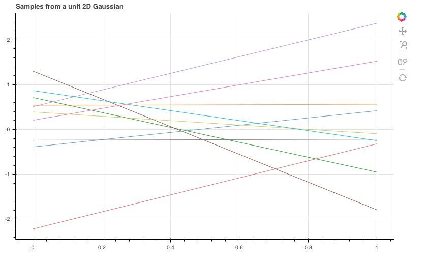
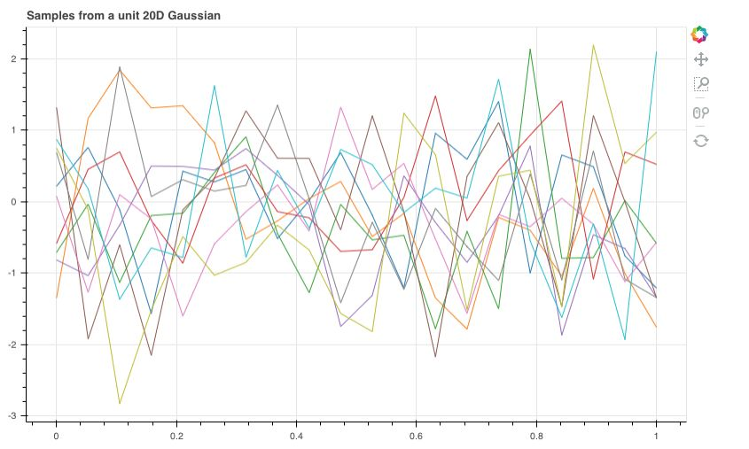
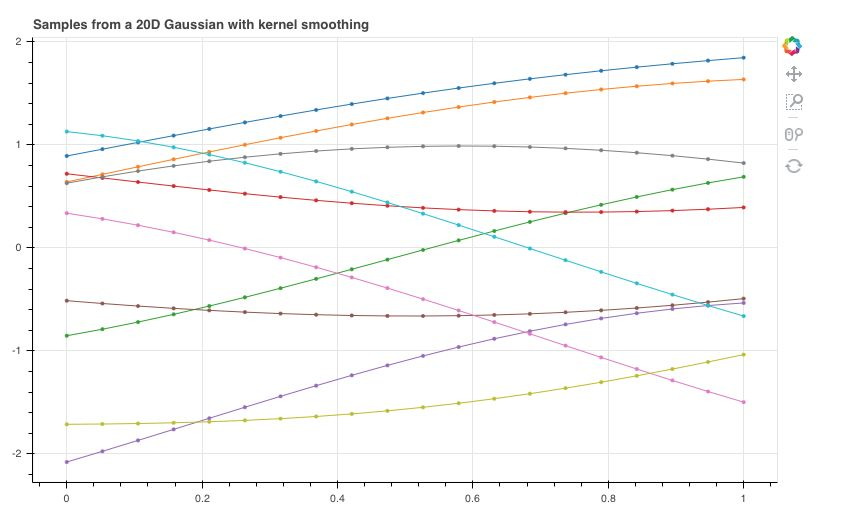

本文介绍了高斯过程，包括高斯函数、多元高斯分布、高斯过程。

<!--more-->

 ---
 
- [1. 一元高斯分布](#1-一元高斯分布)
- [2. 多元高斯分布](#2-多元高斯分布)
  - [2.1. 独立多元高斯分布](#21-独立多元高斯分布)
- [3. 高斯过程](#3-高斯过程)
  - [3.1. 概念](#31-概念)
  - [3.2. 举例](#32-举例)
  - [3.3. 高斯过程回归](#33-高斯过程回归)
- [4. 参考文献](#4-参考文献)

# 1. 一元高斯分布

**高斯分布又称正态分布。**

标准高斯函数为

$$
f(x) = \frac{1}{\sqrt{2\pi}}e^{-\frac{x^2}{2}}
$$

函数图像为

这个函数描述了变量 $x$ 的一种分布特性，变量x的分布有如下特点：

- 均值 = 0
- 方差 = 1
- 概率密度和 = 1

一元高斯函数的一版形式为

$$
f(x) = \frac{1}{\sqrt{2\pi}\sigma}e^{-\frac{(x-\mu)^2}{2\sigma^2}}
$$

函数图像为

若令

$$
z = \frac{x-\mu}{\sigma}
$$

称这个过程为标准化，那么 $z\sim N(0,1)$。

唯一不太好理解的是前面的系数， 为什么多了一个 $\sigma$， 不是 $2\sigma$  或其他。直观理解如下图

实线代表的函数是标准高斯函数，虚线代表的是标准高斯函数在 $x$ 轴方向 2 倍延展，效果如下

$$
\begin{aligned}
A(x = 1) &= D(x = 2)\\
E(x = 1.5) &= F(x = 3)\\
G(x = 2) &= H(x = 4)\\
\end{aligned}
$$

横向拓宽了，纵向还是保持不变，可以想象，最后的函数积分肯定不等于 1。区域的面积可以近似采用公式：$面积 = 底 × 高$ 求得：从 $AQRS -> DTUV$， 底乘以 2 倍，高维持不变，所以，要保持变化前后面积不变，函数的高度应该变为原来的 1/2。所以高斯函数在 $x$ 轴方向做 2 倍延展的同时，纵向应该压缩为原来的一半，才能重新形成新的高斯分布函数

扩展到一般情形，$x$ 轴方向做 $\sigma$ 倍延拓的同时， $y$ 轴应该压缩 $\sigma$ 倍（乘以 $1/\sigma$ ）

# 2. 多元高斯分布

## 2.1. 独立多元高斯分布

# 3. 高斯过程

## 3.1. 概念

首先简单理解高斯过程，比如你有 $(t_1,t_2,\cdots,t_N)=\boldsymbol T$ 个时间点，每个时间点的观测值都是高斯分布的，并且任意 $k$ 个时间点的观测值的组合都是联合高斯分布。这样的一个过程称为高斯过程。高斯过程通常可以用来表示一个**函数的分布**。

高斯过程，从字面上分解，我们就可以看出他包含两部分：
- 高斯，指的是高斯分布
- 过程，指的是随机过程

> 当随机变量是 1 维时，我们称之为一维高斯分布，概率密度函数 $p(x)=N(\mu,\sigma^2)$
> 当随机变量是有限的 $p$ 维时，我们称之为高维高斯分布， $p(x) = N(\mu, \Sigma_{p \times p})$
> 当随机变量是连续域上的无限多个高斯随机变量组成的随机过程，称之为无限维的高斯分布，即高斯过程

通常如果我们要学习一个函数（或者说学习一个映射），首先定义函数的参数，然后根据训练数据来学习这个函数的参数。例如我们做线性回归，学习这样一个函数就相当于训练回归参数（权重、偏置）。这种方法叫做**参数化的方法**。但是这种做法就把可学习的函数的范围限制死了，无法学习任意类型的函数。非参数化的方法就没有这个缺点。用高斯过程来建模函数，就是一种**非参数方法**。

## 3.2. 举例

**举一个简单的例子**，下面的图中，横轴 $T$ 是一个关于时间的连续域，表示人的一生，而纵轴表示的是体能值 $\xi$。对于一个人而言，在任意不同的时间点体能值都服从正态分布，但是不同时间点分布的均值和方差不同。一个人的一生的体能曲线就是一个**函数**（体能关于时间的函数），该函数的分布就是高斯过程。

对于任意 $t\in T, \xi_t \sim N(\mu_t,\sigma_t^2)$ ，也就是对于一个确定的高斯过程而言，对于任意时刻 $t$ ，他的 $\mu_t$ 和 $\sigma_t$ 都已经确定了。而像上图中，我们对同一人体能值在关键节点进行采样，然后平滑连接，也就是图中的两条虚线，就形成了这个高斯过程中的两个样本。

回顾 $p$ 维度高斯分布，决定他的分布是两个参数，一个是 $p$ 维的均值向量 $\mu_p$ ，他反映了 $p$ 维高斯分布中每一维随机变量的期望，另一个就是 $p\times p$ 的协方差矩阵 $\Sigma_{p\times p}$ ，他反映了高维分布中，每一维自身的方差，以及不同维度之间的协方差。

定义在连续域 $T$ 上的高斯过程其实也是一样，他是无限维的高斯分布，他同样需要描述每一个时间点 $t$ 上的均值，但是这个时候就不能用向量了，因为是在连续域上的，维数是无限的，因此就应该定义成一个关于时刻 $t$ 的**函数** $m(t)$。

协方差矩阵也是同理，无限维的情况下就定义为一个**核函数** $k(t_i,t_j)$ ，其中 $t_i$ 和 $t_j$ 表示任意两个时刻。核函数也称协方差函数，是一个高斯过程的核心，他决定了高斯过程的性质。在研究和实践中，核函数有很多种不同的类型，他们对高斯过程的衡量方法也不尽相同，最为常见的一个核函数是径向基函数，其定义如下：

$$
k_\lambda(t_i,t_j)=\sigma^2 exp(-\frac{\vert\vert t_i-t_j\vert\vert^2}{2l^2})
$$

$\sigma$ 和 $l$ 是径向基函数的超参数，是我们提前可以设置好的。径向基函数输出的是一个标量，他代表的就是两个时间点各自所代表的高斯分布之间的协方差值，很明显径向基函数是一个关于距离 $\vert\vert x_i-x_j\vert\vert$ 负相关的函数，两个点距离越大，两个分布之间的协方差值越小，即相关性越小，反之越靠近的两个时间点对应的分布其协方差值就越大。

由此，高斯过程的两个核心要素：均值函数和核函数的定义我们就描述清楚了，按照高斯过程存在性定理，一旦这两个要素确定了，那么整个高斯过程就确定了：

$$
\xi_t \sim GP(m(t),k(t_i,t_j))
$$

------

**另一个简单的例子**，假设我们有**两个点** $x_0=0$ 和 $x_1=1$ ，对应这两个点的函数值服从二维高斯分布（高斯过程中“高斯”二字的由来）

$$
\begin{aligned}
\left(
  \begin{matrix}
  y_0\\
  y_1
  \end{matrix}
\right)
\sim \mathcal N
\left(
  \begin{matrix}
  \left(
  \begin{matrix}
  0\\
  1
  \end{matrix}
  \right),
  \left(
  \begin{matrix}
  1&0\\
  0&1
  \end{matrix}
  \right)
  \end{matrix}
\right)
\end{aligned}
$$

从这个二维高斯分布中采样 10 组数据，其中两个点在 $x$ 轴上的两端，采样得到的两个 $y$ 对应在 $y$ 轴取值，可以得到下图所示的结果

每条直线可以被认为是从**一个线性函数分布**中采样出来的线性函数。

如果我们有**20个 $x$ 点**，对应这 20 个 $x$ 的函数值符合均值为 0，协方差矩阵为单位矩阵的联合高斯分布。和上面一样采样 10 组数据，得到下图

每一条线都是一个函数，是从某个**函数分布**中采样得到的。但是这样的函数看上去一点也不平滑，并且显得杂乱无章，距离很近的两个 $x$ 对应的函数值 $y$ 可以相差很大。

直观来说，两个 $x$ 离得越近，对应的函数值应该相差越小，也就是说这个函数应该是平滑的，而不是像上图那样是突变的。所以我们应该通过两个 $x$ 之间的某种距离来定义这两个 $x$ 对应的函数值之间的协方差。两个 $x$ 离得越近，对应函数值之间的协方差应该越大，意味着这两个函数值的取值可能越接近。

我们引入核函数（以高斯核为例，也可以用其他核，并不是说我们在讲高斯过程所以这里就一定用高斯核）：

$$
k_\lambda(x_i,x_j)=exp(-\frac{\vert\vert \boldsymbol x_i-\boldsymbol x_j\vert\vert^2}{\lambda})
$$

和函数可以表示两个点 $x_i,x_j$ 之间的距离。此时，若我们有N个数据点( $x_1,\cdots,x_N$ )，则这个 $N$ 个数据点对应的 $N$ 个函数值服从 $N$ 维高斯分布，这个高斯分布的均值是 0，协方差矩阵是 $K$，$K$ 里的每一个元素对应

$$
K_{nm} = k(\boldsymbol x_n,\boldsymbol x_m)
$$

此时，再以刚才 20 个数据点的情况为例，我们采样 10 组，得到下图，现在看起来函数就平滑多了

如果数据点再多点，例如 100 个数据点，则采样 10 组，得到下图：

上图每条曲线就是一个高斯过程的采样，每个数据点上的函数值都是高斯分布。且任意k个数据点对应的函数值的组合都是联合高斯分布。

## 3.3. 高斯过程回归

# 4. 参考文献

[1] bingjianing. [多元高斯分布（The Multivariate normal distribution）](https://www.cnblogs.com/bingjianing/p/9117330.html)

[2] 论智. [图文详解高斯过程（一）——含代码](https://zhuanlan.zhihu.com/p/32152162)

[3] 我能说什么好. [通俗理解高斯过程及其应用](https://zhuanlan.zhihu.com/p/73832253)

[4] 石溪. [如何通俗易懂地介绍 Gaussian Process](https://www.zhihu.com/question/46631426)