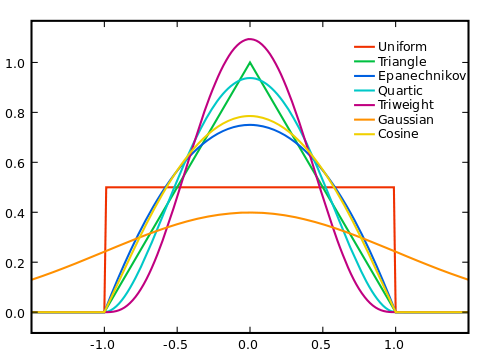

本文介绍了统计学中的核回归方法，并铺垫了非参数化统计方法等一些基础知识。

<!--more-->

 ---
 
- [1. 基本知识](#1-基本知识)
  - [1.1. 回归](#11-回归)
  - [1.2. 近邻回归](#12-近邻回归)
  - [1.3. 核回归](#13-核回归)
  - [1.4. 深度核回归](#14-深度核回归)
    - [1.4.1. 初始化](#141-初始化)
    - [1.4.2. 前向传播](#142-前向传播)
    - [1.4.3. 反向传播](#143-反向传播)
    - [1.4.4. 预测](#144-预测)
- [2. 参考文献](#2-参考文献)

# 1. 基本知识

## 1.1. 回归

回归分析（Regression Analysis）是一种统计学上分析数据的方法，目的在于了解两个或多个变量间是否相关、相关方向与强度，并建立数学模型以便观察特定变量来预测研究者感兴趣的变量。更具体的来说，回归分析可以帮助人们了解在只有一个自变量变化时因变量的变化量。一般来说，通过回归分析我们可以由给出的自变量估计因变量的条件期望。

回归分析是建立因变量 $Y$（或称依变量，反因变量）与自变量 $X$（或称独变量，解释变量）之间关系的模型。简单线性回归使用一个自变量 $X$，复回归使用超过一个自变量（$X_{1},X_{2}...X_{i}$）。

- **参数回归**

  优点：

  - 模型形式简单明确，仅由一些参数表达
  - 在某些问题中，模型参数具有明确的含义（如经济问题中）
  - 当模型参数假设成立时，统计推断的精度较高，能经受实际检验
  - 模型能够进行外推运算
  - 模型可以用于小样本的统计推断

  缺点：

  - 回归函数怒的形式需要预先假定
  - 模型限制条件较多，一般要求样本满足某种分布，随机误差满足正态假设，解释变量间独立，解释变量与随机误差不相关等
  - 模型泛化能力弱、缺乏稳健性

- **非参数回归**

  非参数回归是指并不需要知道总的分布的情况下进行的一种非参数统计方法。

  > [非参数统计](https://zh.wikipedia.org/wiki/%E7%84%A1%E6%AF%8D%E6%95%B8%E7%B5%B1%E8%A8%88)（nonparametric statistics），或称非参数统计学，统计学的分支，适用于母群体分布情况未明、小样本、母群体分布不为正态也不易变换为正态。特点在于尽量减少或不修改其建立之模型，较具稳健特性；在样本数不大时，计算过程较简单。
  > 
  > 非参数统计推断时所使用的统计量的抽样分配通常与总体分配无关，不必推论其中位数、拟合优度、独立性、随机性，更广义的说，非参数统计又称为“不受分布限制统计法”（distribution free）。

  优点：

  - 回归函数形式自由、受约束少，对数据分布一般不做任何要求
  - 适应能力强，稳健性高，回归模型完全由数据驱动
  - 对于非线性、非齐次问题效果很好

  缺点

  - 不能进行外推运算
  - 估计的收敛速度慢
  - 一般只有在大样本下才能取得很好的效果，小样本效果较差
  - 高维诅咒？

## 1.2. 近邻回归

1NN（1-Nearest Neighbor）回归：找寻与输入 $x_q$ 最接近的 $x_i$ 对应的 $y_i$ 作为预测输出。缺点时对大块区域没有数据或数据不足时敏感，拟合的不好。

KNN（K-Nearest Neighbor）回归：找寻 $k$ 个最近邻的点 $x_1,x_2,\cdots,x_k$，然后对他们对应的 $y_1,y_2,\cdots,y_k$ 求**平均**。

加权 kNN （Weighted K-Nearest Neighbor）回归：找寻 $k$ 个最近邻的点 $X_1,X_2,\cdots,X_k$，然后对他们对应的 $y_1,y_2,\cdots,y_k$ 求**加权平均**。权重取法为，离得更近的点具备更大的权重，反之更小。简单的算法为计算距离的倒数，即

$$
\begin{aligned}
y_{q} &= \frac{c_{1}y_{1}+\cdots+c_{k}y_{k}}{\sum_{j=1}^k c_{qj}}\\
c_{qj} &= \frac{1}{dis(x_j,x_q)}
\end{aligned}
$$

影响近邻回归性能的因素：

- **k**
  如果 K 值选择的比较小，这时候我们就相当于使用较小的领域中的训练样本对实例进行预测。这时候，算法的**近似误差会减小**，因为只有与输入实例相近的训练样本才能才会对预测结果起作用。但是它也会有明显的缺点：算法的估计误差会偏大，预测的结果会对近邻点十分敏感，也就是说如果近邻点是噪声点的话，那么预测就会出错。也就是说，k 值太小会使得 KNN 算法容易**过拟合**。

  同理，如果 K 值选的比较大的话，这时候距离较远的训练样本都能够对实例的预测结果产生影响。这时候，而模型相对**比较鲁棒**，不会因个别噪声点对最终的预测产生影响。但是缺点也是十分明显的：算法的近似误差会偏大，距离较远的点（与预测实例不相似）也会同样对预测结果产生作用，使得预测产生较大偏差。此时相当于模型发生**欠拟合**。

  因此，在实际的工程实践过程中，我们一般采用交叉验证的方式选取 K 值。从上面的分析也可以知道，一般 k 值取得比较小。我们会选取 k 值在较小的范围，同时在测试集上准确率最高的那一个确定为最终的算法超参数 k。

- **距离度量方法**
  
  距离计算一般采用:

  - 闵可夫斯基距离（欧氏距离、曼哈顿距离、切比雪夫距离）
  - 余弦距离（余弦相似度）

  闵可夫斯基距离不是一种距离，而是一类距离的定义。对于两个具有 $n$ 维特征的样本点 $\boldsymbol x_i,\boldsymbol x_q$，二者间的**闵可夫斯基距离**为

  $$
  dis(\boldsymbol x_i,\boldsymbol x_q)=\left( \sum_{k=1}^n \vert x_i^k - x_q^k \vert^n \right)^{\frac{1}{n}}
  $$

  $p=1$ 时被称为曼哈顿距离；
  $p=2$ 时被称为欧氏距离（L2范数）；
  $p\rightarrow \infty$ 时被称为切比雪夫距离。

  对于两个具有 $n$ 维特征的样本点 $\boldsymbol x_i,\boldsymbol x_q$，二者间的**余弦相似度**为

  $$
  sim_c(\boldsymbol x_i,\boldsymbol x_q) = cos(\boldsymbol x_i,\boldsymbol x_q)=\frac{\boldsymbol x_i\cdot \boldsymbol x_q}{\vert\vert\boldsymbol x_i\vert\vert\cdot\vert\vert\boldsymbol x_q\vert\vert} = \frac{\sum_{k=1}^n x_{ik}x_{qk}}{\sqrt{\sum_{k=1}^n x_{ik}^2} \sqrt{\sum_{k=1}^n x_{qk}^2}}
  $$

  则余弦距离为

  $$
  dis_c(\boldsymbol x_i,\boldsymbol x_q) = 1 - sim_c(\boldsymbol x_i,\boldsymbol x_q)
  $$

  注意，余弦距离不是一个严格意义上的距离度量公式，但在形容两个特征向量之间的关系上用处很大。

  当向量的模长经过归一化时，欧氏距离与余弦距离有着单调的关系

  $$
  dis_2 = \sqrt{2\cdot dis_c}
  $$

  此时如果选择距离最小（相似度最大）的近邻，那么使用余弦相似度和欧氏距离的结果是相同的。

  二者之间的使用差异如下：欧氏距离体现**数值上的绝对差异**，而余弦距离体现**方向上的相对差异**。

  1) 例如，统计两部剧的用户观看行为，用户A的观看向量为(0,1)，用户B为(1,0)；此时二者的余弦距很大，而欧氏距离很小；我们分析两个用户对于不同视频的偏好，更关注相对差异，显然应当使用余弦距离。

  2) 而当我们分析用户活跃度，以登陆次数(单位：次)和平均观看时长(单：分钟)作为特征时，余弦距离会认为(1,10)、(10,100)两个用户距离很近；但显然这两个用户活跃度是有着极大差异的，此时我们更关注数值绝对差异，应当使用欧氏距离。


## 1.3. 核回归

继续细化权重，提出**核权重**的概念。

$$
c_{qj} = k(\boldsymbol x_i,\boldsymbol x_q)
$$

$k$ 是一个函数，一个二元函数，一个 $R^n\times R^n \rightarrow R^+$ 的二元函数，用来描述点与点之间的关系或者说距离的一种东西。

范数就是我们之前强调的距离，或者说广义的距离。向量空间中两向量的内积可度量其距离，即内积就是这个距离的定义的方式，也即由内积可以诱导出范数。可以用内积来刻画 kernel

$$
k(\boldsymbol x_i,\boldsymbol x_q)=<\boldsymbol x_i,\boldsymbol x_q>
$$

根据不同的内积定义，可以构造出不同的核函数。

k 可以用原特征空间上点内积的方式经过运算转化成高维空间点内积的函数，可以用来避免在高维空间里进行繁琐的内积计算。

常用的**高斯核**如下

$$
k_\lambda(x_i,x_q)=exp(-\frac{\vert\vert \boldsymbol x_i-\boldsymbol x_q\vert\vert^2}{\lambda})
$$

其它常用的核函数包括均匀分布核、三角核等等，如下图所示。



**核回归就是升级版的加权 KNN，区别在于不是加权 k 个最近的邻居，而是加权所有样本点**。然后权重是由特定的核函数来确定的。

$$
y_q = \frac{\sum_{i=1}^N c_{qi}y_i}{\sum_{i=1}^Nc_{qi}} = \frac{\sum_{i=1}^N k_{\lambda}(\boldsymbol x_i,\boldsymbol x_q)y_i}{\sum_{i=1}^N k_{\lambda}(\boldsymbol x_i,\boldsymbol x_q)}
$$

要确定两个东西：

- 核
- $\lambda$

$\lambda$ 的选择根据验证集验证时的验证损失来确定。较小的 $\lambda$ 即使得预测量近受到附近距离很近的点的影响，过小的 $\lambda$ 会导致过拟合；过大的 $\lambda$ 则会导致过平滑，即欠拟合。


核的选择比 $\lambda$ 的选择更重要。很多时候我们根本不知道核函数将数据映射成了什么样子，映射后的可分离性可能更好，也可能更差。这个时候我们会尝试不同的核函数和参数。

对于非参数回归问题，点 $x_q$ 对应的预测值 $y_q$ 的条件期望可以写成某个未知函数 $m(\cdot)$ 与噪声 $\sigma$ 之和

$$
y_q = \mathbb E(y\vert x=x_q)=m(x)+\sigma
$$

1964年，Nadaraya 和 Watson 提出了一种局部加权平均估计 $m(\cdot)$ 方法，称为 Nadaraya-Watson 核估计（或 Nadaraya-Watson 回归）。

$$
y_q = \frac{\sum_{i=1}^N k_{\lambda}(\boldsymbol x_q-\boldsymbol x_i)y_i}{\sum_{i=1}^N k_{\lambda}(\boldsymbol x_q-\boldsymbol x_i)}
$$

另外两个核估计方法为 Priestley-Chao 核估计和 Gasser——Müller 核估计。

## 1.4. 深度核回归

> Andrew Gordon Wilson, et al. Deep Kernel Learning. 2016.

数据集如下，输入 $n$ 个 $D$ 维数据 $\boldsymbol X=[\boldsymbol x_1,\cdots,\boldsymbol x_n]$，输出 $n$ 个 1 维数据 $\boldsymbol Y = [y(\boldsymbol x_1),\cdots,y(\boldsymbol x_n)]$。

网络结构如下：


$n<6000$ 时网络为 $[D-1000-500-50-2-gp]$ 结构，$n\leq 6000$ 时网络为 $[D-1000-1000-500-50-2-gp]$ 结构。

其中前面为全连接的 MLP，输入 $D$ 维数据，输出 2 维特征，最后一层为高斯过程回归层，

### 1.4.1. 初始化

```python
NNRegressor.fit()
|--first_run()
    |--layers[i].initialize_ws()
```

- **全连接层**

 `Dense()`，初始化为

```python
def initialize_ws(self):
  self.W=numpy.random.randn(self.n_inp,self.n_out)*numpy.sqrt(1.0/self.n_inp)
  self.b=numpy.zeros((1,self.n_out))
  self.dW=numpy.zeros((self.n_inp,self.n_out))
  self.db=numpy.zeros((1,self.n_out))
```

即

$$
\begin{aligned}
w&\sim N(0,\sqrt{\frac{1}{D}}) \in \mathbb R^{D_i\times D_o}\\
b &= [0,\cdots,0] \in \mathbb R^{D_o}\\
dw &= \left[\begin{matrix}
  0&\cdots&0\\
  \vdots&\ddots&\vdots\\
  0&\cdots&0\\
  \end{matrix}
\right] \in \mathbb R^{D_i\times D_o}\\
db &= [0,\cdots,0] \in \mathbb R^{D_o}
\end{aligned}
$$

- **高斯层**

`CovMat()`，初始化为

```python
def initialize_ws(self):
  self.W=numpy.ones((1,2))*numpy.array([[numpy.log(self.s_alpha/(1.0-self.s_alpha)),numpy.sqrt(self.var)]])
  self.b=numpy.zeros((1,1))
  self.dW=numpy.zeros((1,2))
  self.db=numpy.zeros((1,1))
```

即

$$
\begin{aligned}
\boldsymbol w &= [w_1,w_2] = [{\rm ln}\frac{\alpha}{1-\alpha},\sqrt{var}],\quad \alpha = 0.1,\; var = 1\\
b &= [0]\\
dw &= [0,0]\\
db &= [0]
\end{aligned}
$$

### 1.4.2. 前向传播

```python
NNRegressor.fit()
|--Adam.fit()
    |--NNRegressor.update()
        |--CoreNN.forward()
            |--layers[i].forward(X)
```

- **全连接层**

`Dense()`，前向传播为

```python
def forward(self,X):
  self.inp=X
  self.out=numpy.dot(self.inp,self.W)+self.b
  return self.out
```

即

$$
\boldsymbol {o} = \boldsymbol x_{ND_i} \cdot \boldsymbol w_{D_iD_o} + \boldsymbol b_{D_o}\; \in \mathbb R^{N\times D_o}
$$

其中，$N$ 是样本数量；$D_i$ 是该层输入维度；$D_o$ 是该层输出维度，也是下一层输入维度。

经过多层全连接的 MLP，输入数据集从 $N\times D$ 维变为 $N\times M$ 维特征。

- **高斯层**

`CovMat()`，前向传播为

```python
def forward_rbf(self,X):
  self.inp=X
  
  #Calculate distances
  ll=[]
  for i in range(0,X.shape[1]):
    tmp=X[:,i].reshape(1,-1)-X[:,i].reshape(-1,1)
    ll.append(tmp.reshape(X.shape[0],X.shape[0],1))
  self.z=numpy.concatenate(ll,-1)
  
  #Apply RBF function to distance
  self.s0=numpy.exp(-0.5*numpy.sum(self.z**2,-1))
  
  #Multiply with variance
  self.var=self.W[0,1]**2
  self.s=self.var*self.s0
  
  #Add noise / whitekernel
  self.s_alpha=1.0/(numpy.exp(-self.W[0,0])+1.0)
  self.out=self.s+(self.s_alpha+1e-8)*numpy.identity(X.shape[0])
  return self.out
```

首先**计算每个样本对所有样本的距离矩阵**：

第一步 `X[:,i].reshape(1,-1)-X[:,i].reshape(-1,1)`，对数据的每一列转置成行，然后扩充成方阵，然后减去直接对列扩充成的方阵。这里相当于对数据的每一列逐一减去各个列元素形成一个矩阵。

>  $1m$ 维行向量减 $n1$ 维列向量时，python 会把 $1m$ 维行向量自动扩充为 $nm$ 维，每一行都是行向量的复制； 把 $n1$ 维列向量扩充为 $nm$ 维，增加的每一列都是列向量的复制，然后做差得到 $nm$ 维矩阵。
 


第二步，把上述矩阵重新排列为 $N\times N\times 1$ 的形式；

第三步，逐一遍历所有列，得到 $D$ 个 $N\times N\times 1$ 的矩阵组成的列表，重新拼接为 $N\times N\times D$ 维矩阵。

其实本**质上就是做了对数据集中的每个样本对所有其它样本做差的操作**，假设输入高斯过程的数据集为经过 MLP 的 $N\times M$ 维特征 $\boldsymbol x$

$$
\boldsymbol x = 
\left[
  \begin{matrix}
    \boldsymbol x_1\\
    \boldsymbol x_2\\
    \vdots\\
    \boldsymbol x_N
  \end{matrix}
\right]
= \left[
  \begin{matrix}
    x_{11}&x_{12}&\cdots&x_{1M}\\
    x_{21}&x_{22}&\cdots&x_{2M}\\
    \vdots\\
    x_{N1}&x_{N2}&\cdots&x_{NM}\\
  \end{matrix}
\right]\in \mathbb R^{N\times M}
$$

那么距离为

$$
\boldsymbol z =
\left[
\left[
  \begin{matrix}
    \boldsymbol x_1 - \boldsymbol x_1\\
    \boldsymbol x_2 - \boldsymbol x_1\\
    \vdots\\
    \boldsymbol x_N - \boldsymbol x_1\\
  \end{matrix}
\right],
\left[
  \begin{matrix}
    \boldsymbol x_1 - \boldsymbol x_2\\
    \boldsymbol x_2 - \boldsymbol x_2\\
    \vdots\\
    \boldsymbol x_N - \boldsymbol x_2\\
  \end{matrix}
\right],
\cdots,
\left[
  \begin{matrix}
    \boldsymbol x_1 - \boldsymbol x_N\\
    \boldsymbol x_2 - \boldsymbol x_N\\
    \vdots\\
    \boldsymbol x_N - \boldsymbol x_N\\
  \end{matrix}
\right]
\right]\in \mathbb R^{N\times N\times M}
$$

对 $\boldsymbol z$ 的最后一维（$M$ 维）分量计算二范数的平方

$$
\vert\vert\boldsymbol z\vert\vert^2 = 
\left[
\begin{matrix}
  \vert\vert\boldsymbol x_1 - \boldsymbol x_1\vert\vert^2 & \cdots & \vert\vert\boldsymbol x_N - \boldsymbol x_1\vert\vert^2\\
  \vert\vert\boldsymbol x_1 - \boldsymbol x_2\vert\vert^2 & \cdots & \vert\vert\boldsymbol x_N - \boldsymbol x_2\vert\vert^2\\
  \vdots&\ddots&\vdots\\
  \vert\vert\boldsymbol x_N - \boldsymbol x_1\vert\vert^2 & \cdots & \vert\vert\boldsymbol x_N - \boldsymbol x_N\vert\vert^2\\
\end{matrix}
\right]\in \mathbb R^{N\times N}
$$

其中二范数为

$$
\vert\vert\boldsymbol x_i - \boldsymbol x_j\vert\vert = \sqrt{\sum_{k=1}^M (x_{ik}-x_{jk})^2}
$$

其次**计算RBF**：

$$
\boldsymbol s_0 = e^{0.5\cdot \vert\vert\boldsymbol z\vert\vert^2}\quad\in \mathbb R_{N\times N}
$$

乘以偏差（之前定义的第 2 个权重系数 $w_2$）

$$
\boldsymbol s = w_2^2 \cdot \boldsymbol s_0  = var\cdot \boldsymbol s_0\quad\in \mathbb R_{N\times N}
$$

加噪声（之前定义的第 1 个权重系数 $w_1$）

$$
\begin{aligned}
s_\alpha &= 1/{(e^{-w_1}+1}) = 1/(e^{\frac{-\alpha}{1-\alpha}}+1)\\
\boldsymbol {out} &= \boldsymbol s + (s_\alpha+10^{-8})\cdot \boldsymbol I_{N\times N}
\end{aligned}
$$

### 1.4.3. 反向传播

### 1.4.4. 预测

$A\in \mathbb R^{N\times D}$ = 测试集
$A_2\in \mathbb R^{n\times D}$ = 训练集

# 2. 参考文献

[1] 维基百科. [Kernel regression](https://en.wikipedia.org/wiki/Kernel_regression)
