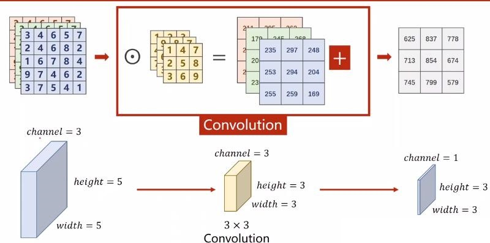
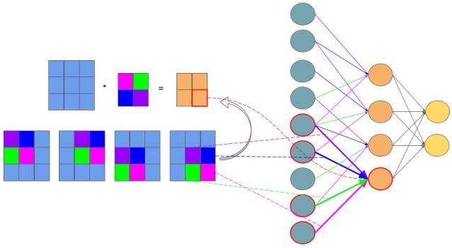
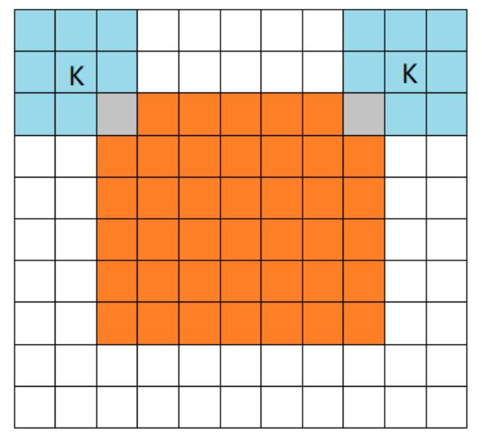
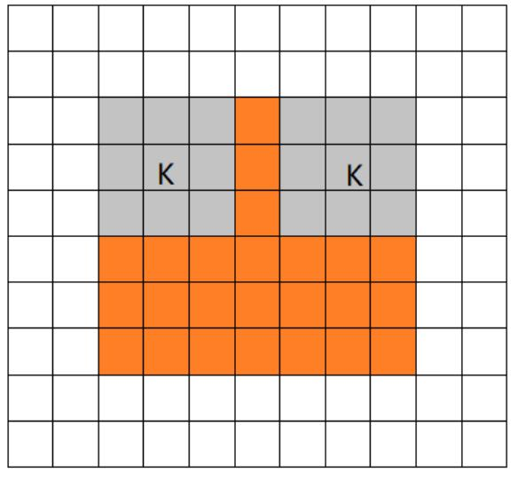
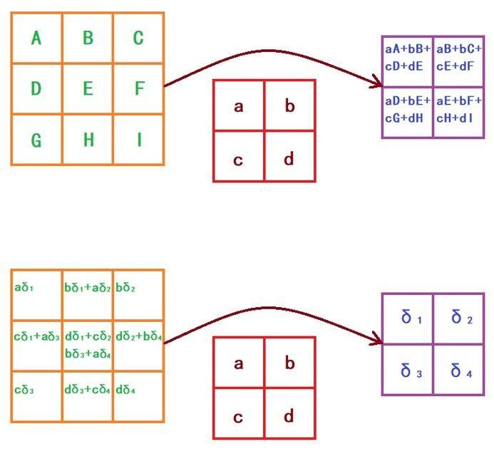
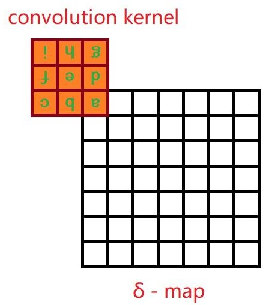
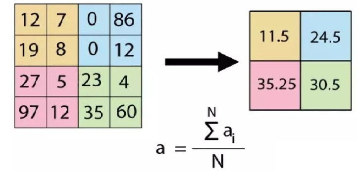

本文介绍了深度学习中卷积神经网络的（CNN）的基础知识。

<!--more-->

 ---
- [1. 基础知识](#1-基础知识)
  - [1.1. 图像](#11-图像)
  - [1.2. 卷积](#12-卷积)
    - [1.2.1. 单通道卷积](#121-单通道卷积)
    - [1.2.2. 多通道卷积](#122-多通道卷积)
    - [1.2.3. 权重](#123-权重)
    - [1.2.4. 偏置](#124-偏置)
    - [1.2.5. 激活](#125-激活)
    - [1.2.6. 共享权值](#126-共享权值)
    - [1.2.7. 初始化](#127-初始化)
    - [1.2.8. 卷积模式](#128-卷积模式)
    - [1.2.9. 反向传播](#129-反向传播)
  - [1.3. 池化](#13-池化)
    - [1.3.1. 最大池化](#131-最大池化)
    - [1.3.2. 平均池化](#132-平均池化)
    - [1.3.3. 池化的好处](#133-池化的好处)
    - [1.3.4. 反向传播](#134-反向传播)
- [2. 参考文献](#2-参考文献)

# 1. 基础知识

## 1.1. 图像

图像在计算机中表示为一个 $height\times width$ 的 2 维的矩阵，矩阵的各个元素取值为颜色的值，可以表示为 $[0,1]$ 区间或 $[0,255]$ 区间的一个数。灰度图像是单通道的，彩色图像是三通道的（R，G，B）。

## 1.2. 卷积

卷积是原始图像与卷积核之间的滑动局部加乘计算过程。

狭义的卷积核（kernel）是一个矩阵，可在图像上滑动并与输入相乘，从而以某种我们期望的方式增强输出。

### 1.2.1. 单通道卷积

假设输入图片为 $6\times 6 \times 1\ channel$，卷积核为 $3\times 3$，stride=1（表示 kernel 的滑动步长为1），padding=1（表示对原始输入图像周围额外增加一层，配合stride=1，可以保证卷积后图片大小不变），则卷积过程如下图所示：

上面的kernel可用于**锐化**图像。比如，考虑下图所示的两个输入图像。

- 第一个图像，中心值为3 * 5 + 2 * -1 + 2 * -1 + 2 * -1 + 2 * -1 =7，值3增加到7。
- 第二个图像，输出是1 * 5 + 2 * -1 + 2 * -1 + 2 * -1 + 2 * -1 = -3，值1减少到-3。

显然，3和1之间的对比度增加到了7和-3，图像将更清晰锐利。

卷积后尺寸计算公式：

$$
输出图像尺寸 = (输出图像尺寸-卷积核尺寸 + 2*填充值)/步长+1
$$

### 1.2.2. 多通道卷积

假设一个图像为 $5\times 5 \times 3\ channel$，此时，对于每一个通道均可以用一个卷积核进行卷积。此时，三个通道的卷积核串联起来，形成一个**滤波器（filter）**。在前面的单通道卷积中，卷积核就是一个单通道的 filter。

举例，采用 1 个 $3\ channel$ 的滤波器，每个通道的卷积核大小仍为 3x3，padding=0，stride=1。卷积过程如下，每一个通道的像素值与对应通道的卷积核的数值进行卷积，因此每一个通道会对应一个输出卷积结果，三个卷积结果对应位置累加 **求和**，得到最终的卷积结果。

上述过程中，每一个 滤波器 的通道数必须与输入图片的通道数 **一致**。

可以看出，一个 滤波器 最终到一个通道的特征图，则采用多个 滤波器 就可得到多个特征图，也即最终输出的特征图的通道数等于 滤波器 的个数。为什么要采用多个 滤波器 呢？因为一个 滤波器 提取特征是不充分的，需要添加多个 滤波器 去学习多种特征。

另外，滤波器 中不同通道上的卷积核的参数并不相同。

### 1.2.3. 权重

卷积核的值就是待学习的权重参数。网络训练时，输出的结果会和数据集标签做损失计算，然后把计算得到的损失反向梯度下降去更新卷积核里的每一个参数。所以卷积核里面的参数最终是训练得到的。

通过深层 CNN，我们无需再用手工设计的 kernel 来提取特征，而是可以直接学习这些可提取潜在特征的 kernel 值。

### 1.2.4. 偏置

每一个 滤波器 都包括一个偏置参数（bias）。这个偏置参数是该 滤波器 中所有 卷积核 共享的。最终的卷积结果需要在加上该偏置值。

### 1.2.5. 激活

卷积与偏置加和后的值，还需要再经过激活函数（比如 ReLU）才得到最终特征图上的值。

### 1.2.6. 共享权值

共享权值包括 共享权重 和 共享偏置。简而言之，卷积核的权重与偏置在卷积过程中保持不变。如下图所示，相同颜色的权值保持不变

### 1.2.7. 初始化

卷积核的权值是通过学习更新的，但是最开始是需要给这些参数提供初始值才能使网络运行。初始化方法可以简略分三种：

- 取偏差很小的高斯分布随机取值
- Xavier 初始化方法
- He kai ming 初始化方法

### 1.2.8. 卷积模式

橙色部分为 image, 蓝色部分为 filter。

- **full mode**

full 模式的意思是，从 filter 和 image 刚相交开始做卷积，白色部分为填 0。filter 的运动范围如图所示。

- **same mode**

当filter的中心 K 与 image 的边角重合时，开始做卷积运算。当卷积步长 stride = 1 时，卷积之后输出的 feature map 尺寸相对于输入图片保持不变（same）。

- **valid mode**

当filter全部在image里面的时候，进行卷积运算。

### 1.2.9. 反向传播

为了说明反向传播，需要先分析前向传播。假设卷积的前向传播采用 valid 模式。

我们发现，当误差反向传播到卷积层时，我们的操作方法依然是一个卷积，只不过要把卷积核**翻转（旋转180°）**，然后在周围补 0。注意到，前向传播采用 valid mode 卷积，反向传播时是 full mode 卷积，如图所示：

显然，如果前向传播是 full mode 卷积，那么反向传播就是 valid mode 卷积，不过依旧要将卷积核翻过来。

而对于 same mode 卷积，它的反向传播也是一个 same mode 卷积，同样也需要翻转卷积核。

最后，对于 strided 卷积（跨超过 1 步的卷积），反向传播是 fractional strided 卷积，反之依然。卷积核同样也要翻转。

## 1.3. 池化

池化层也称下采样层，会压缩输入的特征图，一方面减少了特征，导致了参数减少，进而简化了卷积网络计算时的复杂度；另一方面保持了特征的某种不变性（旋转、平移、伸缩等）。池化的思想来自于视觉机制，是对信息进行抽象的过程。

池化操作主要有两种，一种是平均池化(Average Pooling)，即对邻域内的特征点求平均；另一种是最大池化(Max Pooling)，即对邻域内的特征点取最大。

注意，池化也可以看作一种步长与卷积核相等的卷积，且卷积核参数固定不变。

注意，池化过程没有需要学习的参数。因此池化可以在不增加参数的情况下，大幅降低 feature map 的维度，节约开销。

### 1.3.1. 最大池化

采用 $2\times 2$ 卷积核对 $4\times 4$ 图像的最大池化过程：

通常认为如果选取区域均值(mean pooling)，往往能保留整体数据的特征，较好的突出背景信息。

### 1.3.2. 平均池化

采用 $2\times 2$ 卷积核对 $4\times 4$ 图像的平均池化过程：

如果选取区域最大值(max pooling)，则能更好保留纹理特征。

### 1.3.3. 池化的好处
> 言有三. [池化是什么意思？](https://www.zhihu.com/question/303215483/answer/615115629)

池化的好处：

- **增大感受野**。所谓感受野，即一个像素对应回原图的区域大小，假如没有pooling，一个3*3，步长为1的卷积，那么输出的一个像素的感受野就是3*3的区域，再加一个stride=1的3*3卷积，则感受野为5*5。假如我们在每一个卷积中间加上3*3的pooling呢？很明显感受野迅速增大，这就是pooling的一大用处。感受野的增加对于模型的能力的提升是必要的，正所谓“一叶障目则不见泰山也”。
- **平移不变性**。我们希望目标的些许位置的移动，能得到相同的结果。因为pooling不断地抽象了区域的特征而不关心位置，所以pooling一定程度上增加了平移不变性。
- **降低优化难度和参数**。我们可以用步长大于1的卷积来替代池化，但是池化每个特征通道单独做降采样，与基于卷积的降采样相比，不需要参数，更容易优化。全局池化更是可以大大降低模型的参数量和优化工作量。

### 1.3.4. 反向传播

池化的反向传播比较简单。反向传播是要从缩小后的误差 $\delta^{l+1}$ 还原池化前较大 feature map 对应的误差 $\delta^l$。

假设采用步长为 1 的$2\times 2$ 池化，将 $4\times 4$ 的 feature map 池化为 $2\times 2$，如果 $\delta^{l+1}$ 的第 $k$ 个子矩阵为

$$
\delta^{l+1}_k = \begin{bmatrix}
  2 & 8\\
  4 & 6
\end{bmatrix}
$$

对于最大池化，需要在前向传播时，记住每个池化块中最大值的位置，然后将误差放回去即可。假设四个位置分别为左上，右下，右上，左下，则有

$$
\delta^{l}_k = \begin{bmatrix}
  2 &0&0& 0\\
  0&0&0&8\\
  0&4&0&0\\
  0&0&6&0
\end{bmatrix}
$$

对于平均池化，我们只需要将池化单元的误差平均值放回原来的子矩阵即可：
$$
\delta^{l}_k = \begin{bmatrix}
  0.5&0.5&2&2\\
  0.5&0.5&2&2\\
  1&1&1.5&1.5\\
  1&1&1.5&1.5
\end{bmatrix}
$$

# 2. 参考文献

[1] 木盏. [卷积的三种模式](https://blog.csdn.net/leviopku/article/details/80327478). CSDN.

[2] 永远在你身后. [卷积算法的另一种高效实现，as_strided详解](https://zhuanlan.zhihu.com/p/64933417). 知乎.
