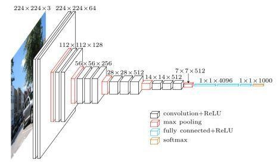
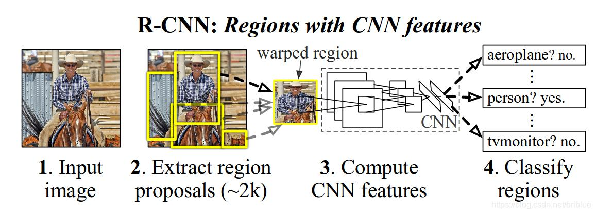
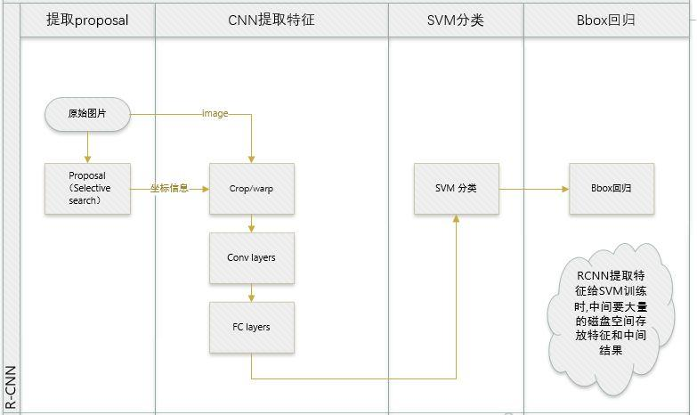
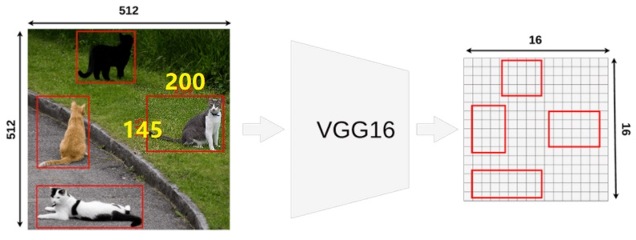
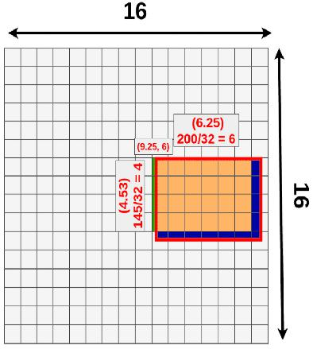

本文介绍了计算机视觉中目标检测问题的基础研究和历史。

<!--more-->

 ---
 
- [1. 前言](#1-前言)
  - [1.1. AlexNet](#11-alexnet)
  - [1.2. VGG16](#12-vgg16)
- [2. 二阶段方法](#2-二阶段方法)
  - [2.1. R-CNN](#21-r-cnn)
  - [2.2. Fast R-CNN](#22-fast-r-cnn)
- [3. 参考文献](#3-参考文献)

# 1. 前言

图片分类任务我们已经熟悉了，就是算法对其中的对象进行分类。而今天我们要了解构建神经网络的另一个问题，即目标检测问题。这意味着，我们不仅要用算法判断图片中是不是一辆汽车， 还要在图片中标记出它的位置， 用边框或红色方框把汽车圈起来， 这就是目标检测问题。 其中“定位”的意思是判断汽车在图片中的具体位置。


近几年来，目标检测算法取得了很大的突破。比较流行的算法可以分为两类，一类是基于 Region Proposal 的 R-CNN 系算法（R-CNN，Fast R-CNN, Faster R-CNN等），它们是two-stage的，需要先算法产生目标候选框，也就是目标位置，然后再对候选框做分类与回归。而另一类是 Yolo，SSD 这类 one-stage 算法，其仅仅使用一个卷积神经网络 CNN 直接预测不同目标的类别与位置。第一类方法是准确度高一些，但是速度慢，但是第二类算法是速度快，但是准确性要低一些。

## 1.1. AlexNet

AlexNet 的网络结构如下：


- Conv 11$\times$11s4,96 / ReLU

  输入为 $224 \times 224 \times 3$ 的图像，每个通道包含 96 个 $11\times 11,\ stride=4$ 的卷积核，一共参数量为

  $$
  3\ channel \times 11\times 11\times 96\ kernels + 96\ bias = 34944 \approx35K\ params
  $$

  卷积后得到

  ```
  wide = (224 + 2 * padding - kernel_size) / stride + 1 = 54
  height = (224 + 2 * padding - kernel_size) / stride + 1 = 54
  dimention = 96
  ```

- Local Response Norm

  局部响应归一化层完成一种 “临近抑制” 操作，对局部输入区域进行归一化。借鉴了神经生物学中侧抑制（lateral inhibitio ）的概念，指的是被激活的神经元会抑制它周围的神经元，从而实现局部抑制。但是，在 2015 年 Very Deep Convolutional Networks for Large-Scale Image Recognition 提到 LRN 基本没什么用。因而在后面的 Googlenet，以及之后的一些 CNN 架构模型，LRN 已经不再使用，因为出现了更加有说服能力的批量归一化（Batch Normalization, BN）。

- Max Pool
  最大池化，代替之前网络的平均池化。采用 3$\times$3卷积核，stride = 2，因此会出现重叠池化的现象。可以减小过拟合。
  池化后得到：

  ```
  wide = (54 + 2 * padding - kernel_size) / stride + 1 = 54
  height = (54 + 2 * padding - kernel_size) / stride + 1 = 54
  dimention = 96
  ```
## 1.2. VGG16

> 2015. ICLR. Very Deep Convolutional Networks for Large-Scale Image Recognition
> Visual Geometry Group

相比 AlexNet 的一个改进是采用连续的几个 3x3 的卷积核代替 AlexNet 中的较大卷积核（11x11，7x7，5x5）。

- 使用了 3 个 3x3 卷积核来代替 7x7 卷积核
- 使用了 2 个 3x3 卷积核来代替 5*5 卷积核

对于给定的感受野（与输出有关的输入图片的局部大小），采用堆积的小卷积核是优于采用大的卷积核，因为多层非线性层可以增加网络深度来保证学习更复杂的模式，而且代价还比较小（参数更少）。




[VGG网络的结构](https://dgschwend.github.io/netscope/#/preset/vgg-16) 非常一致，从头到尾全部使用的是 `3x3x3,stride=1,padding=1` 的卷积和 `2x2` 的 max pooling。VGG16 特指 D 列包含 16 个权重层的网络结构，而 VGG19 特指 E 列包含 19 个权重层的网络结构。

输入 $224\times 224 \times 3\ channel$ 的图像。首先经过 2 次 64 个滤波器的卷积。套公式计算发现卷积后输出尺寸不变

$$
H/W = (224+2\times padding - kernel)/stride + 1 = 224
$$

然后经过 `2x2` 最大池化后大小缩小为原来的一半。按照网络结构继续进行，最终经过五次池化得到 `7x7x512` 的 feature map。传入 `4096` 维的全连接层（FC 层），参数个数为 $7\times 7\times 512\times 4096+4096\ bias=102764544$，经过 ReLU，后再接一个 4096 维的 FC 层，参数个数为 $4096\times 4096=16777216$，经过 ReLU，最后送入 1000 维 FC 层，后接 softmax 进行分类。

# 2. 二阶段方法

## 2.1. R-CNN

> 2014. Ross Girshick，JeffDonahue,TrevorDarrell,Jitendra Malik. 
> **Rich feature hierarchies for accurate oject detection and semantic segmentation**



目标检测有两个主要任务：物体分类和定位，为了完成这两个任务，R-CNN借鉴了滑动窗口思想， 采用对区域进行识别的方案。RCNN是一个 two-stage （两阶段，上图中 1+2 是第一阶段，3+4 是第二阶段）目标检测算法，具体实现步骤如下：




- **提取候选区域**。输入一张图片，通过指定算法从图片中提取 2000 个类别独立的候选区域（可能目标区域）。R-CNN 目标检测首先需要获取2000个目标候选区域，能够生成候选区域的方法很多，比如：

  - objectness
  - **selective search**
  - category-independen object proposals
  - constrained parametric min-cuts (CPMC)
  - multi-scale combinatorial grouping
  - Ciresan
  
  R-CNN 采用的是 Selective Search 算法。简单来说就是通过一些传统图像处理方法将图像分成很多小尺寸区域，然后根据小尺寸区域的特征合并小尺寸得到大尺寸区域，以实现候选区域的选取。 提取候选区域非常**耗时**，可能比实际对象检测还要耗时。

  候选区域有 2000 个，所以很多会进行重叠。针对每个类，通过计算 IoU 指标（交并比），采取非极大性抑制，以最高分的区域为基础，剔除掉那些重叠位置的区域。

- **提取特征向量**。对于上述获取的候选区域，使用 **AlexNet** (2012) 提取 4096 维特征向量。（AlexNet 的输入图像大小是 227x227，而通过 Selective Search 产生的候选区域大小不一，为了与 AlexNet 兼容，R-CNN 采用了非常暴力的手段，那就是无视候选区域的大小和形状，统一变换到 227x227 的尺寸。有一个细节，在对 Region 进行变换的时候，首先对这些区域进行膨胀处理，在其 box 周围附加了 p 个像素，也就是人为添加了边框，在这里 p=16。）网络训练过程如下：
  - 首先进行有监督预训练：使用 ImageNet 训练网络参数，这里只训练和**分类**有关的参数，因为 ImageNet 数据只有分类，没有位置标注。输入图片尺寸调整为 227x227，最后一层输出：4096 维向量 -> 1000 维向量的映射（因为 ImageNet 挑战使用了一个“修剪”的1000 个非重叠类的列表）。
  - 然后在特定样本下的微调（迁移学习） ：采用训练好的 AlexNet 模型进行 PASCAL VOC 2007 样本集下的微调，学习率 = 0.001，最后一层输出：4096 维向量 -> 21 维向量的映射（PASCAL VOC 2007 样本集包含 20 个类 + 背景类共 21 类，既有图像中物体类别标签，也有图像中物体位置标签）。将候选区域与 GroundTrue 中的 box 标签相比较，如果 IoU > 0.5，说明两个对象重叠的位置比较多，于是就可以认为这个候选区域是正，否则就是负。mini-batch 为 128（32 个正样本和 96 个负样本）。

- **SVM 分类**。对于每个区域相应的特征向量，利用 SVM 进行分类，并通过一个 bounding box regression 调整目标包围框的大小。
  - 将 2000×4096 维特征（2000 个候选框，每个候选框获得 4096 的特征向量）与 20 个 SVM 组成的权值矩阵 4096×20 相乘（每一个特征向量分别判断 20 次类别，因为 SVM 是二分类器，每个种类训练一个 SVM 则有 20 个 SVM），获得 2000×20 维矩阵表示每个候选框是某个物体类别的得分。
  - 【IOU<0.3被作为负例，ground-truth是正例，其余的全部丢弃】
  - 然后分别对上述 2000×20 维矩阵中每列（即每一类）进行非极大值抑制，剔除重叠候选框，得到该列（即该类）中得分最高的一些候选框。
  > 非极大值抑制：同一个目标可能有好几个框（每一个框都带有一个分类器得分），目标是一类只保留一个最优的框。
  > - 将所有框的得分排序，选中最高分及其对应的框;
  > - 遍历其余的框，挑出其中第二大得分框，如果和当前最高分框的重叠面积（IoU）大于一定阈值，将其删除，即认为他与最高分框重复了，都指向同一个目标。否则，我们认为这个区域有两个该目标。
  > - 从未处理的框中继续选一个得分最高的，重复上述过程。

- **bounding box 回归**。受 DPM 的启发，作者训练了一个线性的回归模型，这个模型能够针对候选区域的 pool5 数据预测一个新的 box 位置。具体细节，作者放在补充材料当中。

**缺点：**

- 训练分多步。R-CNN 的训练先要fine tuning 一个预训练的网络（AlexNet），然后针对每个类别都训练一个 SVM 分类器，最后还要对 bounding-box 进行回归，另外 region proposal 也要单独用 selective search 的方式获得，步骤比较繁琐；
- 时间和内存消耗比较大。在训练 SVM 和回归的时候需要用网络训练的特征（2000×4096=819万参数）作为输入，特征保存在磁盘上再读入的时间消耗还是比较大的；
- 测试的时候也比较慢，每张图片的每个 region proposal 都要做卷积，重复操作太多。

## 2.2. Fast R-CNN


- **提取特征图（feature maps）**。输入原始图像，主干网络采用 **VGG16** 来提取特征图，3 大改进：
  - 实现大部分 end-to-end 训练（提proposal阶段除外）。所有的特征都暂存在显存中，就不需要额外的磁盘空间。
  - joint training （SVM分类，bbox回归 联合起来在 CNN 阶段训练）把最后一层的Softmax换成两个，一个是对区域的分类Softmax（包括背景），另一个是对bounding box的微调。这个网络有两个输入，一个是整张图片，另一个是候选proposals算法产生的可能proposals的坐标。（对于SVM和Softmax，论文在SVM和Softmax的对比实验中说明，SVM的优势并不明显，故直接用Softmax将整个网络整合训练更好。对于联合训练： 同时利用了分类的监督信息和回归的监督信息，使得网络训练的更加鲁棒，效果更好。这两种信息是可以有效联合的。）
  - 提出了一个RoI层，算是SPP的变种，SPP是pooling成多个固定尺度，RoI只pooling到单个固定的尺度 （论文通过实验得到的结论是多尺度学习能提高一点点mAP，不过计算量成倍的增加，故单尺度训练的效果更好。）

框架：

- **提取候选框（region proposals）**。输入原始图像，通过 selective search 提取感兴趣区域。每个区域的坐标用四元数组 $[r,c,h,w]$ （左上角的行列坐标+高和宽）定义，该四元数组相对于原始图像，都有对应的 ground truth BBox 和 ground truth class label。
  
- **将候选框坐标映射到 feature map 上**。采用 VGG16 时，最后一个 max pooling 层后接 ROI pooling 层，区域坐标经过5 次池化，输出的 feature maps 是原图像的 1/32（`16x16x512`），则将原图像对应的四元数组转换到 feature maps 上就是每个值都除以 32 并量化到最接近的整数，得到映射的坐标，即为 ROI feture map。
    
  在上图的例子中，一个 ROI 的原始大小为 `145x200` ，左上角设置为 `(192x296)` 。除以 32（比例因子）并取整，左上角变为 `(9,6)`，高宽变为 `4x6`，得到的 ROI feature maps 为 $[9,6,4,6]$。
    
  注意，映射过程存在一次量化损失。损失的信息如上图蓝色区域所示（之后会有改进的 ROI Align 方法去除损失）。
- **ROI pooling**。将 ROI feature maps 转换为固定大小 feature maps 输出，以便送入后续固定长度的 FC 层。假设经过 ROI 池化后的固定大小为是一个超参数 $H\times W$ ，因为输入的 ROI feature map 大小不一样，假设为 $h\times w$，需要对这个 feature map 进行池化来减小尺寸，那么可以**计算出池化窗口的尺寸为：$(h/H)\times (w/W)$，即用这个计算出的窗口对 RoI feature map 做 max pooling**，Pooling 对每一个 feature map 通道都是独立的。
  假设我们需要将上面得到的 `4x6x512` 池化为固定大小的 `3x3x512` feature maps，需要进行 `(4/3)x(6/3)x512 = 1x2x512` 的卷积核进行最大池化，会丢失 ROI 的最后一行。如此遍历每个 ROI feature map 最终得到 `Nx3x3x512` 的矩阵。
  
  注意，ROI Pooling 过程存在第二次量化损失（上面的例子中为最后一行）。

# 3. 参考文献

[1] 维基百科. [Kernel regression](https://en.wikipedia.org/wiki/Kernel_regression)
