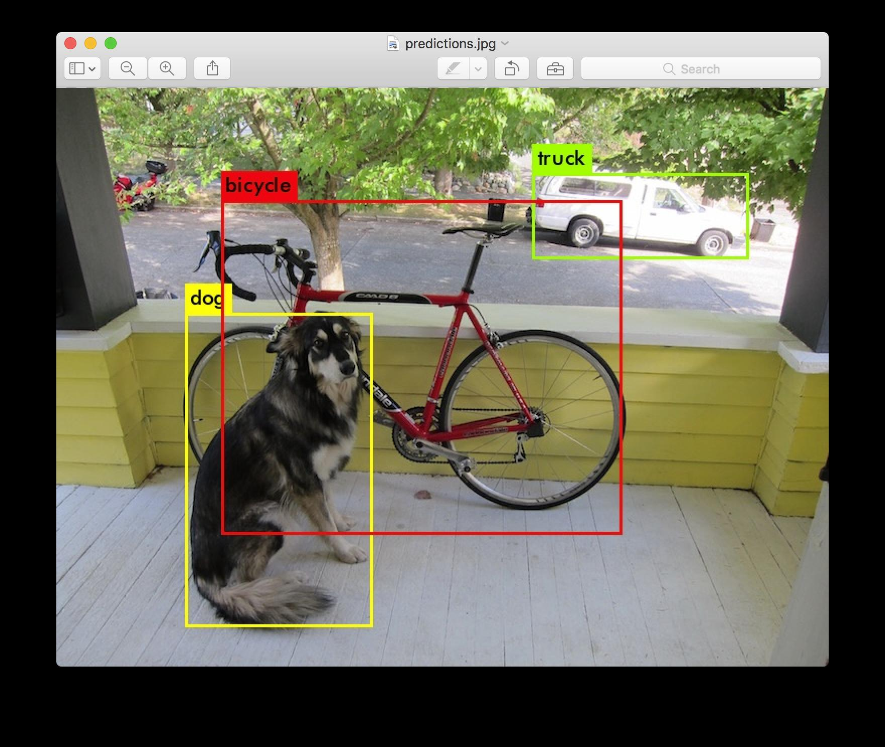

本文介绍了计算机视觉中目标检测问题的基础研究和历史。

<!--more-->

 ---
 
- [1. 前沿](#1-前沿)
  - [1.1. R-CNN](#11-r-cnn)
- [2. 参考文献](#2-参考文献)

# 1. 前沿

图片分类任务我们已经熟悉了，就是算法对其中的对象进行分类。而今天我们要了解构建神经网络的另一个问题，即目标检测问题。这意味着，我们不仅要用算法判断图片中是不是一辆汽车， 还要在图片中标记出它的位置， 用边框或红色方框把汽车圈起来， 这就是目标检测问题。 其中“定位”的意思是判断汽车在图片中的具体位置。

近几年来，目标检测算法取得了很大的突破。比较流行的算法可以分为两类，一类是基于 Region Proposal 的 R-CNN 系算法（R-CNN，Fast R-CNN, Faster R-CNN等），它们是two-stage的，需要先算法产生目标候选框，也就是目标位置，然后再对候选框做分类与回归。而另一类是 Yolo，SSD 这类 one-stage 算法，其仅仅使用一个卷积神经网络 CNN 直接预测不同目标的类别与位置。第一类方法是准确度高一些，但是速度慢，但是第二类算法是速度快，但是准确性要低一些。

## 1.1. R-CNN

> 2014. Ross Girshick，JeffDonahue,TrevorDarrell,Jitendra Malik. 
> **Rich feature hierarchies for accurate oject detection and semantic segmentation**

目标检测有两个主要任务：物体分类和定位，为了完成这两个任务，R-CNN借鉴了滑动窗口思想， 采用对区域进行识别的方案。RCNN是一个 two-stage （两阶段，上图中 1+2 是第一阶段，3+4 是第二阶段）目标检测算法，具体实现步骤如下：

- **提取候选区域**。输入一张图片，通过指定算法从图片中提取 2000 个类别独立的候选区域（可能目标区域）。R-CNN 目标检测首先需要获取2000个目标候选区域，能够生成候选区域的方法很多，比如：

  - objectness
  - selective search
  - category-independen object proposals
  - constrained parametric min-cuts (CPMC)
  - multi-scale combinatorial grouping
  - Ciresan
  
  R-CNN 采用的是 Selective Search 算法。简单来说就是通过一些传统图像处理方法将图像分成很多小尺寸区域，然后根据小尺寸区域的特征合并小尺寸得到大尺寸区域，以实现候选区域的选取。

  候选区域有 2000 个，所以很多会进行重叠。针对每个类，通过计算 IoU 指标（交并比），采取非极大性抑制，以最高分的区域为基础，剔除掉那些重叠位置的区域。

- **提取特征向量**。对于上述获取的候选区域，进一步使用 AlexNet (2012) 提取 4096 维特征向量。（AlexNet 的输入图像大小是 227x227，而通过 Selective Search 产生的候选区域大小不一，为了与 AlexNet 兼容，R-CNN 采用了非常暴力的手段，那就是无视候选区域的大小和形状，统一变换到 227x227 的尺寸。有一个细节，在对 Region 进行变换的时候，首先对这些区域进行膨胀处理，在其 box 周围附加了 p 个像素，也就是人为添加了边框，在这里 p=16。）网络训练过程如下：
  - 首先进行有监督预训练：使用 ImageNet 训练网络参数，这里只训练和**分类**有关的参数，因为 ImageNet 数据只有分类，没有位置标注。输入图片尺寸调整为 227x227，最后一层输出：4096 维向量 -> 1000 维向量的映射（因为 ImageNet 挑战使用了一个“修剪”的1000 个非重叠类的列表）。
  - 然后在特定样本下的微调（迁移学习） ：采用训练好的 AlexNet 模型进行 PASCAL VOC 2007 样本集下的微调，学习率 = 0.001，最后一层输出：4096 维向量 -> 21 维向量的映射（PASCAL VOC 2007 样本集包含 20 个类 + 背景类共 21 类，既有图像中物体类别标签，也有图像中物体位置标签）。将候选区域与 GroundTrue 中的 box 标签相比较，如果 IoU > 0.5，说明两个对象重叠的位置比较多，于是就可以认为这个候选区域是正，否则就是负。mini-batch 为 128（32 个正样本和 96 个负样本）。

- **SVM 分类**。对于每个区域相应的特征向量，利用 SVM 进行分类，并通过一个 bounding box regression 调整目标包围框的大小。
  - 将 2000×4096 维特征（2000 个候选框，每个候选框获得 4096 的特征向量）与 20 个 SVM 组成的权值矩阵 4096×20 相乘（每一个特征向量分别判断 20 次类别，因为 SVM 是二分类器，每个种类训练一个 SVM 则有 20 个 SVM），获得 2000×20 维矩阵表示每个候选框是某个物体类别的得分。
  - 然后分别对上述 2000×20 维矩阵中每列（即每一类）进行非极大值抑制，剔除重叠候选框，得到该列（即该类）中得分最高的一些候选框。
  > 非极大值抑制：同一个目标可能有好几个框（每一个框都带有一个分类器得分），目标是一类只保留一个最优的框。
  > - 将所有框的得分排序，选中最高分及其对应的框;
  > - 遍历其余的框，挑出其中第二大得分框，如果和当前最高分框的重叠面积（IoU）大于一定阈值，将其删除，即认为他与最高分框重复了，都指向同一个目标。否则，我们认为这个区域有两个该目标。
  > - 从未处理的框中继续选一个得分最高的，重复上述过程。

# 2. 参考文献

[1] 维基百科. [Kernel regression](https://en.wikipedia.org/wiki/Kernel_regression)
